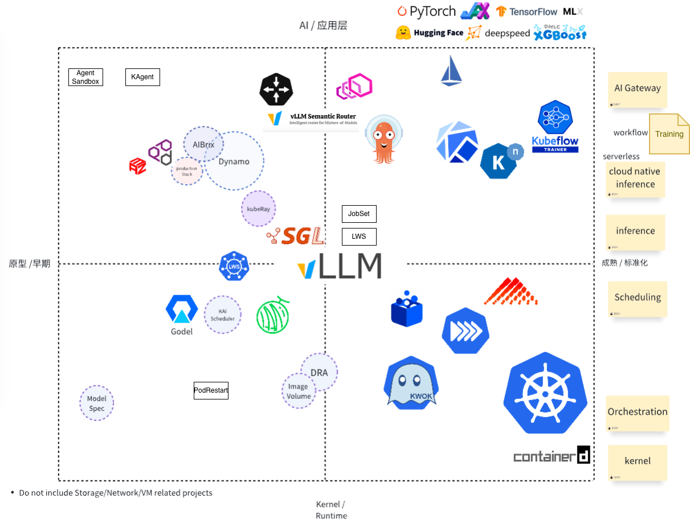

# AI-Infra Landscape & Learning Path 🚀

Welcome to the **AI-Infra** repository! This project provides a curated landscape and structured learning path for engineers building and operating modern **AI infrastructure**, especially in the Kubernetes and cloud-native ecosystem.

## 🌐 Overview

This landscape visualizes key components across the AI Infrastructure stack, mapped by:

- **Horizontal Axis (X):**
  - Left: Prototype / Early-stage projects
  - Right: Kernel & Runtime maturity

- **Vertical Axis (Y):**
  - Bottom: Infrastructure Layer (Kernel/Runtime)
  - Top: Application Layer (AI/Inference)

The goal is to demystify the evolving AI Infra stack and guide engineers on where to focus their learning.

## 📊 AI-Infra Landscape (2025 June, needs an update)

**Legend:**

> - Dashed outlines = Early stage or under exploration
> - Labels on right = Functional categories

## 🧭 Learning Path for AI Infra Engineers

### 📦 0. Kernel & Runtime (底层内核)

Core components for container and workload management.
If your company has a team to maintain a Kubernetes cluster or you are using Kubernetes as a service on cloud providers, you may skip this section.

- **Projects to Learn:**
  - [`Kubernetes`](https://github.com/kubernetes/kubernetes): CNCF First Graduated Project, Core.
  - [`CRI`](https://github.com/kubernetes/cri-api)
    - [`containerd`](https://github.com/containerd/containerd): Container Runtime.
    - [`KubeVirt`](https://github.com/kubevirt/kubevirt): Kubernetes SIG Project for running VMs in Kubernetes.
  - [`CNI`](https://github.com/containernetworking/cni): focus on RDMA or other network devices.
  - [`CSI`](https://github.com/container-storage-interface/spec): focus on Checkpoint/Restore, Model Download, Cache Management, etc.
  - [`KWOK`](https://github.com/kubernetes-sigs/kwok): Kubernetes SIG Project for mock testing(especially for GPU nodes).
  - [`Helm`](https://github.com/helm/helm): Package Manager for Kubernetes.

- **Learning Topics:**
  - Container lifecycle & runtime
  - Scheduler internals
  - Resource allocation & GPU management
  - Emulators & simulators (e.g. KWOK, Mocking Tools)
  - **Workload Isolation**: See [Isolation Guide](./kubernetes/isolation.md)
    for cgroups, security contexts, user namespaces, rootless containers,
    VM-based isolation (Kata, gVisor), and checkpoint/restore

---

### 📍 1. Scheduling & Workloads (调度与工作负载)

- **Projects to Learn:**
  - Scheduling(Include [Batch, Kubernetes-WG](https://github.com/kubernetes/community/blob/master/wg-batch/README.md)):
    - [`Kueue`](https://github.com/kubernetes-sigs/kueue): Kubernetes Subproject for batch scheduling.
    - [`Volcano`](https://github.com/volcano-sh/volcano): CNCF Incubating.
    - [`koordinator`](https://github.com/koordinator-sh/koordinator): CNCF Sandbox.
    - [`Godel Scheduler`](https://github.com/kubewharf/godel-scheduler): ByteDance.（with [katalyst](https://github.com/kubewharf/katalyst-core)）
    - [`HAMI`](https://github.com/Project-HAMi/HAMi): CNCF Sandbox.
    - [`NVIDIA Kai Scheduler`](https://github.com/NVIDIA/kai-scheduler): NVIDIA.
    - [`NVIDIA Grove`](https://github.com/NVIDIA/grove): NVIDIA gang scheduling for AI workloads.
    - [`Apache YuniKorn`](https://github.com/apache/yunikorn-core): Apache.
  - Workloads(Pod Group):
    - [`LWS`](https://github.com/kubernetes-sigs/lws) LeaderWorkset: Kubernetes SIG Project.
    - Volcano Enhanced AI Workloads: https://github.com/volcano-sh/volcano/issues/4554
    - Pod Group & Gang Scheduling KEPs: See roadmap below.
  - Device Management([Kubernetes WG](https://github.com/kubernetes/community/blob/master/wg-device-management/README.md)):
    - [`DRA`](https://github.com/kubernetes/dynamic-resource-allocation/)
    - [`NRI`](https://github.com/containerd/nri)
    - DRANET is a good example: https://github.com/google/dranet

- **Learning Topics:**
  - Job scheduling vs. pod scheduling
  - Binpack / Spread strategies
  - Queue management & SLOs
  - Multi-model & multi-tenant scheduling

- **RoadMap(Ongoing Proposals):**
  - Gang Scheduling Support in Kubernetes [#4671](https://github.com/kubernetes/enhancements/pull/4671)
    - LWS Gang Scheduling [KEP-407](https://github.com/kubernetes-sigs/lws/blob/main/keps/407-gang-scheduling/README.md)

---

### 🧠 2. Model Inference & Runtime Optimization (推理优化)

- **Projects to Learn:**
  - engine:
    - [`vLLM`](https://github.com/vllm-project/vllm)
    - [`SGLang`](https://github.com/sgl-project/sglang)
    - [`Triton`](https://github.com/triton-inference-server/server)
    - [`Text Generation Inference`](https://github.com/huggingface/text-generation-inference)
  - inference platform:
    - [`Dynamo`](https://github.com/dynamo/dynamo)
    - [`llm-d`](https://github.com/llm-d/llm-d)
    - [`AIBrix`](https://github.com/vllm-project/aibrix)
    - [`OME`](https://github.com/sgl-project/ome)
    - [`llmaz`](https://github.com/InftyAI/llmaz)
    - [`Kthena`](https://github.com/volcano-sh/kthena)
  - Others:
    - [`KServe`](https://github.com/kserve/kserve): CNCF Incubating

- **Learning Topics:**
  - Efficient transformer inference
  - CUDA Graphs, KV Cache, Paged KV, FlashAttention
  - LLM serving stacks
  - Multi-accelerator orchestration
  - Large Scale Experts (MoE architecture)

- **RoadMap(Ongoing Proposals Or Working Groups):**
  - [Serving WG](https://github.com/kubernetes/community/blob/master/wg-serving/README.md)

---

### 🧩 3. AI Gateway & Agentic Workflow

- **Projects to Learn:**
  - AI Gateway:
    - [`Gateway API Inference Extension`](https://github.com/kubernetes-sigs/gateway-api-inference-extension)
    - [`Envoy AI Gateway`](https://github.com/envoyproxy/ai-gateway)
    - [`Istio`](https://github.com/istio/istio)
    - [`KGateway`](https://github.com/kgateway-dev/kgateway): previously known as Gloo.
    - [`DaoCloud knoway`](https://github.com/knoway-dev/knoway)
    - [`Higress`](https://github.com/alibaba/higress): Alibaba
    - [`OpenRouter`](https://github.com/OpenRouterTeam/openrouter-runner)
    - [`Kong`](https://github.com/Kong/kong)
    - [`Semantic Router`](https://github.com/vllm-project/semantic-router): vLLM Project
  - CD:
    - [`Argo`](https://github.com/argoproj/argo): CNCF Graduated
    - [`Kubeflow`](https://github.com/kubeflow/kubeflow): CNCF Incubating
    - [`Metaflow`](https://github.com/Netflix/metaflow) (optional)
  - Agentic Workflow:
    - [`Dify`](https://github.com/langgenius/dify)
    - [`KAgent`](https://github.com/kagent-dev/kagent): CNCF Sandbox
    - [`Dagger`](https://github.com/dagger/dagger)
  - Serverless:
    - [`Knative`](https://github.com/knative/serving): Serverless solution

- **Learning Topics:**
  - API orchestration for LLMs
  - Prompt routing and A/B testing
  - RAG workflows, vector DB integration

More details about inference can be found in [Inference](./inference/README.md), including [AIBrix introduction](./inference/aibrix.md), [prefile-decode disaggregation](./inference/pd-disaggregation.md), [caching mechanisms](./inference/caching.md), and [large scale experts (MoE models)](./inference/large-scale-experts.md).

---

### 🎯 4. Training on Kubernetes

- **Projects to Learn:**
  - Training Operators:
    - [`Training Operator`](https://github.com/kubeflow/training-operator):
      Kubernetes-native operators for distributed training (PyTorch,
      TensorFlow, XGBoost, etc.). Part of Kubeflow.
    - [`Volcano`](https://github.com/volcano-sh/volcano): CNCF Incubating.
    - [`Kueue`](https://github.com/kubernetes-sigs/kueue):
      Kubernetes SIG Project for job queueing.
  - Fault Tolerance & Checkpointing:
    - [`PyTorch Distributed`](https://pytorch.org/tutorials/beginner/dist_overview.html):
      Native distributed training support.
    - [`Megatron-LM`](https://github.com/NVIDIA/Megatron-LM): NVIDIA
    - [`DeepSpeed`](https://github.com/microsoft/DeepSpeed): Microsoft
  - Monitoring & Observability:
    - [`DCGM Exporter`](https://github.com/NVIDIA/dcgm-exporter): NVIDIA
    - [`Kineto`](https://github.com/pytorch/kineto): PyTorch Profiler
  - Storage & Caching:
    - [`Fluid`](https://github.com/fluid-cloudnative/fluid): CNCF Project

- **Learning Topics:**
  - Distributed training strategies (data/model/pipeline parallelism)
  - Gang scheduling for distributed jobs
  - Fault tolerance and checkpointing
  - GPU error detection and recovery
  - Training efficiency metrics (ETTR, MFU)
  - Storage optimization for checkpoints

More details about training can be found in
[Training](./training/README.md), including fault tolerance strategies,
ByteDance's training optimization framework, and industry best practices.

---

### 5. Ecosystem Initiatives

- **Projects to Learn:**
  - [`Model Spec`](https://github.com/modelpack/model-spec): CNCF Sandbox
  - [`ImageVolume`]( https://github.com/kubernetes/enhancements/tree/master/keps/sig-node/4639-oci-volume-source)

---

## 🔭 Coming Soon & Something that may not be included

For some reasons, some topics may not be included in this repo, but I may open some issues to discuss them and add some learning materials there.

Coming Soon:

- 🎓 Weekly learning challenges & case studies
- AI Gateway details: Gateway API Inference Extension
- Parallelism & Caching
- Agentic Workflow development like Dify
- KAgent or Dagger
- AutoScaling Metrics and Strategies: TTFT, TPOT, ITL, etc.
- SuperNode
- Devices: RDMA, etc.
- Observability: eBPF for LLM(Deepflow)
- Model Quantization
- LLM Security & Compliance/Policy
- A general/basic guide about LLM, MoE, Ollama, etc.

Something that may not be included:

- Wasm
- MCP related and A2A
- General Observability Projects: Prometheus, Grafana, OpenTelemetry, etc.
- RAG

## 🤝 Contributing

We welcome contributions to improve this landscape and path! Whether it's a new project, learning material, or diagram update — please open a PR or issue.

## 📚 References

- [CNCF Landscape](https://landscape.cncf.io/)
- [Awesome LLMOps](https://awesome-llmops.inftyai.com/)
- [CNCF TAG Workloads Foundation](https://github.com/cncf/toc/blob/main/tags/tag-workloads-foundation/README.md)
- [CNCF TAG Infrastructure](https://github.com/cncf/toc/blob/main/tags/tag-infrastructure/README.md)
- [CNCF AI Initiative](https://github.com/cncf/toc/issues?q=is%3Aissue%20state%3Aopen%20label%3Akind%2Finitiative)
- Kubernetes [WG AI Gateway](https://github.com/kubernetes/community/blob/master/wg-ai-gateway/README.md)
- Kubernetes [WG AI Conformance](https://github.com/kubernetes/community/blob/master/wg-ai-conformance/README.md)
- Kubernetes [WG AI Integration](https://github.com/kubernetes/community/blob/master/wg-ai-integration/README.md)

If you have some resources about AI Infra, please share them in [#8](https://github.com/pacoxu/AI-Infra/issues/8).

### [Conferences](https://github.com/pacoxu/developers-conferences-agenda)

Here are some key conferences in the AI Infra space:

- AI_dev: for instance, [AI_dev EU 2025](https://aideveu2025.sched.com/)
- [PyTorch Conference](https://pytorch.org/pytorchcon/) by PyTorch Foundation
- KubeCon+CloudNativeCon AI+ML Track, for instance, [KubeCon NA 2025](https://events.linuxfoundation.org/kubecon-cloudnativecon-north-america/program/schedule-at-a-glance/) and co-located events [Cloud Native + Kubernetes AI Day](https://events.linuxfoundation.org/kubecon-cloudnativecon-north-america/co-located-events/cloud-native-kubernetes-ai-day/)
- AICon in China by QCon.
- GOSIM(Global Open-Source Innovation Meetup): for instance, [GOSIM Hangzhou 2025](https://hangzhou2025.gosim.org/)

## 📜 License

Apache License 2.0.

---

_This repo is inspired by the rapidly evolving AI Infra stack and aims to help engineers navigate and master it._

