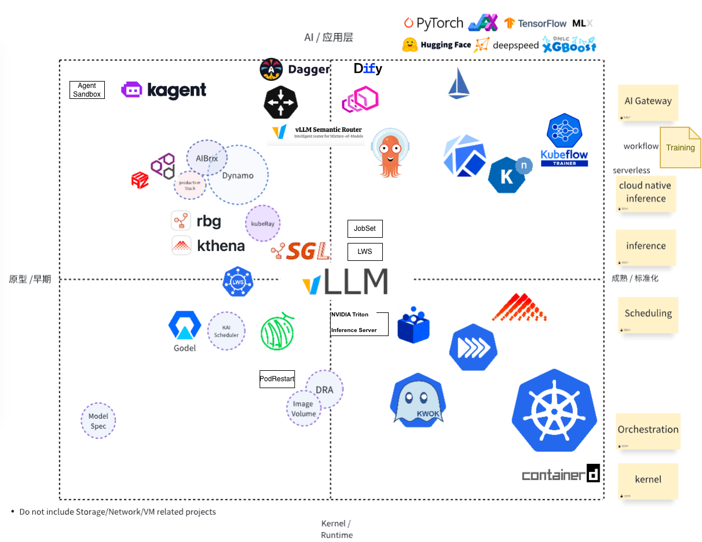

# AI-Infra Landscape & Learning Path 🚀

Welcome to the **AI-Infra** repository! This project provides a curated landscape and structured learning path for engineers building and operating modern **AI infrastructure**, especially in the Kubernetes and cloud-native ecosystem.

## 🌐 Overview

This landscape visualizes key components across the AI Infrastructure stack, mapped by:

- **Horizontal Axis (X):**
  - Left: Prototype / Early-stage projects
  - Right: Kernel & Runtime maturity

- **Vertical Axis (Y):**
  - Bottom: Infrastructure Layer (Kernel/Runtime)
  - Top: Application Layer (AI/Inference)

The goal is to demystify the evolving AI Infra stack and guide engineers on where to focus their learning.

## 📊 AI-Infra Landscape (2025 June, needs an update)

**Legend:**

> - Dashed outlines = Early stage or under exploration
> - Labels on right = Functional categories

## 🧭 Learning Path for AI Infra Engineers

### 📦 0. Kernel & Runtime (底层内核)

Core Kubernetes components and container runtime fundamentals. Skip this
section if using managed Kubernetes services.

- **Key Components:**
  - **Core**: Kubernetes, CRI, containerd, KubeVirt
  - **Networking**: CNI (focus: RDMA, specialized devices)
  - **Storage**: CSI (focus: checkpointing, model caching, data management)
  - **Tools**: KWOK (GPU node mocking), Helm (package management)

- **Learning Topics:**
  - Container lifecycle & runtime internals
  - Kubernetes scheduler architecture
  - Resource allocation & GPU management
  - For detailed guides, see [Kubernetes Guide](./docs/kubernetes/README.md)

---

### 📍 1. Scheduling & Workloads (调度与工作负载)

Advanced scheduling, workload orchestration, and device management for AI
workloads in Kubernetes clusters.

- **Key Areas:**
  - **Batch Scheduling**: Kueue, Volcano, koordinator, Godel, YuniKorn
    ([Kubernetes WG Batch](https://github.com/kubernetes/community/blob/master/wg-batch/README.md))
  - **GPU Scheduling**: HAMI, NVIDIA Kai Scheduler, NVIDIA Grove
  - **Workload Management**: LWS (LeaderWorkset), Pod Groups, Gang Scheduling
  - **Device Management**: DRA, NRI
    ([Kubernetes WG Device Management](https://github.com/kubernetes/community/blob/master/wg-device-management/README.md))
  - **Checkpoint/Restore**: GPU checkpoint/restore for fault tolerance and
    migration (NVIDIA cuda-checkpoint, AMD AMDGPU plugin via CRIU)

- **Learning Topics:**
  - Job vs. pod scheduling strategies (binpack, spread, DRF)
  - Queue management & SLOs
  - Multi-model & multi-tenant scheduling

**See [Kubernetes Guide](./docs/kubernetes/README.md)** for comprehensive coverage
of pod lifecycle, scheduling optimization, workload isolation, and resource
management. Detailed guides:
[Kubernetes Learning Plan](./docs/kubernetes/learning-plan.md) |
[Pod Lifecycle](./docs/kubernetes/pod-lifecycle.md) |
[Pod Startup Speed](./docs/kubernetes/pod-startup-speed.md) |
[Scheduling Optimization](./docs/kubernetes/scheduling-optimization.md) |
[Isolation](./docs/kubernetes/isolation.md) |
[DRA](./docs/kubernetes/dra.md) |
[NRI](./docs/kubernetes/nri.md)

- **RoadMap:**
  - Gang Scheduling in Kubernetes [#4671](https://github.com/kubernetes/enhancements/pull/4671)
  - LWS Gang Scheduling [KEP-407](https://github.com/kubernetes-sigs/lws/blob/main/keps/407-gang-scheduling/README.md)

---

### 🧠 2. Model Inference & Runtime Optimization (推理优化)

LLM inference engines, platforms, and optimization techniques for efficient
model serving at scale.

- **Key Topics:**
  - Efficient transformer inference (KV Cache, FlashAttention, CUDA Graphs)
  - LLM serving and orchestration platforms
  - Multi-accelerator optimization
  - MoE (Mixture of Experts) architectures
  - Model lifecycle management (cold-start, sleep mode, offloading)
  - AI agent memory and context management

- **RoadMap:**
  - [Serving WG](https://github.com/kubernetes/community/blob/master/wg-serving/README.md)

**See [Inference Guide](./docs/inference/README.md)** for comprehensive coverage of
engines (vLLM, SGLang, Triton, TGI), platforms (Dynamo, AIBrix, OME, llmaz,
Kthena, KServe), and deep-dive topics:
[AIBrix](./docs/inference/aibrix.md) |
[P/D Disaggregation](./docs/inference/pd-disaggregation.md) |
[Caching](./docs/inference/caching.md) |
[Memory/Context DB](./docs/inference/memory-context-db.md) |
[MoE Models](./docs/inference/large-scale-experts.md) |
[Model Lifecycle](./docs/inference/model-lifecycle.md)

---

### 🧩 3. AI Gateway & Agentic Workflow

- **Projects to Learn:**
  - AI Gateway:
    - [`Gateway API Inference Extension`](https://github.com/kubernetes-sigs/gateway-api-inference-extension)
    - [`Envoy AI Gateway`](https://github.com/envoyproxy/ai-gateway)
    - [`Istio`](https://github.com/istio/istio)
    - [`KGateway`](https://github.com/kgateway-dev/kgateway): previously known as Gloo.
    - [`DaoCloud knoway`](https://github.com/knoway-dev/knoway)
    - [`Higress`](https://github.com/alibaba/higress): Alibaba
    - [`Kong`](https://github.com/Kong/kong)
    - [`Semantic Router`](https://github.com/vllm-project/semantic-router): vLLM Project
  - Agentic Workflow:
    - [`Dify`](https://github.com/langgenius/dify)
    - [`KAgent`](https://github.com/kagent-dev/kagent): CNCF Sandbox
    - [`Dagger`](https://github.com/dagger/dagger)
  - Serverless:
    - [`Knative`](https://github.com/knative/serving): Serverless solution

- **Learning Topics:**
  - API orchestration for LLMs
  - Prompt routing and A/B testing
  - RAG workflows, vector DB integration

---

### 🎯 4. Training on Kubernetes

Distributed training of large AI models on Kubernetes with fault tolerance,
gang scheduling, and efficient resource management.

- **Key Topics:**
  - Distributed training strategies (data/model/pipeline parallelism)
  - Gang scheduling and job queueing
  - Fault tolerance and checkpointing
  - GPU error detection and recovery
  - Training efficiency metrics (ETTR, MFU)
  - GitOps workflows for training management
  - Storage optimization for checkpoints

**See [Training Guide](./docs/training/README.md)** for comprehensive coverage of
training operators (Kubeflow, Volcano, Kueue), ML platforms (Kubeflow
Pipelines, Argo Workflows), GitOps (ArgoCD), fault tolerance strategies,
ByteDance's training optimization framework, and industry best practices.
Detailed guides: [Parallelism Strategies](./docs/training/parallelism.md) |
[Kubeflow](./docs/training/kubeflow.md) | [ArgoCD](./docs/training/argocd.md)

---

### 5. Ecosystem Initiatives

- **Projects to Learn:**
  - [`Model Spec`](https://github.com/modelpack/model-spec): CNCF Sandbox
  - [`ImageVolume`]( https://github.com/kubernetes/enhancements/tree/master/keps/sig-node/4639-oci-volume-source)

---

## 🗺️ RoadMap

For planned features, upcoming topics, and discussion on what may or may not be
included in this repository, please see the [RoadMap](./RoadMap.md).

## 🤝 Contributing

We welcome contributions to improve this landscape and path! Whether it's a new project, learning material, or diagram update — please open a PR or issue.

## 📚 References

- [CNCF Landscape](https://landscape.cncf.io/)
- [Awesome LLMOps](https://awesome-llmops.inftyai.com/)
- [CNCF TAG Workloads Foundation](https://github.com/cncf/toc/blob/main/tags/tag-workloads-foundation/README.md)
- [CNCF TAG Infrastructure](https://github.com/cncf/toc/blob/main/tags/tag-infrastructure/README.md)
- [CNCF AI Initiative](https://github.com/cncf/toc/issues?q=is%3Aissue%20state%3Aopen%20label%3Akind%2Finitiative)
- Kubernetes [WG AI Gateway](https://github.com/kubernetes/community/blob/master/wg-ai-gateway/README.md)
- Kubernetes [WG AI Conformance](https://github.com/kubernetes/community/blob/master/wg-ai-conformance/README.md)
- Kubernetes [WG AI Integration](https://github.com/kubernetes/community/blob/master/wg-ai-integration/README.md)

If you have some resources about AI Infra, please share them in [#8](https://github.com/pacoxu/AI-Infra/issues/8).

### [Conferences](https://github.com/pacoxu/developers-conferences-agenda)

Here are some key conferences in the AI Infra space:

- AI_dev: for instance, [AI_dev EU 2025](https://aideveu2025.sched.com/)
- [PyTorch Conference](https://pytorch.org/pytorchcon/) by PyTorch Foundation
- KubeCon+CloudNativeCon AI+ML Track, for instance, [KubeCon NA 2025](https://events.linuxfoundation.org/kubecon-cloudnativecon-north-america/program/schedule-at-a-glance/) and co-located events [Cloud Native + Kubernetes AI Day](https://events.linuxfoundation.org/kubecon-cloudnativecon-north-america/co-located-events/cloud-native-kubernetes-ai-day/)
- AICon in China by QCon.
- GOSIM(Global Open-Source Innovation Meetup): for instance, [GOSIM Hangzhou 2025](https://hangzhou2025.gosim.org/)

## 📜 License

Apache License 2.0.

---

_This repo is inspired by the rapidly evolving AI Infra stack and aims to help engineers navigate and master it._

