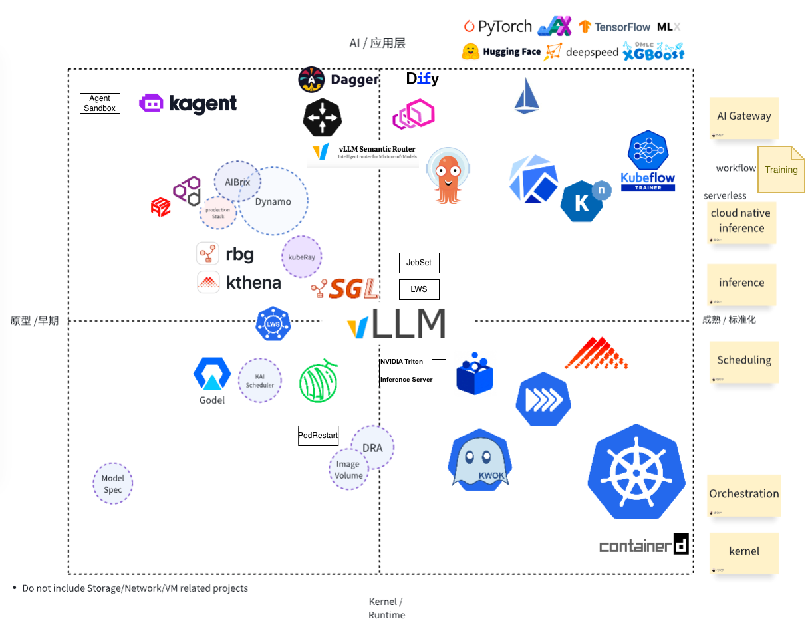

# AI-Infra 全景图与学习路径 🚀

中文版 | [English](./README.md)

欢迎来到 **AI-Infra** 仓库！本项目为工程师提供了精心策划的全景图和结构化学习路径，
帮助您在 Kubernetes 和云原生生态系统中构建和运营现代 **AI 基础设施**。

## 🌐 概述

本全景图可视化了 AI 基础设施栈的关键组件，映射方式如下：

- **横轴 (X):**
  - 左侧: 原型 / 早期阶段项目
  - 右侧: 内核与运行时成熟度

- **纵轴 (Y):**
  - 底部: 基础设施层（内核/运行时）
  - 顶部: 应用层（AI/推理）

我们的目标是揭开不断发展的 AI 基础设施栈的神秘面纱，
引导工程师关注学习的重点。

## 📑 目录

- [AI-Infra 全景图](#-ai-infra-全景图-2025年6月需要更新)
- [AI 基础设施工程师学习路径](#-ai-基础设施工程师学习路径)
  - [0. 内核与运行时](#-0-内核与运行时底层内核)
  - [1. 调度与工作负载](#-1-调度与工作负载调度与工作负载)
  - [2. 模型推理与运行时优化](#-2-模型推理与运行时优化推理优化)
  - [3. AI 网关与智能体工作流](#-3-ai-网关与智能体工作流)
  - [4. Kubernetes 上的训练](#-4-kubernetes-上的训练)
  - [5. AI 工作负载的可观测性](#-5-ai-工作负载的可观测性)
  - [6. 生态系统倡议](#6-生态系统倡议)
- [路线图](#️-路线图)
- [贡献](#-贡献)
- [参考资料](#-参考资料)
- [会议](#会议)
- [许可证](#-许可证)

### 📂 文档文件

#### Kubernetes

- [Kubernetes 概述](./docs/kubernetes/README.md)
- [Kubernetes 学习计划](./docs/kubernetes/learning-plan.md)
- [Pod 生命周期](./docs/kubernetes/pod-lifecycle.md)
- [Pod 启动速度](./docs/kubernetes/pod-startup-speed.md)
- [GPU Pod 冷启动](./docs/kubernetes/gpu-pod-cold-start.md)
- [调度优化](./docs/kubernetes/scheduling-optimization.md)
- [工作负载隔离](./docs/kubernetes/isolation.md)
- [动态资源分配 (DRA)](./docs/kubernetes/dra.md)
- [DRA 性能测试](./docs/kubernetes/dra-performance-testing.md)
- [NVIDIA GPU Operator](./docs/kubernetes/nvidia-gpu-operator.md)
- [NVIDIA AI 集群运行时 (AICR)](./docs/kubernetes/nvidia-aicr.md)
- [GPU 故障检测与自愈](./docs/kubernetes/gpu-fault-detection.md)
- [节点资源接口 (NRI)](./docs/kubernetes/nri.md)
- [大规模集群 (130K+ 节点)](./docs/kubernetes/large-scale-clusters.md)

#### 推理

- [推理概述](./docs/inference/README.md)
- [模型架构](./docs/inference/model-architectures.md)
- [LoRA: 低秩适应](./docs/inference/lora.md)
- [AIBrix 平台](./docs/inference/aibrix.md)
- [OME 平台](./docs/inference/ome.md)
- [无服务器 AI 推理](./docs/inference/serverless.md)
- [模型切换与动态调度](./docs/inference/model-switching.md)
- [预填充-解码分离](./docs/inference/pd-disaggregation.md)
- [缓存策略](./docs/inference/caching.md)
- [内存与上下文数据库](./docs/inference/memory-context-db.md)
- [大规模 MoE 模型](./docs/inference/large-scale-experts.md)
- [模型生命周期管理](./docs/inference/model-lifecycle.md)
- [性能测试](./docs/inference/performance-testing.md)

#### 训练

- [训练概述](./docs/training/README.md)
- [Transformers](./docs/training/transformers.md)
- [PyTorch 生态系统](./docs/training/pytorch-ecosystem.md)
- [预训练](./docs/training/pre-training.md)
- [并行策略](./docs/training/parallelism.md)
- [Kubeflow 训练](./docs/training/kubeflow.md)
- [ArgoCD GitOps](./docs/training/argocd.md)

#### 可观测性

- [可观测性概述](./docs/observability/README.md)

#### AI 智能体

- [AI 智能体平台与框架](./docs/agents/README.md)

#### 博客

- [博客概述](./docs/blog/README.md)
- [【2020】拜耳作物科学以 15,000 节点的 GKE 集群为未来播种](./docs/blog/2026-03-13/bayer-gke-15000-nodes_zh.md)
- [贡献开源的 ROI：LF Research 2025 年调查报告解读](./docs/blog/2026-02-25/opensource-contribution-roi_zh.md)
- [GPU 故障检测与自愈](./docs/blog/2025-12-17/gpu-fault-detection_zh.md)
- [AI Infra 时代的多租户隔离性方案探讨](./docs/blog/2025-12-15/multi-tenancy-isolation_zh.md)
  | [English](./docs/blog/2025-12-15/multi-tenancy-isolation.md)
- [KCD 杭州：大规模可观测性](./docs/blog/2025-12-02/kcd-hangzhou-observability_zh.md)
  | [English](./docs/blog/2025-12-02/kcd-hangzhou-observability.md)
- [Kubernetes 安全升级与回滚](./docs/blog/2025-12-01/safe-upgrade-rollback_zh.md)
  | [English](./docs/blog/2025-12-01/safe-upgrade-rollback.md)
- [JobSet 原地重启：速度提升 92%](./docs/blog/2025-11-26/jobset-in-place-restart_zh.md)
  | [English](./docs/blog/2025-11-26/jobset-in-place-restart.md)
- [cgroup v2 迁移指南](./docs/blog/2025-11-26/cgroup-v2_zh.md)
  | [English](./docs/blog/2025-11-26/cgroup-v2.md)
- [Kubernetes v1.35 中的 Gang Scheduling](./docs/blog/2025-11-25/gang-scheduling_zh.md)
  | [English](./docs/blog/2025-11-25/gang-scheduling.md)
- [AWS 10K 节点 EKS 超大规模集群](./docs/blog/2025-12-01/aws-10k-node-clusters_zh.md)
  | [English](./docs/blog/2025-12-01/aws-10k-node-clusters.md)
- [推理编排解决方案](./docs/blog/2025-12-01/inference-orchestration_zh.md)
  | [English](./docs/blog/2025-12-01/inference-orchestration.md)

## 📊 AI-Infra 全景图 (2025年6月，需要更新)

**图例:**

> - 虚线轮廓 = 早期阶段或正在探索中
> - 右侧标签 = 功能类别

## 🎯 云原生 AI 架构师目标达成图

灵感来自大谷翔平的目标达成方法论，此图表概述了成为成功的云原生 AI
基础设施架构师的关键实践和习惯。该图表围绕九大核心支柱组织：
**Kubernetes 核心功力**、**AI 工作负载 & GPU**、**AI 平台架构**、
**行业影响力**、**架构视野**、**技术领导力**、**自我管理**、**家庭陪伴**
和 **长期主义**。

|  |  |  | |  | | | | |
| --- | --- | --- | --- | --- | --- | --- | --- | --- |
| Agent Sandbox | 新子项目更新了解 | DRA + NRI | GPU CUDA | 预留和回填 | 模型切换 | 推理编排 | 训练故障恢复 | 考虑多租户隔离方案 |
| API Server & ETCD & DRA 性能 | **Kubernetes 核心功力(KEPs & Coding)** | 安全升级 | KV-cache / Prefill-Decode 归纳 | **AI 工作负载 & GPU** | 冷启动/预热池 | Cluster AutoScaler | **AI 平台架构** | 拓扑管理 |
| Node/GPU 自愈能力探索 | Steering | kubeadm | 关注新模型与算子趋势 | LPU/TPU/NPU 等 | 加速方案矩阵 | Co-Evolving | 公有云私有云差异 | 可观测性 |
| AI-Infra Repo 路线图维护 | 顶会 Talk 2–3 场/年 | 每月发表一篇技术长文 | **Kubernetes 核心功力** | **AI 工作负载 & GPU** | **AI 平台架构** | 成本多维度评估 | 性能量化/优化 | SLA 稳定性 |
| 英文能力（Blog） | **行业影响力** | 一致性认证 | **行业影响力** | **Cloud Native AI Infra on Kubernetes Lead** | **架构视野** | 多集群方案 | **架构视野** | 超大规模 |
| 新贡献者引导 | CNCF Ambassador | | **技术领导力** | **自我管理** | **家庭陪伴** | 思考 3 年演进路线图 | Agentic / 模型生态趋势 | 与外部行业领导者保持沟通 |
| 推动跨公司协作任务 | 学会温和但清晰地反对 | 跨部门影响力提升 | 保证 7–8 小时睡眠 | 每周 3 次运动保持体能 | 季度 OKR/月度复盘/Top 5 Things | 每天女儿 1h 陪伴 | 每月夫妻一次约会/长谈 | 支持老婆个人时间/兴趣 |
| Mentor 核心贡献者梯队建设 | **技术领导力** | 长期主义 | 控制信息输入与刷屏时间 | **自我管理** | 长假防 burn-out | 节日/纪念日提前规划 | **家庭陪伴** | 女儿成长记录 / 季度回顾 |
| 跨项目依赖治理，架构协同 | Governance | TOC | 读书 + 知识库积累 | 减少含糖饮料 | 像高效 Agent 一样工作 | 季度家庭旅行预算(10%) & 计划 | 预留家庭与休息时间 | 每年1次全家活动（含父母） |

## 🧭 AI 基础设施工程师学习路径

### 📦 0. 内核与运行时（底层内核）

核心 Kubernetes 组件和容器运行时基础知识。如果使用托管的 Kubernetes 服务，
可以跳过此部分。

- **关键组件:**
  - **核心**: Kubernetes, CRI, containerd, KubeVirt
  - **网络**: CNI（重点：RDMA，专用设备）
  - **存储**: CSI（重点：检查点、模型缓存、数据管理）
  - **工具**: KWOK（GPU 节点模拟）, Helm（包管理）

- **学习主题:**
  - 容器生命周期与运行时内部机制
  - Kubernetes 调度器架构
  - 资源分配与 GPU 管理
  - 详细指南请参见 [Kubernetes 指南](./docs/kubernetes/README.md)

---

### 📍 1. 调度与工作负载（调度与工作负载）

Kubernetes 集群中 AI 工作负载的高级调度、工作负载编排和设备管理。

- **关键领域:**
  - **批处理调度**: Kueue, Volcano, koordinator, Godel, YuniKorn
    ([Kubernetes WG Batch](https://github.com/kubernetes/community/blob/master/wg-batch/README.md))
  - **GPU 调度**: HAMI, NVIDIA Kai Scheduler, NVIDIA Grove
  - **GPU 管理**: NVIDIA GPU Operator, NVIDIA DRA Driver, Device Plugins,
    NVIDIA AICR
  - **工作负载管理**: LWS (LeaderWorkset), Pod Groups, Gang Scheduling
  - **设备管理**: DRA, NRI
    ([Kubernetes WG Device Management](https://github.com/kubernetes/community/blob/master/wg-device-management/README.md))
  - **检查点/恢复**: GPU 检查点/恢复用于容错和迁移（NVIDIA cuda-checkpoint,
    AMD AMDGPU plugin via CRIU）

- **学习主题:**
  - Job 与 pod 调度策略（binpack, spread, DRF）
  - 队列管理与 SLO
  - 多模型与多租户调度

**详细内容请参见 [Kubernetes 指南](./docs/kubernetes/README.md)**，
包含 Pod 生命周期、调度优化、工作负载隔离和资源管理的全面介绍。详细指南：
[Kubernetes 学习计划](./docs/kubernetes/learning-plan.md) |
[Pod 生命周期](./docs/kubernetes/pod-lifecycle.md) |
[Pod 启动速度](./docs/kubernetes/pod-startup-speed.md) |
[调度优化](./docs/kubernetes/scheduling-optimization.md) |
[隔离](./docs/kubernetes/isolation.md) |
[DRA](./docs/kubernetes/dra.md) |
[DRA 性能测试](./docs/kubernetes/dra-performance-testing.md) |
[NVIDIA GPU Operator](./docs/kubernetes/nvidia-gpu-operator.md) |
[NVIDIA AICR](./docs/kubernetes/nvidia-aicr.md) |
[NRI](./docs/kubernetes/nri.md)

- **路线图:**
  - Kubernetes 中的 Gang 调度 [#4671](https://github.com/kubernetes/enhancements/pull/4671)
  - LWS Gang 调度 [KEP-407](https://github.com/kubernetes-sigs/lws/blob/main/keps/407-gang-scheduling/README.md)

---

### 🧠 2. 模型推理与运行时优化（推理优化）

LLM 推理引擎、平台和优化技术，用于大规模高效模型服务。

- **关键主题:**
  - 模型架构（Llama 3/4, Qwen 3, DeepSeek-V3, Flux）
  - 高效 Transformer 推理（KV Cache, FlashAttention, CUDA Graphs）
  - LLM 服务和编排平台
  - 无服务器 AI 推理（Knative, AWS SageMaker, 云平台）
  - 多加速器优化
  - MoE（专家混合）架构
  - 模型生命周期管理（冷启动、休眠模式、卸载）
  - AI 智能体内存和上下文管理
  - 性能测试和基准测试

- **路线图:**
  - [Serving WG](https://github.com/kubernetes/community/blob/master/wg-serving/README.md)

**详细内容请参见 [推理指南](./docs/inference/README.md)**，
包含引擎（vLLM, SGLang, Triton, TGI）、平台（Dynamo, AIBrix, OME,
Kthena, KServe）、无服务器解决方案（Knative, AWS SageMaker）的全面介绍，以及深入主题：
[模型架构](./docs/inference/model-architectures.md) |
[AIBrix](./docs/inference/aibrix.md) |
[无服务器](./docs/inference/serverless.md) |
[P/D 分离](./docs/inference/pd-disaggregation.md) |
[缓存](./docs/inference/caching.md) |
[内存/上下文数据库](./docs/inference/memory-context-db.md) |
[MoE 模型](./docs/inference/large-scale-experts.md) |
[模型生命周期](./docs/inference/model-lifecycle.md) |
[性能测试](./docs/inference/performance-testing.md)

---

### 🧩 3. AI 网关与智能体工作流

AI 网关为 LLM API 提供路由、负载均衡和管理，
而智能体工作流平台使构建能够感知、推理和行动的自主 AI 系统成为可能。

- **学习项目:**
  - AI 网关:
    - [`Gateway API Inference Extension`](https://github.com/kubernetes-sigs/gateway-api-inference-extension)
    - [`Envoy AI Gateway`](https://github.com/envoyproxy/ai-gateway)
    - [`Istio`](https://github.com/istio/istio)
    - [`KGateway`](https://github.com/kgateway-dev/kgateway): 前称 Gloo
    - [`DaoCloud knoway`](https://github.com/knoway-dev/knoway)
    - [`Higress`](https://github.com/alibaba/higress): 阿里巴巴
    - [`Kong`](https://github.com/Kong/kong)
    - [`Semantic Router`](https://github.com/vllm-project/semantic-router): vLLM 项目
  - 原生智能体套件:
    - **火山引擎原生 AI 智能体套件** (字节跳动): 全面的平台，支持 MCP、
      弹性扩缩容、内存管理和全链路可观测性
  - Kubernetes 原生智能体平台:
    - [`KAgent`](https://github.com/kagent-dev/kagent): CNCF Sandbox - K8s 原生
      智能体编排
    - [`Volcano AgentCube`](https://github.com/volcano-sh/agentcube): Volcano
      生态系统中的智能体编排
    - [`Kubernetes SIG Agent Sandbox`](https://github.com/kubernetes-sigs/agent-sandbox):
      AI 智能体的安全沙箱
    - [`Agent Infra Sandbox`](https://github.com/agent-infra/sandbox): 社区
      沙箱基础设施
    - [`OpenKruise Agents`](https://github.com/openkruise/agents): 应用
      生命周期智能体操作
  - 智能体开发框架:
    - [`Dify`](https://github.com/langgenius/dify): 智能体应用的 LLMOps 平台
    - [`AgentScope`](https://github.com/agentscope-ai/agentscope): 多智能体
      开发框架
    - [`Dapr Agents`](https://github.com/dapr/dapr-agents): 使用 Dapr 的
      云原生智能体原语
    - [`Coze Studio`](https://github.com/coze-dev/coze-studio): 可视化
      智能体设计环境
    - [`Open-AutoGLM`](https://github.com/zai-org/Open-AutoGLM): 自主
      智能体框架
    - [`Spring AI Alibaba`](https://github.com/alibaba/spring-ai-alibaba):
      Spring Boot 智能体集成
    - [`Google ADK-Go`](https://github.com/google/adk-go): Go 原生智能体
      开发工具包
    - [`Dagger`](https://github.com/dagger/dagger): 智能体的可编程 CI/CD
  - 智能体基础设施:
    - [`kube-agentic-networking`](https://github.com/kubernetes-sigs/kube-agentic-networking):
      Kubernetes 中智能体和工具的网络策略与治理
    - **模型上下文协议 (MCP)**: 智能体间通信标准 (CNCF Tech Radar 2025: Adopt)
    - **Agent2Agent (A2A)**: 直接智能体通信模式
    - **ACP (智能体通信协议)**: 多智能体通信标准
  - 无服务器:
    - [`Knative`](https://github.com/knative/serving): 无服务器解决方案，
      如 [llama stack 用例](https://github.com/knative/docs/blob/071fc774faa343ea996713a8750d78fc9225356c/docs/blog/articles/ai_functions_llama_stack.md)

- **学习主题:**
  - LLM 的 API 编排
  - 提示词路由和 A/B 测试
  - RAG 工作流、向量数据库集成
  - 智能体架构模式（感知、推理、行动、记忆）
  - 多智能体协作与通信
  - 智能体安全与沙箱
  - MCP 和智能体协议标准
  - 智能体可观测性与监控

- **社区倡议:**
  - [CNCF 智能体系统倡议](https://github.com/cncf/toc/issues/1746)
  - [WG AI Integration](https://github.com/kubernetes/community/blob/master/wg-ai-integration/charter.md)
  - [CNCF Tech Radar 2025](https://radar.cncf.io/) - 智能体 AI 平台部分

**参见 [AI 智能体平台指南](./docs/agents/README.md)**，全面了解智能体平台、
框架、MCP 协议、智能体基础设施组件，以及在 Kubernetes 上构建和部署
AI 智能体的详细学习路径。

---

### 🎯 4. Kubernetes 上的训练

在 Kubernetes 上进行大型 AI 模型的分布式训练，包含容错、Gang 调度和高效资源管理。

- **关键主题:**
  - **Transformers: 在 PyTorch 生态系统中标准化模型定义**
  - PyTorch 生态系统和加速器集成（DeepSpeed, vLLM, NPU/HPU/XPU）
  - 分布式训练策略（数据/模型/流水线并行）
  - Gang 调度和作业队列
  - 容错和检查点
  - GPU 错误检测和恢复
  - 训练效率指标（ETTR, MFU）
  - 训练管理的 GitOps 工作流
  - 检查点的存储优化
  - **预训练大型语言模型（MoE, DeepseekV3, Llama4）**
  - **扩展实验和集群设置（AMD MI325）**

**详细内容请参见 [训练指南](./docs/training/README.md)**，
包含训练算子（Kubeflow, Volcano, Kueue）、ML 平台（Kubeflow Pipelines,
Argo Workflows）、GitOps（ArgoCD）、容错策略、字节跳动的训练优化框架以及行业最佳实践的全面介绍。
详细指南：[Transformers](./docs/training/transformers.md) |
[PyTorch 生态系统](./docs/training/pytorch-ecosystem.md) |
[预训练](./docs/training/pre-training.md) |
[并行策略](./docs/training/parallelism.md) |
[Kubeflow](./docs/training/kubeflow.md) | [ArgoCD](./docs/training/argocd.md)

---

### 🔍 5. AI 工作负载的可观测性

跨 AI 基础设施栈的全面监控、指标和可观测性，用于生产运营。

- **关键主题:**
  - **基础设施监控**: GPU 利用率、内存、温度、功率
  - **GPU 故障检测**: XID 错误、显卡掉线、链路故障、自动恢复
  - **推理指标**: TTFT, TPOT, ITL, 吞吐量, 请求延迟
  - **调度器可观测性**: 队列深度、调度延迟、资源分配
  - **LLM 应用追踪**: 请求追踪、提示词性能、模型质量
  - **成本优化**: 资源利用率分析和合理配置
  - **多租户监控**: 每租户指标和公平共享执行

**详细内容请参见 [可观测性指南](./docs/observability/README.md)**，
包含 GPU 监控（DCGM, Prometheus）、推理指标（OpenLLMetry, Langfuse,
OpenLit）、调度器可观测性（Kueue, Volcano）、分布式追踪（DeepFlow）和
LLM 评估平台（TruLens, Deepchecks）的全面介绍。

关于 GPU 故障检测与自愈，请参见
[GPU 故障检测指南](./docs/kubernetes/gpu-fault-detection.md)。

- **特色工具:**
  - OpenTelemetry 原生: <a href="https://github.com/openlit/openlit">`OpenLit`</a>,
    <a href="https://github.com/traceloop/openllmetry">`OpenLLMetry`</a>
  - LLM 平台: <a href="https://github.com/langfuse/langfuse">`Langfuse`</a>,
    <a href="https://github.com/truera/trulens">`TruLens`</a>
  - 模型验证: <a href="https://github.com/deepchecks/deepchecks">`Deepchecks`</a>
  - 网络追踪: <a href="https://github.com/deepflowio/deepflow">`DeepFlow`</a>
  - 基础设施: <a href="https://github.com/okahu">`Okahu`</a>

---

### 6. 生态系统倡议

- **学习项目:**
  - [`Model Spec`](https://github.com/modelpack/model-spec): CNCF Sandbox
  - [`ImageVolume`](https://github.com/kubernetes/enhancements/tree/master/keps/sig-node/4639-oci-volume-source)

---

## 🗺️ 路线图

有关计划功能、即将推出的主题以及关于此仓库可能包含或不包含内容的讨论，
请参见 [路线图](./RoadMap.md)。

路线图现已更新，重点关注 **AI Native 时代**（2025-2035）的核心挑战，包括：

- AI Native 平台：Model/Agent 一等公民，统一抽象与治理
- 资源调度：DRA、异构算力、拓扑感知、功耗与成本优化
- 运行时：容器 + WASM + Nix + Agent Runtime
- 平台工程 2.0：IDP + AI SRE + 安全 + 成本 + 合规
- 安全与供应链：LLM 依赖、模型权重、数据集的全链路治理
- 开源与生态：AI Infra / Model Runtime / Agent Runtime 上游协作

## 🤝 贡献

我们欢迎对此全景图和路径的改进贡献！无论是新项目、学习材料还是图表更新，
请开启 PR 或 issue。

## 📚 参考资料

- [CNCF 全景图](https://landscape.cncf.io/)
- [Awesome LLMOps](https://awesome-llmops.inftyai.com/)
- [CNCF TAG Workloads Foundation](https://github.com/cncf/toc/blob/main/tags/tag-workloads-foundation/README.md)
- [CNCF TAG Infrastructure](https://github.com/cncf/toc/blob/main/tags/tag-infrastructure/README.md)
- [CNCF AI Initiative](https://github.com/cncf/toc/issues?q=is%3Aissue%20state%3Aopen%20label%3Akind%2Finitiative)
- Kubernetes [WG AI Gateway](https://github.com/kubernetes/community/blob/master/wg-ai-gateway/README.md)
- Kubernetes [WG AI Conformance](https://github.com/kubernetes/community/blob/master/wg-ai-conformance/README.md)
- Kubernetes [WG AI Integration](https://github.com/kubernetes/community/blob/master/wg-ai-integration/README.md)
- [CNCF 智能体系统倡议](https://github.com/cncf/toc/issues/1746)
- [CNCF Tech Radar 2025](https://radar.cncf.io/) - 智能体 AI 平台

如果您有关于 AI 基础设施的资源，请在 [#8](https://github.com/pacoxu/AI-Infra/issues/8) 中分享。

关于 AI 智能体项目和进展，请参见 [#30](https://github.com/pacoxu/AI-Infra/issues/30)。

### [会议](https://github.com/pacoxu/developers-conferences-agenda)

以下是 AI 基础设施领域的一些重要会议：

- AI_dev: 例如，[AI_dev EU 2025](https://aideveu2025.sched.com/)
- [PyTorch Conference](https://pytorch.org/pytorchcon/) by PyTorch Foundation
- KubeCon+CloudNativeCon AI+ML Track，
  例如，[KubeCon NA 2025](https://events.linuxfoundation.org/kubecon-cloudnativecon-north-america/program/schedule-at-a-glance/)
  和共同举办的活动 [Cloud Native + Kubernetes AI Day](https://events.linuxfoundation.org/kubecon-cloudnativecon-north-america/co-located-events/cloud-native-kubernetes-ai-day/)
- AICon in China by QCon
- GOSIM(全球开源创新峰会): 例如，[GOSIM Hangzhou 2025](https://hangzhou2025.gosim.org/)

## 📜 许可证

Apache License 2.0.

---

_本仓库受快速发展的 AI 基础设施栈启发，旨在帮助工程师驾驭和掌握它。_
