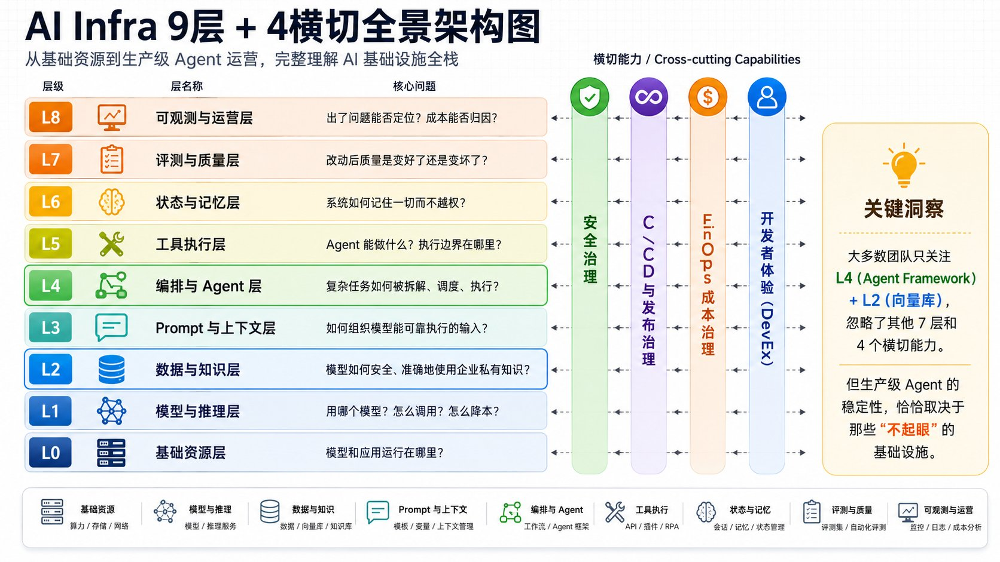

# AI Infra 全景图：Agent Framework、调度、编排、沙箱、记忆管理、Tracing 分层拆解

这篇文档补充的是 **生产级 AI Agent Infra 的分层架构视角**。

仓库当前主全景图偏向 Cloud Native AI Infra 项目生态：Kubernetes、调度、
推理、训练、可观测、安全隔离等组件分别处在什么位置。下面这张图补的是另一条
视角：当一个 Agent 真正进入生产环境时，请求会穿过哪些层，每层要回答什么问题，
以及安全、发布、成本、开发者体验如何横向贯穿全链路。



图源：[anata_404 on X](https://x.com/anata_404/status/2075046551563727126/photo/1)。
本文基于该图的“9 层 + 4 横切能力”视角，结合本仓库已有 Kubernetes、推理、
Agent Sandbox、记忆管理和可观测性内容整理。

核心判断：大多数团队会优先投入 **L4 Agent Framework** 和 **L2 向量库 /
知识库**，但生产级 Agent 的稳定性通常取决于其他层，包括模型网关、上下文管理、
工具执行边界、状态记忆、评测门禁、Tracing、成本归因和安全治理。

## 9 层 + 4 横切能力

| 层级 | 名称 | 核心问题 | 仓库对应方向 |
| ---- | ---- | -------- | ------------ |
| L0 | 基础资源层 | 模型和应用运行在哪里？ | Kubernetes、运行时、存储、网络 |
| L1 | 模型与推理层 | 用哪个模型？怎么调用？怎么降本？ | 推理引擎、AI Gateway、模型生命周期 |
| L2 | 数据与知识层 | 模型如何安全、准确地使用企业私有知识？ | RAG、向量库、知识库、权限继承 |
| L3 | Prompt 与上下文层 | 如何组织模型能可靠执行的输入？ | PromptOps、上下文工程、Token Budget |
| L4 | 编排与 Agent 层 | 复杂任务如何被拆解、调度、执行？ | Agent Framework、Workflow Engine |
| L5 | 工具执行层 | Agent 能做什么？执行边界在哪里？ | MCP、API Connector、沙箱、浏览器自动化 |
| L6 | 状态与记忆层 | 系统如何记住一切而不越权？ | 短期记忆、长期记忆、Checkpoint |
| L7 | 评测与质量层 | 改动后质量是变好了还是变坏了？ | Eval、Golden Set、发布门禁 |
| L8 | 可观测与运营层 | 出了问题能否定位？成本能否归因？ | Tracing、Metrics、Logs、SRE |

横切能力贯穿所有层：

- **安全治理**：身份、权限、租户隔离、Prompt Injection 防护、DLP、审计、
  模型供应链安全。
- **CI/CD 与发布治理**：代码、Prompt、模型、RAG 索引、工具 Schema、Workflow
  都要可版本化、可灰度、可回滚。
- **FinOps 成本治理**：Token、GPU、向量检索、Embedding、Rerank、日志留存、
  存储和带宽都要能归因到应用、租户、用户和任务。
- **开发者体验 DevEx**：Playground、Trace 回放、Prompt 调试、RAG 调试、
  Eval 看板、SDK/CLI、模板工程。

## L0：基础资源层

L0 是所有 AI 系统的物理和云原生底座，回答“模型和 AI 应用运行在哪里”。

关键组件：

| 类别 | 能力 | 常见选择 |
| ---- | ---- | -------- |
| 计算 | GPU / TPU / NPU / CPU | NVIDIA GPU、Google TPU、云厂商加速器 |
| 编排 | 容器与任务调度 | Kubernetes、Ray、Slurm、Volcano、Kueue |
| 存储 | 对象 / 块 / 文件 / 缓存 | S3、MinIO、JuiceFS、Alluxio、Dragonfly |
| 网络 | 高速互联与服务治理 | RDMA、InfiniBand、VPC、Service Mesh |
| 镜像与模型分发 | 容器镜像、模型权重、制品版本 | Harbor、Artifact Registry、OCI Artifacts |
| 基础安全 | 密钥、隔离、租户边界 | KMS、Secret Manager、RuntimeClass、NetworkPolicy |

生产实践：

- 推理服务需要弹性伸缩、冷启动优化、模型权重预热和请求排队。
- 训练和批处理任务需要队列、公平共享、Gang Scheduling、拓扑感知调度。
- 模型权重、镜像和数据集应进入统一制品仓库，避免散落在本地磁盘。
- 多租户平台要把命名空间、队列、Quota、NetworkPolicy 和运行时隔离一起设计。

仓库延伸阅读：

- [Kubernetes 学习计划](../docs/kubernetes/learning-plan.md)
- [调度优化](../docs/kubernetes/scheduling-optimization.md)
- [工作负载隔离](../docs/kubernetes/isolation.md)
- [GPU Pod 冷启动](../docs/kubernetes/gpu-pod-cold-start.md)

## L1：模型与推理层

L1 管理模型来源、调用、路由和推理成本，是 Agent 系统的模型入口。

核心能力：

- **Model Gateway**：统一不同模型供应商和自建模型的调用入口。
- **Model Router**：按任务类型、上下文长度、质量要求、成本预算选择模型。
- **Inference Server**：承载自托管模型推理，例如 vLLM、TGI、TensorRT-LLM、
  SGLang 等。
- **Model Registry**：管理模型版本、元数据、评测结果、灰度和回滚。
- **Fallback / Rate Limit / Quota**：处理超时、失败、限流和租户预算。
- **Cache / Batching / Streaming**：降低延迟和成本。
- **KV Cache / Prefix Cache / Quantization**：优化吞吐和显存利用率。

生产实践：

- 简单任务路由到小模型，复杂任务路由到高质量模型。
- 为每个应用、租户和用户设置 Token 预算，超额时降级或人工审批。
- 对 Prompt、模型版本、RAG 索引和工具版本一起记录，避免 Trace 无法复现。
- 自建推理平台要同时观察 TTFT、TPOT、ITL、吞吐、队列延迟和 GPU 利用率。

仓库延伸阅读：

- [推理概述](../docs/inference/README.md)
- [模型切换与动态调度](../docs/inference/model-switching.md)
- [缓存策略](../docs/inference/caching.md)
- [模型生命周期管理](../docs/inference/model-lifecycle.md)

## L2：数据与知识层

L2 把企业数据变成模型可安全使用的上下文，是 RAG 和知识增强的基础。

典型链路：

```text
数据源 -> 解析/清洗 -> Chunking -> Embedding -> 索引 -> 检索 -> Rerank -> 注入上下文
```

关键能力：

| 环节 | 关注点 |
| ---- | ------ |
| 数据源连接 | API、数据库 CDC、对象存储、文件系统、网页、SaaS |
| 文档解析 | PDF、表格、图片、OCR、结构化抽取 |
| Chunking | 固定长度、递归切分、语义切分、结构感知切分 |
| Embedding | 多语言、多模态、领域模型、版本兼容 |
| 索引 | 向量索引、全文索引、知识图谱、混合检索 |
| Rerank | Cross-Encoder、LLM Rerank、规则混合 |
| 权限继承 | 文档级、字段级、租户级、用户级 ACL |
| 数据治理 | 脱敏、DLP、数据血缘、删除权、保留策略 |

从朴素 RAG 到 Agentic RAG：

- **朴素 RAG**：检索 Top-K，拼到 Prompt，直接生成。
- **Advanced RAG**：Query Rewrite、混合检索、Rerank、Citation、置信度控制。
- **Agentic RAG**：Agent 主动判断何时检索、检索什么、是否需要二次检索或调用工具。

生产实践：

- 权限必须从数据源继承到索引和召回结果，不能只在 UI 层过滤。
- RAG 索引要版本化，线上回答应能回放到具体索引版本。
- 引用和证据链是企业知识问答的默认能力，不是可选项。
- RAG 质量要和业务数据更新频率一起治理，避免过期知识长期进入上下文。

## L3：Prompt 与上下文层

L3 负责管理进入模型的上下文结构。它常被低估，但往往直接决定稳定性。

一次 LLM 调用的上下文通常包括：

- System Prompt：角色定义、行为约束、安全边界。
- Developer Prompt：工具说明、输出格式、业务规则。
- RAG 结果：检索到的知识片段、引用、证据。
- Few-shot Examples：示范输入输出。
- 用户画像：偏好、权限、语言、地域。
- 会话记忆：最近 N 轮对话和中间状态。
- User Prompt：用户当前请求。

PromptOps 需要具备：

| 能力 | 说明 |
| ---- | ---- |
| Prompt Registry | 统一管理模板、变量、适用场景和负责人 |
| 版本管理 | 每次变更有版本号、Diff、Review 和回滚 |
| 实验 | A/B 测试、灰度、指标对比 |
| 审批 | 高风险 Prompt 或系统 Prompt 变更需 Review |
| 上下文压缩 | Token 超限时按优先级压缩或截断 |
| Token Budget | 为 RAG、记忆、工具结果、用户输入分配预算 |
| 输出契约 | JSON Schema、函数调用 Schema、结构化约束 |

生产实践：

- Prompt 应作为代码管理，进入 Git、Code Review 和发布流程。
- 上下文拼装要显式记录来源，便于追踪“模型为什么这么回答”。
- 对工具结果、RAG 片段、用户输入分别标注信任级别，降低 Prompt Injection 风险。
- Token Budget 要和成本预算联动，避免长上下文静默放大成本。

## L4：编排与 Agent 层

L4 是 Agent Infra 中最显眼的一层，但它不是全部。它负责把模型能力组织成可执行的
工作流、状态机或多 Agent 协作系统。

常见编排模式：

| 模式 | 适用场景 |
| ---- | -------- |
| Chain | 线性任务、简单数据处理 |
| DAG / Workflow | 可拆分步骤、可并行、可重试的任务 |
| State Machine | 分支、循环、人工确认、断点恢复 |
| Planner / Executor | 需要动态计划和工具选择的任务 |
| Multi-Agent | 多角色协作、互相审查、并行探索 |
| Event-Driven Agent | 长时间运行、事件触发、异步协作 |

Agent Framework 和 Workflow Engine 要分清：

- **Agent Framework** 负责推理循环、工具选择、状态传递和多 Agent 协作。
- **Workflow Engine** 负责持久化执行、重试、超时、补偿、调度和审计。

生产实践：

- 长任务不要只依赖内存里的 Agent loop，应有持久化状态和恢复机制。
- 工具调用、人工确认、外部 API 调用都要具备幂等设计。
- Workflow 的每个节点都应有输入、输出、错误、耗时和成本记录。
- 对高风险操作使用 Human-in-the-loop，不要让 Agent 默认拥有直接写权限。

仓库延伸阅读：

- [AI 智能体平台与框架](./README.md)
- [Kubernetes 上的 Agent Sandbox](../docs/kubernetes/isolation.md#6-agent-sandbox)

## L5：工具执行层

当 Agent 需要执行代码、调用 API、操作数据库、浏览网页或修改文件时，L5 定义它能做
什么以及边界在哪里。

完整能力矩阵：

| 能力 | 说明 |
| ---- | ---- |
| 函数调用 | 调用预定义函数或工具 |
| MCP Server | 标准化工具协议和工具发现 |
| API Connector | 连接 CRM、ERP、工单、知识库、数据库 |
| 代码解释器 | 在隔离环境中执行 Python、Node.js、Shell |
| 浏览器自动化 | Playwright、Puppeteer、远程浏览器 |
| RPA | 操作传统 GUI 系统 |
| 权限校验 | 最小权限、按需授权、审批 |
| 沙箱隔离 | 每次任务或会话分配独立执行环境 |
| 输出校验 | 工具返回结构化校验和可信度标注 |
| 幂等与事务 | 失败可重试，副作用可补偿 |

沙箱选型要按层拆开，而不是只问“用哪个项目”：

| 层 | 关注点 | 示例 |
| -- | ------ | ---- |
| Agent-facing API | SDK、文件、命令、浏览器、模板 | OpenSandbox、E2B、CubeSandbox |
| Kubernetes 生命周期 | CRD、Warm Pool、SandboxClaim、调度 | kubernetes-sigs/agent-sandbox |
| Runtime Boundary | 隔离强度、密度、启动速度、GPU 支持 | runc、gVisor、Kata、Firecracker |
| 本地开发沙箱 | 仓库访问、凭据代理、出网控制、Diff Review | Cleanroom、Brood Box、microsandbox |

安全设计三原则：

- **最小权限**：Agent 只能访问完成任务所需资源。
- **网络隔离**：默认拒绝外网，按需开放白名单。
- **资源限制**：CPU、内存、磁盘、网络、执行时间都要有上限。

仓库延伸阅读：

- [Agent Sandbox Infrastructure](./README.md#agent-sandbox-infrastructure)
- [Runtime Benchmark: runc vs gVisor vs Kata vs VM](./runtime-benchmark.md)
- [kube-agentic-networking](https://github.com/kubernetes-sigs/kube-agentic-networking)

## L6：状态与记忆层

L6 保存系统运行过程中的短期状态、长期记忆和可恢复检查点。它和 L2 不同：
L2 更偏企业知识，L6 更偏 Agent 自身和用户交互过程中的状态。

记忆分层：

| 类型 | 时间范围 | 存储方式 | 典型场景 |
| ---- | -------- | -------- | -------- |
| 工作记忆 | 当前调用 | Context Window | 当前任务推理过程 |
| 短期记忆 | 最近 N 轮 | 内存、Redis、会话存储 | 多轮对话连贯性 |
| 长期记忆 | 跨会话 | 向量库、结构化 DB | 用户偏好、长期事实 |
| 情景记忆 | 特定事件 | 事件日志、对象存储 | “上次分析的文件” |
| 语义记忆 | 通用知识 | 知识图谱、向量库 | 领域概念和实体关系 |
| 执行状态 | 工作流生命周期 | Checkpoint、Workflow Store | 断点恢复、重试、补偿 |

必须治理的能力：

- **写入策略**：什么信息值得记住，谁批准写入。
- **召回策略**：如何从大量记忆中选出相关内容。
- **TTL 与删除权**：记忆过期、用户删除请求、合规保留。
- **隐私与隔离**：PII 脱敏，用户和租户之间不能串记忆。
- **可解释性**：回答中用了哪些记忆，要能追踪。

生产实践：

- 记忆不是越多越好；错误记忆和过期记忆会持续污染输出。
- 长期记忆写入应经过抽取、归一化、去重和权限标注。
- Checkpoint 用于恢复执行状态，不等同于用户长期记忆。
- 高风险领域默认不把敏感事实写入长期记忆，除非有明确授权。

仓库延伸阅读：

- [内存与上下文数据库](../docs/inference/memory-context-db.md)

## L7：评测与质量层

L7 决定 AI 系统能否持续上线。没有评测，Prompt、模型、RAG 参数和工具链的每次改动
都只能靠主观判断。

评测分三层：

| 层次 | 时机 | 方法 |
| ---- | ---- | ---- |
| 离线评测 | 上线前 | Golden Set、合成数据、回归测试 |
| 在线评测 | 运行中 | 实时指标、用户反馈、A/B 测试 |
| 人审抽检 | 定期或高风险场景 | 人工标注、安全红队、业务专家审查 |

关键指标：

- RAG Faithfulness：回答是否忠于检索上下文。
- Answer Relevance：回答是否对题。
- Context Precision / Recall：检索内容是否精准、是否遗漏。
- Tool Success Rate：工具调用是否成功。
- Agent Completion Rate：任务是否完成。
- Safety / Toxicity / Bias：输出是否有害或偏见。
- Hallucination Rate：是否编造事实。
- Cost per Successful Task：每个成功任务的综合成本。

生产实践：

- Prompt、模型、RAG、工具 Schema、Workflow 的改动都应触发回归评测。
- Eval 结果应进入发布门禁，而不是只作为离线报告。
- Golden Set 要覆盖失败样本、边界样本和高价值业务样本。
- 对 Agent 系统要评估“任务完成率”和“副作用正确性”，不只评估最终文本质量。

## L8：可观测与运营层

L8 是生产 Agent 的运营入口。没有 Tracing，Agent 系统的问题通常无法复现；没有成本
归因，平台就无法规模化运营。

AI 可观测性的三大支柱：

- **Tracing**：记录一次 Agent 调用的完整链路。
- **Metrics**：Token、成本、延迟、错误率、成功率、队列长度、GPU 利用率。
- **Logs**：中间状态、工具结果、异常、审计事件。

一次完整 Trace 至少应包含：

- 用户原始问题和请求元数据。
- 实际发送给模型的 Prompt 和上下文来源。
- 模型、版本、参数、路由策略。
- RAG 检索 Query、命中文档、Rerank 结果、引用。
- Tool Calls、参数、权限审批、Tool Results。
- Agent 状态转移、重试、分支选择。
- LLM 原始输出和最终回复。
- Token 用量、延迟、成本、错误。
- Sandbox ID、Runtime、资源用量和网络访问记录。

生产实践：

- 使用 OpenTelemetry 或兼容语义把 Agent Step、LLM Call、Tool Call、
  Sandbox Execution 串成同一条 Trace。
- Trace 要能回放，才能支撑 Prompt 调试、RAG 调试和事故复盘。
- 成本指标要沿 Trace 下钻到模型、工具、用户、租户和业务任务。
- 对高风险工具调用保留审计日志，并与权限审批记录关联。

仓库延伸阅读：

- [可观测性概述](../docs/observability/README.md)

## 四个横切能力

### 安全治理

安全治理不是 L5 沙箱一层的事情，而是贯穿 L0 到 L8。

| 层 | 典型安全问题 |
| -- | ------------ |
| L0 | 多租户隔离、节点可信、密钥管理、网络边界 |
| L1 | 模型供应链、API Key、Quota、模型输出安全 |
| L2 | 数据权限继承、DLP、索引隔离、删除权 |
| L3 | Prompt Injection、上下文污染、输出格式绕过 |
| L4 | 工作流越权、自动化审批绕过、无限循环 |
| L5 | 工具权限、代码执行、浏览器操作、外部网络 |
| L6 | 记忆串租户、PII 长期保留、错误记忆污染 |
| L7 | 安全评测、红队、发布门禁 |
| L8 | 审计日志、Trace 脱敏、合规留存 |

### CI/CD 与发布治理

AI 系统的可发布单元不只是代码：

- 代码：标准 CI/CD、测试、灰度、回滚。
- Prompt：版本管理、Diff、Review、实验、回滚。
- 模型：Registry、评测、灰度、流量切分。
- RAG 索引：数据版本、索引版本、回滚、增量更新。
- 工具 Schema：兼容性检查、权限变更审批。
- Workflow：状态迁移、断点续跑、补偿逻辑验证。
- Eval：发布门禁、质量趋势、失败样本管理。

### FinOps 成本治理

Agent 的成本来自整条链路：

- LLM Token：按模型、应用、租户、用户和任务归因。
- GPU：推理、训练、批处理、沙箱中的 GPU 任务。
- RAG：Embedding、向量库存储、检索、Rerank。
- 工具：外部 SaaS API、浏览器、代码执行、队列等待。
- 可观测：Trace、日志、指标、长期留存。
- 存储与带宽：模型分发、文件上传下载、对象存储。

目标是每一笔成本都能解释为“哪个业务任务为了什么效果花掉的”。

### 开发者体验 DevEx

生产级 Agent 平台需要让开发者看见、调试、复现、评测和发布：

- Playground：快速试 Prompt、模型、工具和 RAG 参数。
- Trace 回放：复现一次失败调用，查看每一步输入输出。
- Prompt 调试：对比不同版本的 Prompt 效果。
- RAG 调试：查看 Query Rewrite、检索、Rerank、注入上下文。
- Eval 看板：质量指标、失败样本、发布门禁。
- SDK / CLI：标准化接入、测试、部署和回滚。
- 模板工程：常见 Agent 场景的脚手架。

## 一次完整 Agent 调用如何穿过 9 层

场景：用户让 Agent “分析这份 CSV 文件里的销售趋势，并生成中文报告”。

1. **L0 基础资源层**：请求进入 Kubernetes 集群，控制面分配 API 实例和沙箱资源。
2. **L1 模型与推理层**：模型网关根据任务复杂度选择模型，设置 Token 预算和
   Fallback。
3. **L2 数据与知识层**：检索企业内“销售分析口径”和“指标定义”。
4. **L3 Prompt 与上下文层**：拼装 System Prompt、用户输入、RAG 片段、
   用户偏好和输出格式。
5. **L4 编排与 Agent 层**：Workflow 判断需要读取 CSV、运行代码、生成图表、
   汇总洞察。
6. **L5 工具执行层**：在沙箱中启动 Python，读取文件，执行 pandas 分析。
7. **L6 状态与记忆层**：保存中间结果、用户偏好和可恢复 Checkpoint。
8. **L7 评测与质量层**：检查输出是否引用正确、指标是否一致、是否满足格式要求。
9. **L8 可观测与运营层**：记录完整 Trace、工具调用、Token、成本、耗时和错误。

这就是 Demo 级 Agent 与生产级 Agent 的差别：Demo 通常只需要 L1 + L4 + 少量 L2；
生产系统需要完整 9 层，并且四个横切能力必须落地。

## 技术选型路线图

### 阶段 1：验证期

目标是快速验证业务价值，不追求平台完整性。

| 层 | 常见做法 |
| -- | -------- |
| L0 | 本地开发机或单个云环境 |
| L1 | 直接调用模型 API |
| L2 | 本地向量库或简单全文检索 |
| L3 | Prompt 写在代码或配置文件中 |
| L4 | 简单 Chain 或单 Agent |
| L5 | 本地 Docker 或受限工具函数 |
| L6 | 内存变量或会话存储 |
| L7 | 人工检查输出 |
| L8 | 日志和少量 Trace |

### 阶段 2：原型期

目标是让团队能多人协作、可调试、可回归。

| 层 | 常见做法 |
| -- | -------- |
| L0 | Kubernetes 或托管容器平台 |
| L1 | LiteLLM / AI Gateway / 基础 Fallback |
| L2 | 托管向量库或自建 Qdrant / Milvus |
| L3 | Prompt Registry 和版本管理 |
| L4 | LangGraph、CrewAI、AutoGen 或同类框架 |
| L5 | E2B / OpenSandbox / Kubernetes Sandbox |
| L6 | Checkpoint、Redis、基础长期记忆 |
| L7 | Golden Set、RAGAS / DeepEval 等评测 |
| L8 | Langfuse、LangSmith、OpenTelemetry |

### 阶段 3：生产期

目标是可运营、可治理、可审计、可持续降本。

| 层 | 常见做法 |
| -- | -------- |
| L0 | K8s + GPU 弹性 + 队列 + 拓扑感知 + 多租户隔离 |
| L1 | 自建网关 + 推理引擎 + 智能路由 + 配额治理 |
| L2 | 混合检索 + 权限继承 + 索引版本化 + 数据治理 |
| L3 | Prompt 即代码 + 审批 + 灰度 + Token Budget |
| L4 | Agent Framework + Workflow Engine + 持久化状态 |
| L5 | 沙箱 Warm Pool + RuntimeClass / microVM + MCP 治理 |
| L6 | 短期/长期记忆策略 + 隐私治理 + 删除权 |
| L7 | 发布门禁 + 在线评测 + 人审抽检 + 安全红队 |
| L8 | OTel Trace + 成本归因 + 告警 + SRE Runbook |

## 一句话总结

完整 AI Infra 不是“模型 + Agent Framework + 向量库”，而是：

> 基础资源底座 + 模型服务与网关 + 数据/RAG 管道 + Prompt/Context 管理 +
> Agent/Workflow 编排 + 工具执行沙箱 + 状态记忆系统 + 评测质量体系 +
> 可观测/SRE + 安全治理/发布治理/成本治理/开发者平台。

9 层纵向架构负责解释系统如何运行，4 个横切能力负责解释系统如何进入生产。

## References

- [anata_404: AI Infra 9 层 + 4 横切全景架构图](https://x.com/anata_404/status/2075046551563727126/photo/1)
- [LangGraph documentation](https://langchain-ai.github.io/langgraph/)
- [CrewAI documentation](https://docs.crewai.com/)
- [Microsoft AutoGen](https://microsoft.github.io/autogen/)
- [OpenAI Agents guide](https://platform.openai.com/docs/guides/agents)
- [E2B documentation](https://e2b.dev/docs)
- [OpenTelemetry GenAI semantic conventions](https://opentelemetry.io/docs/specs/semconv/gen-ai/)
- [RAGAS documentation](https://docs.ragas.io/)
- [vLLM documentation](https://docs.vllm.ai/)
- [LiteLLM documentation](https://docs.litellm.ai/)
