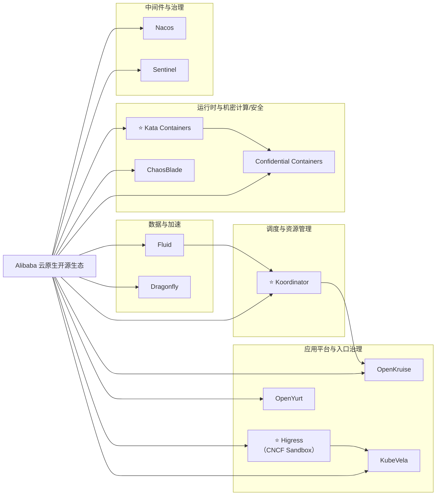

# 阿里巴巴（Alibaba）云原生开源案例（初稿）

## 重点整理

- `Higress`：新晋 CNCF Sandbox（API Gateway 方向）
- `Kata Containers`：容器隔离与安全运行时领域的重要项目

## 可编辑生态图（Mermaid）

## 发起/主导项目（代表）

- [alibaba/higress](https://github.com/alibaba/higress)
- [openyurtio/openyurt](https://github.com/openyurtio/openyurt)
- [kata-containers/kata-containers](https://github.com/kata-containers/kata-containers)
- [koordinator-sh/koordinator](https://github.com/koordinator-sh/koordinator)
- [chaosblade-io/chaosblade](https://github.com/chaosblade-io/chaosblade)
- [confidential-containers/confidential-containers](https://github.com/confidential-containers/confidential-containers)
- [openkruise/kruise](https://github.com/openkruise/kruise)
- [kubevela/kubevela](https://github.com/kubevela/kubevela)
- [fluid-cloudnative/fluid](https://github.com/fluid-cloudnative/fluid)
- [dragonflyoss/dragonfly](https://github.com/dragonflyoss/dragonfly)
- [alibaba/nacos](https://github.com/alibaba/nacos)
- [alibaba/Sentinel](https://github.com/alibaba/Sentinel)

## 深度参与项目（代表）

- [kubernetes/kubernetes](https://github.com/kubernetes/kubernetes)
- [istio/istio](https://github.com/istio/istio)
