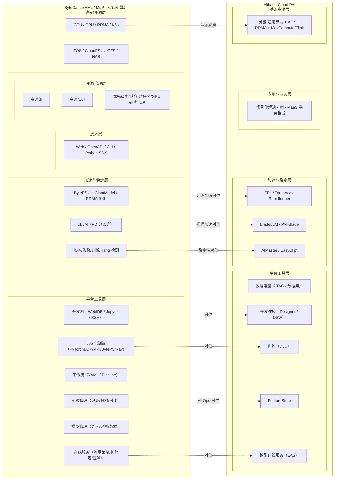

# AML vs PAI 对照架构图（2026-04 快照）

## 1. 范围与口径

本文对比以下两个“云上机器学习平台”产品体系：

- **ByteDance / 火山引擎 AML/MLP**（公开文档中常见“机器学习平台”表述）
- **阿里云 PAI（Platform for AI）**

对比目标：从“AI 平台工程”视角抽象可复用能力，而非做单点功能评测。

## 2. 分层对照（平台工程视角）

| 分层 | AML（火山引擎） | PAI（阿里云） | AI-Infra 当前覆盖 |
| --- | --- | --- | --- |
| 业务/方案层 | 行业场景化落地 | 行业场景化解决方案 | 弱（缺统一方法论） |
| 应用接入层 | Web / OpenAPI / CLI / Python SDK | 控制台 + API + 各类产品集成 | 中 |
| 平台工具层 | 开发机、Job 训练、工作流、在线服务、模型管理、实验管理 | iTAG、Designer、DSW、DLC、FeatureStore、EAS | 弱（缺平台化闭环章节） |
| 加速与稳定层 | BytePS、veGiantModel、RDMA、xLLM、监控诊断 | EPL/TorchAcc/Rapidformer、BladeLLM、AIMaster、EasyCkpt | 中（偏引擎/调度，缺平台编排） |
| 资源治理层 | 资源组/资源队列/优先级/闲时任务/GPU 碎片治理 | 资源池 + 训练/服务资源调度 | 弱（缺资源治理模型） |
| 基础资源层 | GPU/CPU/RDMA + TOS/CloudFS/vePFS/NAS | GPU/CPU/RDMA/ACK + MaxCompute/Flink | 中 |

## 3. AML vs PAI 对照架构图（Mermaid）

## 4. 共性能力与关键差异

### 共性（两者都成熟）

- 训练、推理、工作流、模型管理的端到端平台化
- 分布式训练与推理加速能力内建
- 面向大规模 GPU 的资源池与调度优化
- 平台可观测与稳定性能力（监控、日志、容错）

### 差异（对学习仓库最有价值）

- **PAI 的“产品模块命名与边界”更清晰**：iTAG/DSW/DLC/EAS/FeatureStore 易做标准化教学拆解
- **AML 的“资源治理与工程实践”暴露更细**：开发机语义、资源组/队列、排队策略、挂载与运维细节更贴近平台实战
- **推理引擎策略不同**：PAI 强调 BladeLLM 与 EAS 深度耦合；AML 更强调 xLLM 与平台任务体系融合

## 5. 对 AI-Infra 的直接启示（缺口归纳）

当前仓库强项在推理引擎、K8s 调度、GPU 与运行时；弱项在“平台控制面闭环”：

1. 缺统一的 AI 平台分层参考架构（控制面/数据面/治理面）。
2. 缺资源治理模型（资源组/队列/优先级/成本归因）的实操章节。
3. 缺数据标注-特征-训练-部署-回流的全流程闭环说明。
4. 缺实验追踪、模型注册、血缘与复现的工程基线。
5. 缺训练容错（任务级监控、异步 checkpoint、部分故障恢复）专题。
6. 缺平台级推理控制面（流量策略、灰度、自动扩缩容、SLO）的章节。

## 6. 参考链接（公开资料）

- 火山引擎机器学习平台功能总览：
  <https://www.volcengine.com/docs/6459/72379>
- 火山引擎大规模机器学习平台架构实践：
  <https://developer.volcengine.com/articles/7098906081463648270>
- 从字节跳动机器学习平台到火山引擎智能中台：
  <https://www.volcengine.com/docs/6360/66900>
- 阿里云 PAI 产品架构：
  <https://www.alibabacloud.com/help/zh/pai/product-overview/service-architecture>
- 阿里云 PAI AI 加速：
  <https://www.alibabacloud.com/help/zh/pai/user-guide/ai-acceleration/>
- 阿里云 BladeLLM 简介：
  <https://www.alibabacloud.com/help/zh/pai/user-guide/what-is-bladellm/>

