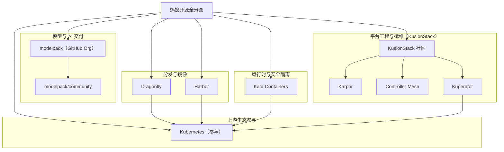

# 蚂蚁集团（Ant Group）云原生开源案例（初稿）

## 可编辑全景图（Mermaid）

## 发起/主导项目（代表）

- [dragonflyoss/dragonfly](https://github.com/dragonflyoss/dragonfly)
- [goharbor/harbor](https://github.com/goharbor/harbor)
- [KusionStack/community](https://github.com/KusionStack/community)（KusionStack 社区入口）
- [KusionStack/karpor](https://github.com/KusionStack/karpor)
- [KusionStack/controller-mesh](https://github.com/KusionStack/controller-mesh)
- [KusionStack/kuperator](https://github.com/KusionStack/kuperator)
- [modelpack（GitHub Org）](https://github.com/modelpack/)
- [modelpack/community](https://github.com/modelpack/community)
- [kata-containers/kata-containers](https://github.com/kata-containers/kata-containers)

## 深度参与项目（代表）

- [kubernetes/kubernetes](https://github.com/kubernetes/kubernetes)
