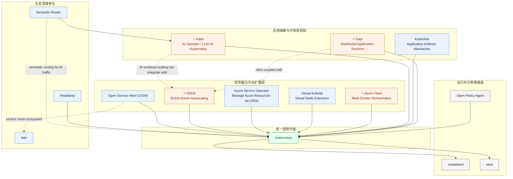

# Azure（Microsoft）云原生开源案例（初稿）

## 可编辑开源全景图（Mermaid）

## 发起/共同发起项目（代表）

- [dapr/dapr](https://github.com/dapr/dapr)
- [kedacore/keda](https://github.com/kedacore/keda)
- [virtual-kubelet/virtual-kubelet](https://github.com/virtual-kubelet/virtual-kubelet)
- [openservicemesh/osm](https://github.com/openservicemesh/osm)
- [Azure/azure-service-operator](https://github.com/Azure/azure-service-operator)
- [kubevela/kubevela](https://github.com/kubevela/kubevela)
- [Azure/fleet](https://github.com/Azure/fleet)
- [kaito-project/kaito](https://github.com/kaito-project/kaito)

## 深度参与项目（代表）

- [kubernetes/kubernetes](https://github.com/kubernetes/kubernetes)
- [istio/istio](https://github.com/istio/istio)
- [containerd/containerd](https://github.com/containerd/containerd)
- [etcd-io/etcd](https://github.com/etcd-io/etcd)
- [open-policy-agent/opa](https://github.com/open-policy-agent/opa)
- [kubernetes-sigs/headlamp](https://github.com/kubernetes-sigs/headlamp)
- [vllm-project/semantic-router](https://github.com/vllm-project/semantic-router)
