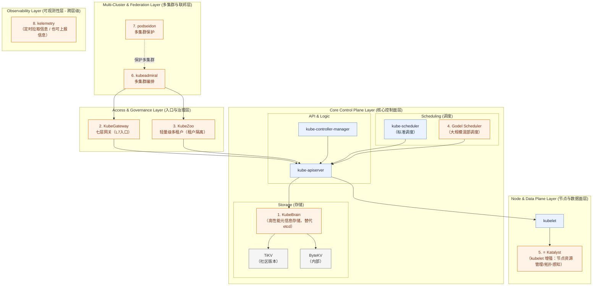

# 字节跳动（ByteDance）云原生开源案例（初稿）

## 参考输入

- 你提供的文章链接：https://mp.weixin.qq.com/s/fUK6qqcFzkoNcscHBE9v8A
- 你提供的分层图（KubeBrain / Godel / Katalyst / kubeadmiral / podseidon / kelemetry 等）

## 分层视角（基于你给的图和字节方案）

- 多集群与联邦层：`kubeadmiral`、`podseidon`
- 入口与治理层：`kubegateway`、`kubezoo`
- 核心控制面层：`kubebrain`（元信息存储）、`godel-scheduler`（调度）
- 节点与数据面层：`katalyst-core`
- 跨层可观测层：`kelemetry`

## 可编辑架构图（Mermaid）

## 发起/主导项目（代表）

- [kubewharf/kubebrain](https://github.com/kubewharf/kubebrain)
- [kubewharf/godel-scheduler](https://github.com/kubewharf/godel-scheduler)
- [kubewharf/katalyst-core](https://github.com/kubewharf/katalyst-core)
- [kubewharf/kubeadmiral](https://github.com/kubewharf/kubeadmiral)
- [kubewharf/podseidon](https://github.com/kubewharf/podseidon)
- [kubewharf/kubegateway](https://github.com/kubewharf/kubegateway)
- [kubewharf/kubezoo](https://github.com/kubewharf/kubezoo)
- [kubewharf/kelemetry](https://github.com/kubewharf/kelemetry)

## 深度参与项目（代表）

- [kubernetes/kubernetes](https://github.com/kubernetes/kubernetes)
- [istio/istio](https://github.com/istio/istio)
- [etcd-io/etcd](https://github.com/etcd-io/etcd)
