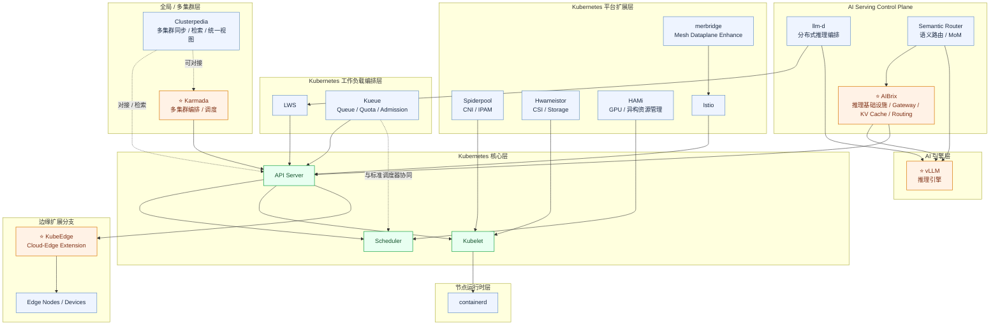

# DaoCloud 云原生开源案例（架构重整版）

## 参考输入

- DaoCloud Profile README: https://github.com/DaoCloud/.github/blob/main/profile/README.md

## 架构分层视角（你给定的结构）

- 多云组件（最上层）：`Clusterpedia`
- Kubernetes 平台层（3 层）：
  - 1. 调度编排层：`LWS`、`Kueue`（`llm-d` 使用 `LWS`）
  - 2. 网络存储层：`Spiderpool(CNI)`、`Hwameistor(存储)`、`merbridge(mesh)`
  - 3. 资源管理层：`HAMi`、`containerd`
- AI 引擎层：`vLLM`（并与 `llm-d` 协同）
- 安装与测试链路：`kubean -> kubespray -> kubeadm`，`kwok` 作为测试组件

## 可编辑生态图（Mermaid）

## 项目清单（按架构分层）

### 多云组件（顶层）

- [⭐ clusterpedia-io/clusterpedia](https://github.com/clusterpedia-io/clusterpedia)

### AI 引擎层

- [⭐ vllm-project/vllm](https://github.com/vllm-project/vllm)
- [llm-d/llm-d](https://github.com/llm-d/llm-d)

### Kubernetes 平台层

#### 调度编排层

- [kubernetes-sigs/lws](https://github.com/kubernetes-sigs/lws)
- [kubernetes-sigs/kueue](https://github.com/kubernetes-sigs/kueue)

#### 网络存储层

- [⭐ spidernet-io/spiderpool](https://github.com/spidernet-io/spiderpool)
- [hwameistor/hwameistor](https://github.com/hwameistor/hwameistor)
- [merbridge/merbridge](https://github.com/merbridge/merbridge)
- [istio/istio](https://github.com/istio/istio)

#### 资源管理层

- [⭐ Project-HAMi/HAMi](https://github.com/Project-HAMi/HAMi)
- [containerd/containerd](https://github.com/containerd/containerd)

#### 底座

- [⭐ kubernetes/kubernetes](https://github.com/kubernetes/kubernetes)

### 安装与测试组件

- [⭐ kubean-io/kubean](https://github.com/kubean-io/kubean)
- [kubernetes-sigs/kubespray](https://github.com/kubernetes-sigs/kubespray)
- [kubernetes/kubeadm](https://github.com/kubernetes/kubeadm)
- [kubernetes-sigs/kwok](https://github.com/kubernetes-sigs/kwok)

### 其他 DaoCloud 相关项目（补充）

- [knoway-dev/knoway](https://github.com/knoway-dev/knoway)
- [kdoctor-io/kdoctor](https://github.com/kdoctor-io/kdoctor)
