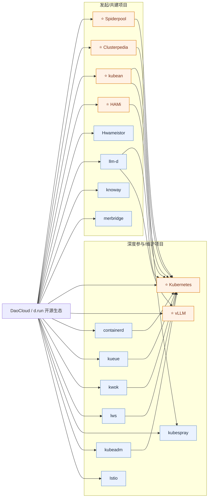

# DaoCloud 云原生开源案例（初稿）

## 参考输入

- DaoCloud Profile README: https://github.com/DaoCloud/.github/blob/main/profile/README.md

## 可编辑生态图（Mermaid）

## 发起/主导项目（代表）

- [⭐ spidernet-io/spiderpool](https://github.com/spidernet-io/spiderpool)
- [⭐ clusterpedia-io/clusterpedia](https://github.com/clusterpedia-io/clusterpedia)
- [⭐ kubean-io/kubean](https://github.com/kubean-io/kubean)
- [⭐ Project-HAMi/HAMi](https://github.com/Project-HAMi/HAMi)
- [knoway-dev/knoway](https://github.com/knoway-dev/knoway)
- [merbridge/merbridge](https://github.com/merbridge/merbridge)
- [hwameistor/hwameistor](https://github.com/hwameistor/hwameistor)
- [llm-d/llm-d](https://github.com/llm-d/llm-d)
- [kdoctor-io/kdoctor](https://github.com/kdoctor-io/kdoctor)

## 深度参与项目（代表）

- [⭐ kubernetes/kubernetes](https://github.com/kubernetes/kubernetes)
- [⭐ vllm-project/vllm](https://github.com/vllm-project/vllm)
- [containerd/containerd](https://github.com/containerd/containerd)
- [kubernetes-sigs/kueue](https://github.com/kubernetes-sigs/kueue)
- [kubernetes-sigs/kwok](https://github.com/kubernetes-sigs/kwok)
- [kubernetes-sigs/lws](https://github.com/kubernetes-sigs/lws)
- [kubernetes-sigs/kubespray](https://github.com/kubernetes-sigs/kubespray)
- [kubernetes/kubeadm](https://github.com/kubernetes/kubeadm)
- [istio/istio](https://github.com/istio/istio)
