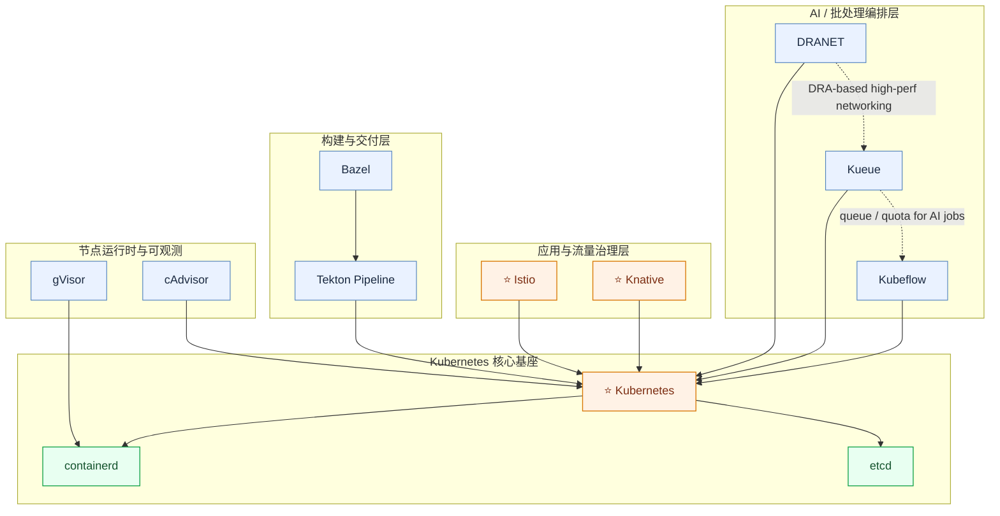

# Google 云原生开源案例（初稿）

## 可编辑开源全景图（Mermaid）

## 发起/共同发起项目（代表）

- [kubernetes/kubernetes](https://github.com/kubernetes/kubernetes)
- [istio/istio](https://github.com/istio/istio)
- [knative/serving](https://github.com/knative/serving)
- [google/gvisor](https://github.com/google/gvisor)
- [google/cadvisor](https://github.com/google/cadvisor)
- [bazelbuild/bazel](https://github.com/bazelbuild/bazel)
- [tektoncd/pipeline](https://github.com/tektoncd/pipeline)

## 深度参与项目（代表）

- [containerd/containerd](https://github.com/containerd/containerd)
- [etcd-io/etcd](https://github.com/etcd-io/etcd)

## 补充：Google 生态重点项目（可纳入全景图）

- [kubernetes-sigs/kueue](https://github.com/kubernetes-sigs/kueue)
- [google/dranet](https://github.com/google/dranet)
- [kubernetes-sigs/dranet](https://github.com/kubernetes-sigs/dranet)
- [kubeflow/kubeflow](https://github.com/kubeflow/kubeflow)
