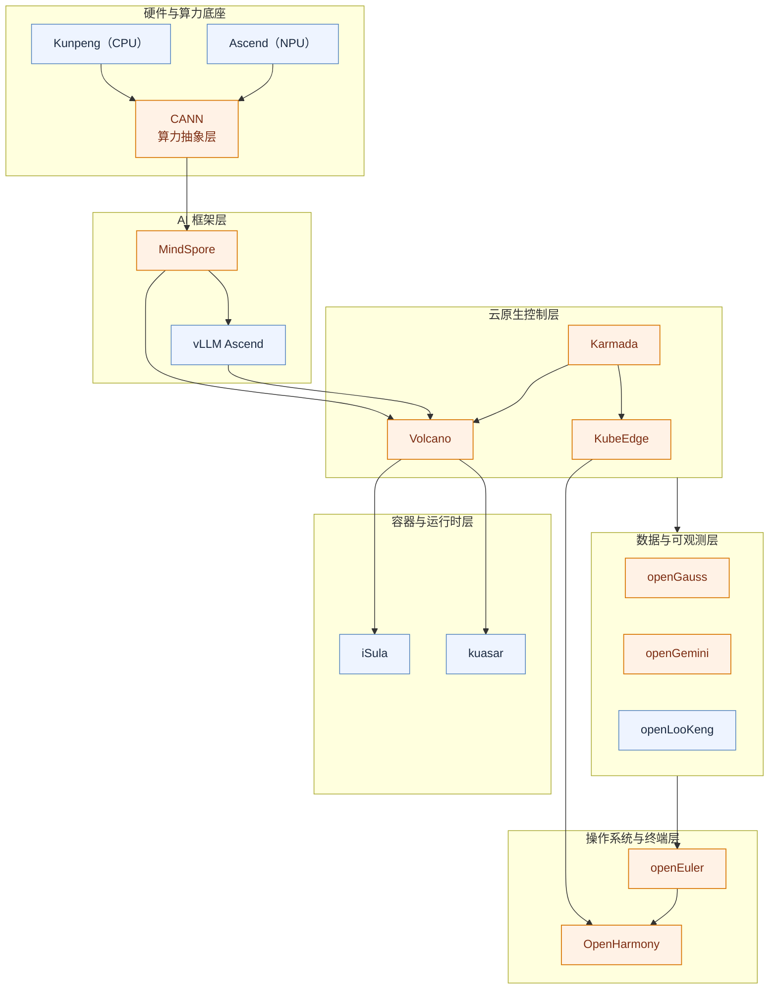

# 华为开源生态布局（全栈补充版）

## 参考输入

- 云原生主文档：[huawei.md](./huawei.md)
- 补充材料：[ChatGPT 分享链接](https://chatgpt.com/s/t_69dc9de15ae4819189f11606fced2fac)

## 生态总览（从云原生扩展到全栈）

> `huawei.md` 聚焦云原生；本文补齐“基础软件 + AI + 云原生”的全栈布局视角。

1. 设备与操作系统层：`OpenHarmony`、`openEuler`
2. 数据与中间件层：`openGauss`、`openGemini`、`openLooKeng`
3. AI 与算力层：`MindSpore`、`CANN`
4. 云原生控制层：`KubeEdge`、`Karmada`、`Volcano`
5. 容器与运行时层：`iSula`、`kuasar`
6. 服务治理与可观测层：`kmesh`、`Sermant`、`openGemini`

## 全栈布局图（Mermaid）

## 战略主线（解读版）

- 纵向打通：硬件（鲲鹏/昇腾）→ 算力抽象（`CANN`）→ AI 框架（`MindSpore`）→ 云原生调度（`Volcano/Karmada`）→ 系统底座（`openEuler/OpenHarmony`）。
- 横向协同：`KubeEdge + Karmada + Volcano` 组成“边缘接入 + 多集群治理 + AI/HPC 调度”的控制闭环。
- 生态外溢：通过社区与产业协作扩展生态覆盖，降低对单一闭源技术栈的依赖。

## 与云原生主文档的边界

- `huawei.md`：聚焦 CNCF/Kubernetes 相关项目对照与架构关系。
- `huawei-ecosystem.md`：聚焦全栈版图、战略路径与跨层协同关系。
