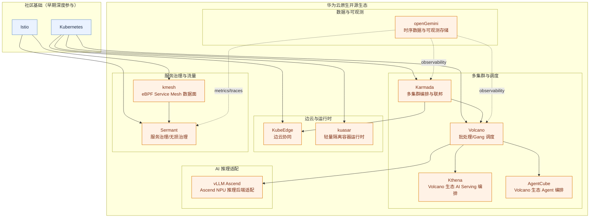

# 华为云（Huawei）云原生开源案例（初稿）

## 分析基线

- 对照基线：字节分层方案（你提供的链接 + 分层图）
- 本文聚焦你点名的华为相关项目：`Karmada`、`Volcano`（含 `kthena/agentcube`）、`KubeEdge`、`kmesh`、`kuasar`、`vllm-ascend`、`openGemini`、`Sermant`

## 与字节方案的分层对照（简版）

- 多集群与联邦：字节 `kubeadmiral/podseidon`；华为 `Karmada`
- 调度与编排：字节 `godel-scheduler`；华为 `Volcano`（并扩展 `kthena/agentcube`）
- 节点/运行时与边云：字节 `katalyst-core`；华为 `KubeEdge`、`kuasar`
- 服务治理：字节 `kubegateway/kubezoo`；华为 `kmesh`、`Sermant`
- 可观测/数据底座：字节 `kelemetry`；华为 `openGemini`
- AI 推理适配：华为侧代表项目 `vllm-ascend`

## 可编辑生态图（Mermaid）

## 发起/主导项目（代表）

- [karmada-io/karmada](https://github.com/karmada-io/karmada)
- [volcano-sh/volcano](https://github.com/volcano-sh/volcano)
- [volcano-sh/kthena](https://github.com/volcano-sh/kthena)
- [volcano-sh/agentcube](https://github.com/volcano-sh/agentcube)
- [kubeedge/kubeedge](https://github.com/kubeedge/kubeedge)
- [kmesh-net/kmesh](https://github.com/kmesh-net/kmesh)
- [kuasar-io/kuasar](https://github.com/kuasar-io/kuasar)
- [vllm-project/vllm-ascend](https://github.com/vllm-project/vllm-ascend)
- [openGemini/openGemini](https://github.com/openGemini/openGemini)
- [sermant-io/Sermant](https://github.com/sermant-io/Sermant)

## 深度参与项目（代表）

- [kubernetes/kubernetes](https://github.com/kubernetes/kubernetes)
- [istio/istio](https://github.com/istio/istio)
