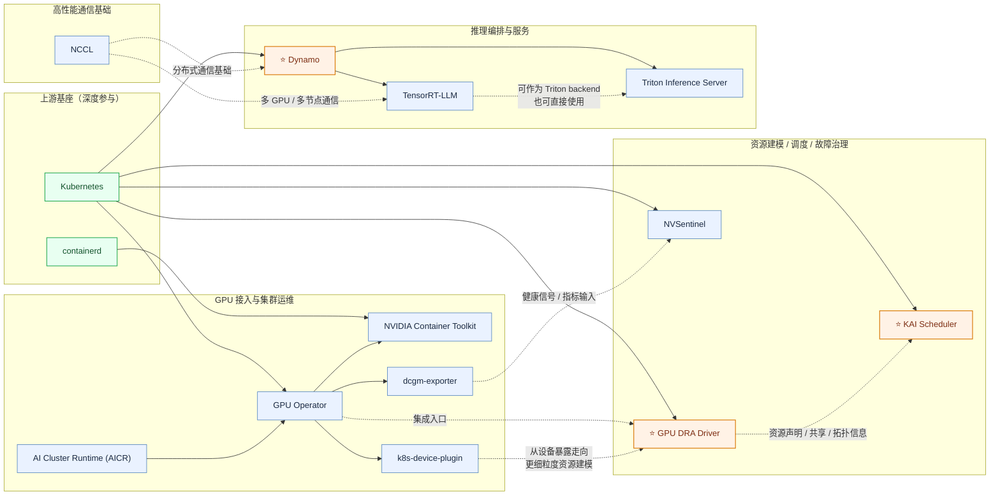

# NVIDIA 云原生开源案例（全景版）

## 参考输入

- 你提供的图片（NVIDIA ❤️ Kubernetes 时间线）
- 当前仓库 `nvidia` 项目清单

## 可编辑云原生开源全景图（Mermaid）

## 发起/主导项目（代表）

- [⭐ ai-dynamo/dynamo](https://github.com/ai-dynamo/dynamo)
- [⭐ kai-scheduler/KAI-Scheduler](https://github.com/kai-scheduler/KAI-Scheduler)
- [⭐ NVIDIA/k8s-dra-driver-gpu](https://github.com/NVIDIA/k8s-dra-driver-gpu)
- [NVIDIA/gpu-operator](https://github.com/NVIDIA/gpu-operator)
- [NVIDIA/k8s-device-plugin](https://github.com/NVIDIA/k8s-device-plugin)
- [NVIDIA/dcgm-exporter](https://github.com/NVIDIA/dcgm-exporter)
- [NVIDIA/nvidia-container-toolkit](https://github.com/NVIDIA/nvidia-container-toolkit)
- [NVIDIA/NVSentinel](https://github.com/NVIDIA/NVSentinel)
- [NVIDIA/aicr](https://github.com/NVIDIA/aicr)
- [NVIDIA/TensorRT-LLM](https://github.com/NVIDIA/TensorRT-LLM)
- [triton-inference-server/server](https://github.com/triton-inference-server/server)
- [NVIDIA/nccl](https://github.com/NVIDIA/nccl)

## 深度参与项目（代表）

- [kubernetes/kubernetes](https://github.com/kubernetes/kubernetes)
- [containerd/containerd](https://github.com/containerd/containerd)
