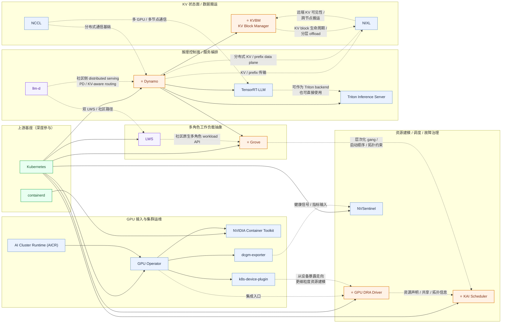

# NVIDIA 云原生开源案例（全景版）

## 参考输入

- 你提供的图片（NVIDIA ❤️ Kubernetes 时间线）
- 当前仓库 `nvidia` 项目清单

## 可编辑云原生开源全景图（Mermaid）



## 发起/主导项目（代表）

- [⭐ ai-dynamo/dynamo](https://github.com/ai-dynamo/dynamo)
- [⭐ ai-dynamo/grove](https://github.com/ai-dynamo/grove)
- [ai-dynamo/nixl](https://github.com/ai-dynamo/nixl)
- [⭐ kai-scheduler/KAI-Scheduler](https://github.com/kai-scheduler/KAI-Scheduler)
- [⭐ kubernetes-sigs/dra-driver-nvidia-gpu](https://github.com/kubernetes-sigs/dra-driver-nvidia-gpu)
- [NVIDIA/gpu-operator](https://github.com/NVIDIA/gpu-operator)
- [NVIDIA/k8s-device-plugin](https://github.com/NVIDIA/k8s-device-plugin)
- [NVIDIA/dcgm-exporter](https://github.com/NVIDIA/dcgm-exporter)
- [NVIDIA/nvidia-container-toolkit](https://github.com/NVIDIA/nvidia-container-toolkit)
- [NVIDIA/NVSentinel](https://github.com/NVIDIA/NVSentinel)
- [NVIDIA/aicr](https://github.com/NVIDIA/aicr)
- [NVIDIA/TensorRT-LLM](https://github.com/NVIDIA/TensorRT-LLM)
- [triton-inference-server/server](https://github.com/triton-inference-server/server)
- [NVIDIA/nccl](https://github.com/NVIDIA/nccl)

## 深度参与项目（代表）

- [kubernetes/kubernetes](https://github.com/kubernetes/kubernetes)
- [containerd/containerd](https://github.com/containerd/containerd)

## 补充主线：Dynamo / Grove / KAI / KVBM

这条线现在更适合理解成：

```text
Dynamo -> Grove -> KAI Scheduler -> GPU DRA Driver
          \-> KVBM -> NIXL
```

它们不是四个并列竞争项目，而是从推理系统意图一路落到工作负载抽象、调度策略、
资源模型和 KV 状态面的主链路。

| 组件 | 在图中的位置 | 主要职责 |
| --- | --- | --- |
| `Dynamo` | 推理控制面 / 服务编排 | 作为 NVIDIA 的 distributed inference control plane，承接 `DGDR/DGD`、Planner、Router、Profiler 等平台入口 |
| `Grove` | 多角色工作负载抽象 | 用 `PodCliqueSet / PodGang` 一类 API 把 `prefill / decode / router / worker` 表达成单个 Kubernetes 对象 |
| `KAI Scheduler` | 调度策略层 | 负责 gang、拓扑感知、层次队列、公平性和 DRA support，把 Grove 的编排意图落成真正的放置决策 |
| `KVBM` | KV 状态面 | 管理 KV block 生命周期、跨节点复用与 `HBM -> host -> SSD -> remote` 分层 offload，和 `NIXL` 一起构成 Dynamo 的 KV state plane |

这里最容易被漏掉的是 `KVBM`：它不是独立 repo，而是 `Dynamo` 内部非常关键的系统层。
如果不把它画出来，`Dynamo` 看起来就会像“又一个推理部署器”，而不是一个把 KV 生命周期、
路由和多节点 serving 一起组织起来的平台。

## 与 llm-d 的交叉补充

`llm-d` 不属于 NVIDIA 私有主线，但它是理解 NVIDIA 这条路线时非常好的社区对照组。
更准确地说：

- `Dynamo` 更接近 **performance-first inference platform**
- `llm-d` 更接近 **Kubernetes-native distributed serving stack**
- `Grove` 和 `LWS` 处在相近的 workload abstraction 位置，但前者更强意见、后者更社区原生

| 维度 | NVIDIA 主线 | `llm-d` 路线 |
| --- | --- | --- |
| 控制面 / serving stack | `Dynamo` | `llm-d` |
| 多角色 workload API | `Grove` | `LWS`（双 `LeaderWorkerSet` 路径） |
| 调度与拓扑 | `KAI + GPU DRA Driver`，更强调 GPU / ComputeDomain / fabric 拓扑 | 更偏社区调度生态组合，常与 `KServe`、Gateway API、Kubernetes 原生 workload API 协同 |
| KV 路径 | `KVBM + NIXL`，把 KV 复用、offload、远端传输做成系统级 state plane | 更强调 KV-aware routing、PD serving 和 serving stack 集成 |
| 硬件姿态 | 更偏 NVIDIA 一体化优化 | 更偏中立，更容易成为跨厂商 distributed serving 基线 |

所以把 `llm-d` 交叉补进 NVIDIA 全景图的价值，不是说它和 `Dynamo` 是同一项目，而是能把
两条路线的分层关系看得更清楚：

- NVIDIA 主线的辨识度在 `Grove + KAI Scheduler + GPU DRA Driver + KVBM`
- 社区主线的辨识度在 `llm-d + LWS + KServe / Gateway API` 这类更上游、更中立的组合

## 生态交叉项目入口

- [llm-d/llm-d](https://github.com/llm-d/llm-d)
- [Dynamo KVBM design doc](https://github.com/ai-dynamo/dynamo/blob/main/docs/design-docs/kvbm-design.md)

## 延伸阅读

- [Dynamo 架构全景](../docs/inference/dynamo.md)
- [Grove: Kubernetes API for Inference Orchestration](../docs/inference/grove.md)
- [NVIDIA 推理编排主线拆解：Dynamo、Grove、KAI Scheduler 与 GPU DRA Driver](../docs/blog/2026-05-11/2026-05-11-dynamo-grove-kai-dra-ecosystem-zh.md)
- [推理编排方案如何选择？AIBrix、Kthena、Dynamo、llm-d、KServe、vLLM Production Stack 与 SGLang/RBG](../docs/blog/2026-05-13/2026-05-13-how-to-choose-inference-orchestration-stacks_zh.md)
