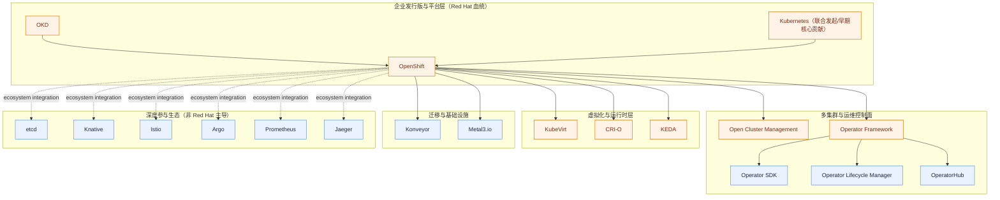

# Red Hat 云原生开源案例（初稿）

## 可编辑开源全景图（Mermaid）

## 发起/主导项目（代表）

- [kubernetes/kubernetes](https://github.com/kubernetes/kubernetes)（历史联合发起/早期核心贡献）
- [openshift/origin](https://github.com/openshift/origin)
- [open-cluster-management-io/ocm](https://github.com/open-cluster-management-io/ocm)（Open Cluster Management）
- [operator-framework/operator-sdk](https://github.com/operator-framework/operator-sdk)
- [operator-framework/operator-lifecycle-manager](https://github.com/operator-framework/operator-lifecycle-manager)
- [operatorhub.io](https://operatorhub.io/)（OperatorHub 生态入口）
- [kubevirt/kubevirt](https://github.com/kubevirt/kubevirt)
- [cri-o/cri-o](https://github.com/cri-o/cri-o)
- [kedacore/keda](https://github.com/kedacore/keda)

## 发起/主导（或 Red Hat 血统很强）

- [okd-project/okd](https://github.com/okd-project/okd) / [openshift/origin](https://github.com/openshift/origin)（OKD / OpenShift upstream）
- [open-cluster-management-io/ocm](https://github.com/open-cluster-management-io/ocm)（Open Cluster Management）
- Operator Framework：  
  [operator-framework/operator-sdk](https://github.com/operator-framework/operator-sdk) /  
  [operator-framework/operator-lifecycle-manager](https://github.com/operator-framework/operator-lifecycle-manager) /  
  [operatorhub.io](https://operatorhub.io/)
- [kubevirt/kubevirt](https://github.com/kubevirt/kubevirt)
- [cri-o/cri-o](https://github.com/cri-o/cri-o)
- [kedacore/keda](https://github.com/kedacore/keda)
- [konveyor（GitHub Org）](https://github.com/konveyor)
- [metal3-io（GitHub Org）](https://github.com/metal3-io)

## 深度参与项目（代表）

- [kubernetes/kubernetes](https://github.com/kubernetes/kubernetes)
- [etcd-io/etcd](https://github.com/etcd-io/etcd)
- [knative/serving](https://github.com/knative/serving)
- [istio/istio](https://github.com/istio/istio)
- [argoproj/argo-workflows](https://github.com/argoproj/argo-workflows)
- [prometheus/prometheus](https://github.com/prometheus/prometheus)
- [jaegertracing/jaeger](https://github.com/jaegertracing/jaeger)
