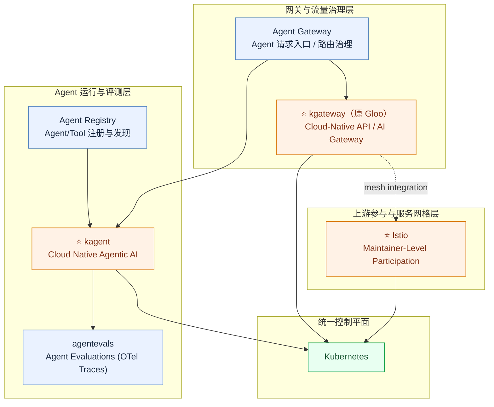

# Solo.io 云原生开源案例（初稿）

## 关键观察

- Solo.io 在 `Istio` 社区中长期深度参与，并有 maintainer 级别贡献者。
- `Gloo` 体系已演进为 `kgateway`，是其 API Gateway / AI Gateway 方向的核心项目。
- 在 Agent 方向，围绕 `kagent` 延伸出 `Agent Registry`、`Agent Gateway`、`agentevals` 等能力。

## 可编辑开源全景图（Mermaid）

## 发起/主导项目（代表）

- [kgateway-dev/kgateway](https://github.com/kgateway-dev/kgateway)（Gloo 演进 / 更名方向）
- [solo-io/gloo](https://github.com/solo-io/gloo)（历史主线项目）
- [kagent-dev/kagent](https://github.com/kagent-dev/kagent)
- [agentevals-dev/agentevals](https://github.com/agentevals-dev/agentevals)
- [kagent-dev/kmcp](https://github.com/kagent-dev/kmcp)（Agent 工具协议与连接能力）
- [kagent-dev/tools](https://github.com/kagent-dev/tools)（Agent 工具生态）

## 深度参与项目（代表）

- [istio/istio](https://github.com/istio/istio)
- [kubernetes/kubernetes](https://github.com/kubernetes/kubernetes)
- [kubernetes-sigs/gateway-api](https://github.com/kubernetes-sigs/gateway-api)
