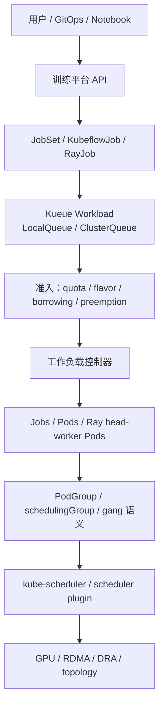
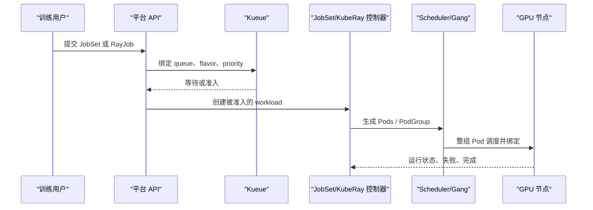

# AI 训练作业管理：JobSet、Kueue、Ray 与 Gang Scheduling

如果把 AI 训练平台只看成“提交一个 Pod”，很多设计会自然滑向两个极端：
要么把所有能力塞进训练框架，要么把所有问题都交给调度器。
真正落地到多团队 GPU 集群时，更稳妥的心智模型是把训练作业拆成四层：

1. **作业拓扑**：训练任务由哪些角色、多少副本、什么生命周期组成。
2. **队列与准入**：哪些团队可以用多少资源，什么时候允许启动。
3. **运行时执行**：训练代码、分布式通信、driver/worker、actor/task 如何运行。
4. **协同调度**：一组 Pod 是否必须一起拿到资源，否则就不应该半启动。

`JobSet`、`Kueue`、`Ray/KubeRay` 和 `Gang Scheduling` 分别落在这些不同层次。
它们不是四个互斥选择，而是一组可以组合的控制面能力。

本文原计划发布日是 **2026-04-13**。版本、发布日期和特性阶段按
**2026-07-11** 的公开信息重新核对。

## 先说结论

- `JobSet` 适合表达静态或半静态的多角色训练拓扑，例如 driver、worker、parameter
  server、launcher 等组合。
- `Kueue` 负责队列、配额、准入、借用、抢占和 cohort 级资源治理，不负责训练运行时本身。
- `Ray/KubeRay` 负责 Ray 集群、RayJob、RayService 以及 Ray Train/Tune/RL 等运行时语义，
  不应该被当成 Kubernetes 配额系统。
- `Gang Scheduling` 解决“必须一起调度”的问题。它不是公平队列，也不是多租户治理层。
- 多团队训练平台最推荐的形态是：用户提交 `JobSet`、`RayJob` 或其他训练 CRD，
  由 `Kueue` 做准入，底层调度器在需要时使用 gang/PodGroup 语义避免半启动。

## 四层参考架构

这张图的重点是控制面边界：平台入口可以统一，但不要把对象语义混在一起。
`Kueue` 决定什么时候可以启动，`JobSet` 和 `KubeRay` 决定启动什么，
调度器和 gang 语义决定这一批 Pod 是否能作为一个整体落到集群里。

## 对象边界

| 组件 | 主对象 | 负责什么 | 不负责什么 |
| --- | --- | --- | --- |
| JobSet | `JobSet` | 多组 `Job`、角色拓扑、生命周期 | 全局配额、公平性 |
| Kueue | `Workload`、`Queue` | 队列、准入、quota、借用、抢占 | 训练框架运行时 |
| KubeRay | `RayCluster`、`RayJob` | Ray head/worker、作业提交、Ray 运行时 | 集群级公平共享 |
| Gang | `PodGroup` 等 | 一组 Pod all-or-nothing 调度 | 队列和多租户策略 |

`JobSet` 的价值在于把“一个训练作业由多组 Kubernetes Job 组成”变成原生对象。
例如一个作业可以有 launcher、worker、eval 三组副本，
每组都有自己的模板、完成条件和重试语义。
这比直接维护一堆裸 `Job` 更适合平台化，也便于 Kueue 将其作为一个 workload 做准入。

`Kueue` 的价值在于把资源治理前移到“作业是否可以进入执行”这个阶段。
在多团队集群里，问题通常不是某一个 Pod 能不能调度，
而是整个作业是否应该占用某个队列、某种 GPU flavor、某个 cohort 里的共享额度。
Kueue 的 `LocalQueue`、`ClusterQueue`、
`ResourceFlavor`、borrowing 和 preemption 共同回答这类问题。

`Ray/KubeRay` 的边界更偏运行时。Ray 的 driver、actor、task、placement group、
autoscaler 和作业提交模型对 Ray Train、Ray Tune、RLHF、数据处理很重要。
但 Ray 不应该替代 Kubernetes 里的队列、公平性和集群级配额。平台应该让 RayJob 进入
Kueue 的准入流程，而不是让每个 Ray 集群自行争抢 GPU。

`Gang Scheduling` 只解决一个窄问题：如果一个训练作业需要 32 个 worker 才能开始，
那么先启动 5 个 worker 往往没有意义，还可能占住 GPU 造成队列阻塞。
gang 语义让这一组 Pod 要么一起拿到资源，要么继续等待。

## 推荐落地方式

对静态分布式训练，例如 MPI、PyTorch DDP、Megatron-LM 或多数多角色批训练，
优先使用 `JobSet + Kueue`。用户提交的是作业拓扑，Kueue 控制进入集群的时机，
底层通过 gang 或 PodGroup 避免 worker 半启动。平台侧重点是模板化、队列归属、
checkpoint 和失败恢复策略。

对 Ray Train、Ray Tune、RLHF、在线数据处理或 actor/task 结构明显的训练任务，
优先使用 `KubeRay + Kueue`。Ray 继续管理运行时内部的弹性和调度，
Kueue 负责 RayCluster/RayJob 进入集群前的资源准入。这样既保留 Ray 的编程模型，
也避免 Ray 集群绕过平台配额。

对正在跟进 upstream Kubernetes 的团队，可以把 KEP-4671 的 gang scheduling 视为未来
原生收敛方向。它引入 workload-level API 思路，包括 `Workload` 与 `PodGroup` 这样的抽象。
但需要注意，KEP 明确不把 fairness、多队列治理做进 `kube-scheduler`；
这些仍然属于 Kueue、Volcano 或平台层的职责。

## 一个实用流程

在这个流程里，平台最应该做的是三件事。

第一，统一入口，但保留对象差异。不要强行把 RayJob 包装成 JobSet，
也不要为了所有作业都像 Ray 一样运行而牺牲 PyTorch/MPI 的简单性。

第二，先准入再创建大量 Pod。大训练作业如果绕过 Kueue 直接创建 Pod，
失败时不仅浪费 scheduler 循环，还会让 quota、抢占和队列等待状态变得难以解释。

第三，把观测面拆清楚：看队列时查 Kueue `Workload` 和 `ClusterQueue`；
看拓扑时查 JobSet/RayJob；看执行时查 Pod、事件和训练日志；
看协同调度时查 PodGroup、scheduler event 和相关 metrics。

## 常见反模式

- **用 Ray 替代队列系统**：Ray 可以管理运行时内部任务，但不能天然解决团队公平共享。
- **用 Kueue 替代训练框架**：Kueue 不知道训练 step、checkpoint、driver 语义。
- **先启动 driver 再慢慢等 worker**：对强同步训练来说，这会制造空转和资源占用。
- **所有作业都强制 gang**：弹性任务、可降级任务和小规模调试任务
  不一定需要 all-or-nothing。
- **只看 Pod 状态**：训练平台还需要看 Workload、Queue、JobSet/RayJob 和调度事件。

## 事实校对

截至 **2026-07-11**：

- `Kueue` 最新 release 为 `v0.18.3`，发布时间为 `2026-07-10`。
- `JobSet` 最新 release 为 `v0.12.0`，发布时间为 `2026-05-08`。
- `KubeRay` 最新 release 为 `v1.6.2`，发布时间为 `2026-06-18`。
- `KEP-4671 Gang Scheduling` 状态为 `implementable`，stage 标记为 `beta`。
- KEP-4671 的里程碑规划是 `alpha: v1.35`、`beta: v1.37`、`stable: v1.38`。
- Kueue 官方任务文档已经覆盖 `Run A JobSet` 与 `Run A RayJob` 两类集成路径。

## 参考

- 本仓库材料：
  [scheduling-optimization](../../kubernetes/scheduling-optimization.md)、
  [training README](../../training/README.md)、
  [JobSet in-place restart](../../archive-blog/2025-11-26/2025-11-26-jobset-in-place-restart_zh.md)
- [Kueue](https://kueue.sigs.k8s.io/)
- JobSet repository: `kubernetes-sigs/jobset`
- [KEP-4671 Gang Scheduling](https://raw.githubusercontent.com/kubernetes/enhancements/master/keps/sig-scheduling/4671-gang-scheduling/README.md)
- [Kueue: Run A JobSet](https://kueue.sigs.k8s.io/docs/tasks/run/jobsets/)
- [Kueue: Run A RayJob](https://kueue.sigs.k8s.io/docs/tasks/run/rayjobs/)
- [Ray on Kubernetes](https://docs.ray.io/en/latest/cluster/kubernetes/)
