# Kubernetes v1.36 DRA 的整体设计：从请求入口到调度、状态与拓扑

Kubernetes 的 GPU 管理长期建立在一个简单模型上：

```yaml
resources:
  limits:
    nvidia.com/gpu: 8
```

这个模型非常成功，但它表达的是“我要几个同类设备”。在今天的 AI 集群里，
平台真正需要回答的问题已经复杂得多：

- 这 8 张 GPU 是否在同一 NVLink/NVSwitch 域里？
- GPU 和 RDMA NIC 是否靠近同一个 PCIe root 或 NUMA node？
- 用户是否接受 H100 不足时降级到 A100 或 L40？
- MIG、vGPU、带宽份额、显存份额应该提前切好，还是按 workload 即时分配？
- fabric-attached device 是否已经 attach 完成，Pod 现在能不能安全绑定到节点？
- 某块设备健康退化时，是 drain 整个节点，还是只阻止新的 claim 使用这块设备？
- 管理员如何诊断被租户占用的设备，同时不越权读取租户 workload？

Dynamic Resource Allocation，简称 DRA，就是 Kubernetes 为这些问题铺设的一条新控制面
路径。它不是 Device Plugin 的简单替代品，也不只是多了一组资源 API。更准确地说，在
v1.36 这个时间点，DRA 已经开始把“请求入口、资源建模、调度决策、节点准备、状态回写、
管理员治理”收敛到一套相互关联的整体设计里。

本文基于 Kubernetes v1.36 release blog、官方 DRA 文档，以及
`kubernetes/enhancements` 中相关 KEP 草案整理。由于 DRA 仍在快速演进，文中
feature 阶段以目标 Kubernetes 版本最终 release notes 和 API 文档为准。

2026-04-27 更新：本文补充了基于本地 `kubernetes/enhancements` `master` 和 34 条
DRA open issues 快照整理的 1.37 跟进项与已知限制清单。

## 先说结论

v1.36 的 DRA 变化可以概括成一句话：

**DRA 的核心抽象已经越过“能表达设备”的阶段，开始把迁移、共享、健康、异步绑定、
可观测和管理这些问题逐步纳入 Kubernetes 原生 API 与调度路径。**

但这不意味着 v1.36 已经把这些问题都“完整解决”了。更准确地说：

- 一些能力已经足以作为生产入口；
- 一些能力只是把问题纳入标准接口，还依赖 driver、runtime 或外部 controller；
- 还有一些 Alpha 能力更适合跟踪方向或做小规模验证，而不是立即当作生产依赖。

对 AI-Infra 团队而言，最值得关注的是五件事：

1. **兼容迁移**：DRA Extended Resource 给传统 extended resource 请求提供了接入
   DRA 的兼容入口，但不等于 Device Plugin 与 DRA 之间天然存在统一状态同步层。
2. **真实硬件建模**：Partitionable Devices、Consumable Capacity 和 list attributes
   开始让 scheduler 更接近 MIG、共享 capacity、拓扑标签集合等复杂资源形态。
3. **调度可靠性**：Prioritized List、Device Binding Conditions 和 device taints
   把稀缺资源降级、异步 attach、单设备维护纳入标准调度流程，但并不自动解决
   外部控制器、运行时隔离和运维编排问题。
4. **状态可观测**：ResourceClaim device status、Pod resource health 和 PodResources
   API 给设备分配结果、健康状态和节点侧用量提供了统一状态面入口，但不自动完成
   后续处置。
5. **运维边界**：AdminAccess 给管理员诊断和设备管理提供受控入口，但具体能看到什么、
   能做什么，仍然取决于 driver 实现和权限设计。

如果把 v1.36 附近的 DRA KEP 放到一张图里，它们大致在解决六层问题：

- **请求入口**：如何兼容 extended resource，如何让 Pod、PodGroup 或 workload 引用
  `ResourceClaim`，以及管理员如何走受控的 `AdminAccess` 路径。
- **资源模型与适配**：如何描述分区设备、共享 capacity、集合属性，以及未来可能纳入
  DRA 账本的 node allocatable 资源。
- **API 与状态面**：如何用 `ResourceSlice` 和 `ResourceClaim` 承载资源事实、分配结果、
  设备状态与健康状态。
- **调度与绑定**：如何让 scheduler 理解优先级备选、拓扑约束、异步 attach 和单设备维护。
- **节点侧执行**：如何通过 kubelet DRA plugin、`NodePrepareResources` 和 CDI 把分配结果
  变成真正可运行的容器环境。
- **运维与可观测**：如何把 PodResources、可用性查询、metadata 暴露和管理员治理拼成
  一条可诊断、可审计的运维路径。

## 为什么传统 Device Plugin 不够用了

Device Plugin 解决了 Kubernetes 使用 GPU 的第一阶段问题：节点插件把设备注册给
kubelet，kubelet 把 `vendor.com/device` 这种 extended resource 发布到 Node，
scheduler 按整数资源做匹配，runtime 把设备注入容器。

这个模型适合“同质、节点本地、不可再分、只按数量请求”的资源。
它的问题也来自这里：

- **资源表达太薄**：`nvidia.com/gpu: 1` 无法表达型号、显存、NVLink 域、PCIe 拓扑、
  健康状态和共享能力。
- **调度器视野不足**：scheduler 只看到节点上还剩几个资源，不知道具体哪个设备被占用，
  也无法在同一个 Pod 内协调 GPU、NIC、DPU、存储加速卡的组合。
- **动态分配困难**：MIG、vGPU、带宽、fabric 分区往往需要在 workload 到来时才知道最优
  切分方式，提前静态切分会带来碎片。
- **节点外设备缺位**：CXL、PCIe fabric、远端 GPU、网络附着设备不一定天然属于某个节点，
  “节点本地整数资源”很难描述可达范围和 attach 生命周期。
- **运维闭环分散**：设备健康、租户占用、诊断访问、维护隔离和计费通常落在厂商工具或
  平台私有状态里，Kubernetes 控制面看不到一致事实。

DRA 的核心价值是把这些维度重新纳入 Kubernetes API，而不是把所有逻辑塞进 kubelet
插件或调度器私有扩展。

## DRA 的整体设计：从请求入口到调度、状态与拓扑

把 DRA 理解成一组孤立 KEP，很容易只看到单点 feature，看不到整体闭环。更适合的阅读方式
是先看它的核心 API 抽象，再看这些抽象如何穿过调度器、kubelet 和 driver 形成一条端到端
资源路径。

DRA 的 API 位于 `resource.k8s.io` API 组。可以把它理解成三层：

| 层次 | 关键对象 | 作用 |
| --- | --- | --- |
| 资源发布 | `ResourceSlice` | 由 DRA driver 发布，描述资源池、设备、属性、容量和可达节点范围 |
| 管理抽象 | `DeviceClass` | 由管理员定义，封装设备选择规则和管理员级配置 |
| 用户请求 | `ResourceClaim`、`ResourceClaimTemplate`、`Pod.spec.resourceClaims` | 表达 workload 要求，并把 claim 绑定到 Pod 或更高层工作负载 |

典型生命周期如下：

1. DRA driver 发现 GPU、NIC、FPGA、TPU、CXL device 或外部资源池，并把它们写成
   `ResourceSlice`。
2. 管理员定义 `DeviceClass`，例如 `nvidia-h100`、`rdma-nic`、`fabric-gpu`，并用
   selector、config 和策略隐藏底层复杂度。
3. 用户或控制器创建 `ResourceClaim`，声明需要哪些 device request、capacity、
   priority alternatives 或拓扑约束。
4. `kube-scheduler` 的 `DynamicResources` 插件读取 `ResourceSlice` 和 `ResourceClaim`，
   在候选节点上模拟分配，选择满足 claim 的设备组合。
5. 调度器把分配结果写入 `ResourceClaim.status`，并用 `reservedFor` 记录消费方。
6. `kubelet` 在 Pod 启动前调用节点上的 DRA kubelet plugin，执行
   `NodePrepareResources`。
7. DRA driver 完成设备准备，例如 attach、分区、写 CDI spec、生成容器运行所需 metadata。
8. 容器运行时通过 CDI 把设备节点、挂载、环境变量或运行时配置注入容器。
9. Pod 结束后，kubelet 调用 `NodeUnprepareResources`，driver 清理或释放设备。

这个流程的关键点是：scheduler 不直接调用厂商私有分配逻辑，kubelet 也不理解具体硬件
语义。厂商和平台逻辑沉在 DRA driver 中，Kubernetes 通过结构化 API、调度插件和 kubelet
plugin 协议把它们连接起来。

## v1.36 的 KEP 版图与当前完整度

按照 Kubernetes v1.36 release blog 的归类，DRA 相关能力大致可以分成 Stable、Beta、
Alpha 三组：

| 阶段 | KEP | 能力 | AI-Infra 价值 |
| --- | --- | --- | --- |
| Stable | KEP-5018 | DRA AdminAccess | 管理员可受控访问和诊断已分配设备 |
| Stable | KEP-4816 | Prioritized List | 稀缺设备请求支持优先级备选 |
| Stable | KEP-3695 | PodResources API for DRA | 节点侧观测和计费链路可读取 DRA 分配结果 |
| Stable | KEP-4817 | ResourceClaim Device Status | claim status 可标准化承载分配后设备状态 |
| Beta | KEP-5004 | DRA Extended Resource | 传统 extended resource 请求可映射到 DRA 后端 |
| Beta | KEP-4815 | Partitionable Devices | 表达动态分区和互斥分区关系 |
| Beta | KEP-5075 | Consumable Capacity | 同一设备按 capacity 被多个 claim 共享 |
| Beta | KEP-5007 | Device Binding Conditions | 等外部设备 attach/prepare 后再绑定 Pod |
| Beta | KEP-4680 | Resource Health Status | Pod status 暴露已分配设备健康状态 |
| Alpha | KEP-5055 | Device Taints and Tolerations | 单设备维护、健康退化和调度隔离 |
| Alpha | KEP-5729 | ResourceClaim Support for Workloads | PodGroup/Workload 级别共享 ResourceClaim |
| Alpha | KEP-5304 | Device Metadata in Containers | 通过 CDI/Downward API 把设备 metadata 暴露给容器 |
| Alpha | KEP-5517 | DRA Node Allocatable Resources | 探索用 DRA 管理 CPU、memory 等 node allocatable 资源 |
| Alpha | KEP-5677 | Resource Availability Visibility | 按需查询资源池可用性 |
| Alpha | KEP-5491 | List Types for Attributes | 设备属性支持 list 类型和集合语义 |

这张表背后的信号很明确：v1.36 不是单点增强，而是在围绕 DRA 核心 API 补齐迁移、共享、
状态、调度、诊断和治理能力。下面不按 KEP 序号罗列，而是按问题域展开。

需要特别说明的是：**KEP 的阶段并不等于某个能力在所有 driver、runtime 和平台组合上都已经
达到同一成熟度。** 对 DRA 来说，阶段之外至少还要看四个维度：

- 具体 Kubernetes 版本是否已包含目标字段与行为；
- feature gate 是否默认开启或仍需显式启用；
- driver 是否真正实现了对应语义；
- runtime、CDI、外部 controller、autoscaler 等依赖是否能协同工作。

## 1.37 跟进：AI-Infra 团队接下来该盯什么

如果把关注点放到 v1.37 周期和当前未关闭 issue，最值得 AI-Infra 团队继续跟踪的不是
“还会不会多几个 DRA feature”，而是三类更底层的问题：调度质量、共享语义和控制面规模。

### 高相关项

| AI-Infra 相关性 | SIG | 标题 | KEP 阶段 | 目前进展 | 1.37 重要性 |
| --- | --- | --- | --- | --- | --- |
| 高 | sig-node, sig-scheduling | [DRA Device Compatibility Groups #5963](https://github.com/kubernetes/enhancements/issues/5963) | Alpha 提案（目标 1.37） | KEP PR 已提交（#5964），代码和文档待推进 | 解决 MIG/分区模式互斥，避免错误组合调度 |
| 高 | wg/device-management | [DRA: Shared Consumable Capacity #5941](https://github.com/kubernetes/enhancements/issues/5941) | Alpha 提案（目标 1.37） | KEP PR 已提交（#5942） | 让父子设备共享容量可声明，提升 GPU/NIC 共享利用率 |
| 高 | sig-scheduling | [DRA: Support scoring for devices and nodes in scheduling #4970](https://github.com/kubernetes/enhancements/issues/4970) | 议题阶段 | 核心痛点长期存在，尚未落地完整机制 | 降低 first-fit 带来的资源碎片和调度次优问题 |
| 高 | wg/device-management | [DRA: preemption #5690](https://github.com/kubernetes/enhancements/issues/5690) | 议题阶段 | 需求明确，方案未定 | 稀缺设备场景下保障高优训练任务 |
| 高 | sig-scheduling | [DRA: Sharing Affinity for DRA Consumable Capacity #5981](https://github.com/kubernetes/enhancements/issues/5981) | 议题阶段 | KEP 待立项 | 支持同子网、同租户等真实共享约束 |
| 中高 | sig-node, sig-scheduling | [DRA: Reserved Capacity #5719](https://github.com/kubernetes/enhancements/issues/5719) | 议题阶段 | 持续讨论中 | 改善批量训练作业的容量可预测性 |
| 中高 | wg/device-management | [DRA: Raise current number of resource slices per pod significantly #5717](https://github.com/kubernetes/enhancements/issues/5717) | 议题阶段 | 已识别为规模瓶颈 | 大集群多设备池时避免对象数量上限成为主瓶颈 |
| 中高 | wg/device-management | [Support more than 128 resource slices #5718](https://github.com/kubernetes/enhancements/issues/5718) | 议题阶段 | 已识别为规模瓶颈 | 大规模资源切片和 claim 组合下避免上限过早触顶 |
| 中 | sig-scheduling | [DRA: ResourceClaim Support for Workloads #5729](https://github.com/kubernetes/enhancements/issues/5729) | Alpha（1.36）后续推进 | 已有 KEP，继续补齐 workload 级共享和规模能力 | 分布式训练场景最常见需求：按工作负载共享 claim |
| 中 | sig-scheduling | [DRA: Handle extended resource requests via DRA Driver #5004](https://github.com/kubernetes/enhancements/issues/5004) | Beta（1.36）后续推进 | 兼容路径已建立，边界能力仍在完善 | 存量 `vendor.com/gpu: 1` workload 迁移关键 |
| 中 | sig-scheduling | [DRA: Native Resource Requests #5517](https://github.com/kubernetes/enhancements/issues/5517) | Alpha（1.36）后续推进 | QoS、cgroup 和 score 仍未完全收敛 | AI 混部下统一 DRA 与传统资源账本很关键 |
| 中 | sig-scheduling | [DRA: Contextual Capacity Management via Standardized Opaque Hints #5993](https://github.com/kubernetes/enhancements/issues/5993) | 议题阶段 | 新提案讨论中 | 为上下文感知容量管理预留标准入口 |

### 其他值得跟踪但与 AI-Infra 关系较弱的项

| 重要性 | SIG | 标题 | KEP 阶段 | 目前进展 | 与 AI Infra 的关系 |
| --- | --- | --- | --- | --- | --- |
| 中 | sig-node | [DRA Optional Node Lifecycle #5945](https://github.com/kubernetes/enhancements/issues/5945) | Alpha 提案（目标 1.37） | 仍在 issue 设计阶段 | 更偏节点运维简化，不是 AI 资源能力核心 |
| 中 | sig-scheduling | [DRA: ClusterResourceClaimTemplate #5978](https://github.com/kubernetes/enhancements/issues/5978) | 议题阶段 | KEP 待立项 | 偏平台模板治理，间接影响 AI 交付效率 |
| 中低 | sig-scheduling | [DRA: Explicit DeviceClass Fields #5676](https://github.com/kubernetes/enhancements/issues/5676) | 议题阶段 | API 易用性讨论 | 偏 API 清晰度改进 |
| 中低 | sig-scheduling | [DRA: Variables in CEL #5259](https://github.com/kubernetes/enhancements/issues/5259) | 议题阶段 | 表达能力增强讨论 | 偏策略表达语法，不是调度核心瓶颈 |

## 请求面：降低迁移成本，支持更复杂的 workload

### DRA Extended Resource

大量现有应用、Helm chart、训练框架和平台模板只认识 extended resource：

```yaml
resources:
  limits:
    example.com/gpu: 1
```

让所有 workload 一次性改成 `ResourceClaim` 不现实。DRA Extended Resource 的价值在于
给迁移提供兼容入口：管理员可以把动态资源通过 `DeviceClass` 映射成传统 extended
resource，用户侧 YAML 维持原样，底层分配则由 DRA 接管。

这对平台迁移很关键。它允许一个集群里同时存在三类 workload：

- 还在使用 Device Plugin 的存量 Pod；
- 以 extended resource 形式请求，但后端已经接入 DRA 的 Pod；
- 显式使用 `ResourceClaim` 的新 workload。

但它的兼容范围主要是**请求面兼容**，不是状态面自动统一。`KEP-5004` 允许“同一集群不同
节点”分别由 Device Plugin 或 DRA 提供同名资源，但明确不支持“同一节点、同一资源名”
同时由两者提供。迁移时如果替换顺序不对，很容易出现 capacity 残留、调度混乱或 quota
统计错位。

真正落地时，平台团队需要重点设计资源命名、节点池隔离、DeviceClass 映射、quota/accounting
和 cluster autoscaler 适配。最重要的是避免同一块物理设备同时被 Device Plugin 和
DRA driver 共管。

`KEP-5004` 的请求面迁移路径，可以概括成下面这条链路：

```mermaid
flowchart LR
    A["Pod 请求 extended resource<br/>如 vendor.com/gpu: 1"] --> B["API Server 接收 Pod"]
    B --> C["Scheduler DynamicResources 插件"]
    C --> D["按映射规则创建或关联 ResourceClaim"]
    D --> E["读取 DeviceClass 与 ResourceSlice"]
    E --> F["在候选节点做设备分配并写回 Claim.status"]
    F --> G["Pod 绑定到目标节点"]
    G --> H["kubelet 调用 DRA NodePrepareResources"]
    H --> I["DRA Driver 完成设备准备并返回 CDI 引用"]
    I --> J["CRI Runtime 注入设备并启动容器"]
```



这个兼容路径的已知限制也要一开始就讲清楚：

- 同一节点上，同一资源名不能同时由 Device Plugin 和 DRA 后端共同提供；
- 大请求存在硬阈值，文档中明确讨论了超过约 128 个设备请求时的失败边界；
- ephemeral container 路径当前不支持该映射能力；
- 依赖 scheduler 创建的特殊 `ResourceClaim`，会受 apiserver APF 配置影响；
- 调度路径复杂度上升，需要结合规模和延迟预算单独评估。

### ResourceClaim Support for Workloads

分布式训练不是一组彼此无关的 Pod。一个 JobSet、LeaderWorkerSet 或 PodGroup 往往需要
共享同一类拓扑资源，例如同一批 GPU、同一组 RDMA 网络、同一个 fabric 分区。

如果每个 Pod 都独立 claim，系统会遇到两个问题：

- 生命周期不匹配：资源应该跟整个 workload 绑定，而不是跟单个 Pod 绑定。
- 状态膨胀：大规模训练任务会在 `reservedFor` 中留下大量消费方记录。

Workload 级 `ResourceClaim` 的方向，是让更高层 workload API 可以直接表达共享资源需求。
这和 gang scheduling、Kueue、PodGroup 调度天然相关。对 AI 平台来说，它是把“整体作业”
纳入资源分配语义的基础。

但这条线在 v1.36 仍然是 Alpha，而且当前重点更偏向共享与生命周期，不是 placement 本身。
也就是说，它还没有直接解决“PodGroup 级 claim 应该如何影响节点放置”这个问题。

### Prioritized List

AI workload 经常有偏好，而不是硬约束：

- 优先 H100，不够时接受 H200、A100 或 L40；
- 优先同一代网络设备，不够时接受跨代混部；
- 优先整卡，不够时接受 MIG 或显存份额。

Prioritized List 让一个 claim 可以表达按顺序尝试的备选请求。scheduler 按优先级求解，
既保留用户偏好，又避免因为最优设备暂时不可用而让任务长期 Pending。

这对多集群、多云和混合 GPU 池尤其有价值。平台模板可以表达“最好是什么，退而求其次
是什么”，而不是为每种硬件组合维护一套 YAML。

不过这里也要注意两个边界。第一，当前 DRA 还没有完整 scoring，因此它更接近
“按顺序尝试第一个可满足选项”，而不是“从全局角度挑最优设备组合”。
第二，它不保证多个 claim 之间的选择一致性。
同一个 workload 的不同 claim 仍可能落到不同档位的备选项上。

## 资源模型：让 scheduler 看到真实硬件

### Partitionable Devices

很多 AI 设备不是只能整体分配。典型例子包括 MIG、SR-IOV VF、TPU slice、Trainium/
Inferentia 拓扑，以及网络或 fabric 里的动态分区。

传统做法通常是在 workload 到来之前先把设备切好，再把每个切片当成独立资源上报。
这会带来两个问题：

- 切分粒度不匹配真实需求，容易形成资源碎片；
- 调度器不知道不同切片之间的互斥关系，平台只能在 driver 或外部控制器里补逻辑。

Partitionable Devices 让 driver 可以在 `ResourceSlice` 中描述候选分区、重叠关系和
互斥关系。scheduler 负责保证一次分配不会选出冲突组合，真正的分区动作则可以在
分配后由 driver 执行。

这相当于把“按 workload 需求即时塑形设备”的能力纳入调度路径。

但这个“即时塑形”是有边界的：用户并不能请求任意大小或任意形状的切片，
仍然只能申请 driver 预先在 `ResourceSlice` 里定义好的分区集合。
除此之外，分区描述会增大 `ResourceSlice`
对象体积，也会让调度器的分配和回滚路径更复杂。

### Consumable Capacity

Partition 更像“选择哪个互斥切片”，Consumable Capacity 解决的是另一类问题：
同一个底层设备可以被多个 claim 按份额共享。

例子包括：

- GPU 显存份额；
- vGPU 或轻量推理任务共享；
- NIC 带宽份额；
- 智能网卡或存储加速卡的 I/O capacity。

driver 可以在设备上声明 capacity，claim 请求其中一部分，scheduler 负责扣减和防止
超卖。这样 DRA 不再只能做“独占设备分配”，也可以承载多租户共享资源池。

共享资源上线时要格外谨慎。capacity 只是调度账本，真实隔离还需要硬件、driver、
runtime 和监控共同保证。显存份额、带宽份额和算力份额的隔离能力并不等价，不能只因为
调度层能扣账，就默认运行时已经具备强隔离。

此外，这个模型还有几个很容易被忽略的细节：请求值可能会按 request policy 向上取整；
如果一个支持多次分配的设备根本没有声明 capacity，它在语义上可能接近“无限可分”；
而且它不解决“把多个设备聚合起来满足一个容量请求”的问题。

### List Types for Attributes

硬件拓扑往往不是单值属性。一个设备可能同时属于多个 fabric domain，一个 NIC 可能关联
多个网络平面，一个加速卡可能有多个拓扑标签。

List Types for Attributes 让设备属性能表达集合语义。它会影响两类常见调度条件：

- `matchAttribute`：两个 request 的属性有交集即可视为匹配；
- `distinctAttribute`：两个 request 的属性集合需要互不重叠。

这对 GPU + NIC、跨机房 fabric、故障域隔离和多网络平面调度都很重要。它把原本只能靠
命名约定表达的拓扑关系，推进到结构化属性层。

但这里的代价是：一旦某个 attribute 从 scalar 演进成 list，`matchAttribute` 和
`distinctAttribute` 的语义也跟着变化。它不是单纯“多一种字段类型”，而是会改变已有约束
的解释方式，因此 rollout 时需要明确控制 driver 和 workload 的升级顺序。

### DRA Node Allocatable Resources

这条线还在 Alpha，但方向很关键：DRA 不只管理 GPU/NIC，也可能管理 CPU、memory、
hugepages 等传统 node allocatable 资源。

如果一个 CPU DRA driver 把 CPU 也暴露成 `ResourceSlice`，而 kubelet 仍然在
`Node.status.allocatable` 中发布 CPU，scheduler 就会有两套账本：

- `NodeResourcesFit` 看标准资源；
- `DynamicResources` 看 DRA claim。

如果两套账本不统一，就可能出现过量调度、QoS 计算错误、cgroup 设置偏差或 eviction
优先级不一致。Node Allocatable Resources 的长期目标是让 DRA 能和传统资源账本对齐，
避免异构资源和标准资源形成两个割裂世界。

不过从 v1.36 的位置来看，这条线更像架构探索而不是近期可依赖能力。Alpha 范围内
还没有把 kubelet 的 QoS 分类、cgroup 管理和 eviction 逻辑与 DRA 节点资源分配真正
打通；feature 关闭时甚至可能重新引入 oversubscription 风险。

## 调度与绑定：从“能分配”走向“能启动”

### 为什么 topology 是 DRA 的关键试金石

对 AI/HPC 集群来说，设备调度最难的部分往往不是“节点上还有几张卡”，而是“哪些设备能
一起高效工作”。在 GPU + RDMA 训练集群和 supernode 这类高密度系统里，任务如果落在错误的
NUMA node、PCIe root、NVLink/NVSwitch 域或 fabric domain 上，带宽、延迟和扩展效率会
直接下降。

这也是 DRA 与传统 Device Plugin 路线最大的区别之一。Device Plugin 可以暴露设备，也能
带出少量拓扑提示，但这些关系往往仍然散落在节点标签、命名约定、厂商调度器或外部控制器
里。DRA 真正重塑的是“拓扑如何被表达”：把它前移到 `ResourceSlice` attributes、
claim constraints、绑定条件和状态回写中，让 scheduler 逐步在原生资源模型上做更多判断。

这并不意味着 topology 问题已经被完整解决。很多场景仍然依赖 driver 提供精确属性，
依赖外部控制器补 attach/prepare 流程，也依赖队列系统或 workload controller 在更高层
做作业级放置。但从 Kubernetes 设计演进看，topology 已经不再只是外部约定，而开始变成
DRA 控制面里可以被显式讨论的一等问题。

### Device Binding Conditions

对节点本地 GPU，scheduler 分配后通常可以直接绑定 Pod。但对 fabric-attached GPU、
CXL/PCIe 动态挂载设备、网络附着设备、需要 FPGA reprogram 的设备，分配成功不等于设备
已经准备好。

Device Binding Conditions 允许 scheduler 在绑定前等待 `ResourceClaim.status`
里的条件满足。外部控制器或 driver 可以在这段时间完成 attach、fabric 编程、网络准备或
固件操作。如果失败条件出现，scheduler 可以放弃当前分配并重新调度。

这解决的是一个生产中很实际的问题：避免 Pod 先绑定到节点，然后在 kubelet 或 runtime
阶段才发现设备没准备好，导致启动失败、重试和资源卡死。

但这并不是完整的 fabric device 协调模型。它依赖外部 controller 正确、及时地写回状态，
而 controller 缺失、变慢或异常时，Pod 会在 PreBind 等待、超时或重新排队。它还依赖
`DRAResourceClaimDeviceStatus` 这条能力链，整体复杂度明显高于 node-local 设备。

### Device Taints and Tolerations

节点有 taint，设备也需要 taint。对 AI 集群来说，很多故障不需要 drain 整个节点：

- 某张 GPU ECC 错误增多；
- 某个 NIC 端口丢包；
- 某个设备需要固件升级；
- 某个 fabric 端口性能退化。

Device Taints and Tolerations 允许 driver 或管理员对匹配设备施加 taint。新的 claim
默认不再使用这些设备，只有显式 toleration 的 workload 才能接受它们。

这给平台提供了更细粒度的维护手段。相比 drain node，它减少了对同节点其他健康设备的
影响；
相比厂商私有黑名单，它又能被 scheduler、controller 和用户状态共同理解。

不过这条线在 v1.36 仍是 Alpha。它目前没有配套的 `kubectl` 管理体验，toleration 是定义
在 claim 上而不是 pod 上，相关信息也分散在 `ResourceSlice`、`DeviceTaintRule` 和
`ResourceClaim` 里。启用 taint 后，每个 `ResourceSlice` 能容纳的设备数还会下降。

### Resource Health Status

资源健康是 DRA 生产化的基础能力之一。v1.36 中，Pod status 的
`allocatedResourcesStatus` 进入 Beta，并覆盖传统 Device Plugin 和 DRA 场景。

这意味着用户可以从 Pod 状态里看到已分配设备是否 `Healthy`、`Unhealthy` 或 `Unknown`。
对平台控制器来说，这个信号可以触发几类动作：

- 对训练任务做迁移或重试；
- 对推理副本做摘流和重建；
- 对异常设备自动 taint；
- 把故障归因从“应用 crash”提升为“硬件或 driver 状态异常”。

但要注意，这个能力暴露的是“健康状态”，不是完整诊断上下文。对于 DRA，plugin 不实现
主动健康上报时，状态可能长期是 `Unknown`；而 kubelet 也只负责写 PodStatus，不会自动
帮你做 taint、修复或重调度。对已终止 Pod，它还不适合作为 post-mortem 排障入口。

## 状态与可观测：把设备事实交还给 Kubernetes

### ResourceClaim Device Status

分配结果不只是“claim 已满足”。设备分配后，经常会产生新的运行时事实：

- 网络接口名；
- MAC/IP 信息；
- CDI device name；
- driver-specific handle；
- 分区 ID；
- 设备 condition。

ResourceClaim Device Status 给 driver 一个标准位置，把这些信息写回
`ResourceClaim.status`。这让上层控制器、调试工具和用户不必再读取 driver 私有状态。

对网络 DRA 和 fabric device 来说，这尤其关键。分配后的接口信息、attach 结果和设备状态
可以成为上层控制器和运维系统的输入。

不过它本身只是“标准写回位置”，不是“统一消费模型”。
一方面，driver 回写状态会增加 apiserver 写入频率和对象体积；
另一方面，像网络地址这类信息如果挂在被多个 Pod 共享的
claim 上，语义上也需要额外约束才能保持清晰。

### PodResources API for DRA

kubelet 的 PodResources gRPC API 是节点本地监控、计费和 telemetry 的重要入口。
当它能暴露 DRA 分配结果后，节点上的 agent 可以看到：

- 哪个 Pod 使用了哪个 DRA claim；
- claim 来自哪个 driver；
- runtime 最终注入了哪些 CDI device；
- 这些信息如何与 GPU/NIC 指标、功耗、温度、错误计数关联。

这对 DCGM exporter、RDMA telemetry、租户计费和容量报表都很实用。没有这类节点侧视图，
控制面状态和硬件指标很容易对不上。

但它仍然是节点本地、只读接口，不是“DRA 总账本 API”。`GetAllocatableResources()`
并不会因为这个 KEP 自动获得 DRA 视角，`Get()` 对已终止 Pod 也不适用，运行时还需要 CDI
链路配合。

### Resource Availability Visibility

`ResourceSlice` 描述总资源，`ResourceClaim` 记录消耗，但普通用户通常没有权限跨
namespace 读取所有 claim，也不应该为了看剩余资源拿到过宽 RBAC。

Resource Availability Visibility 的方向是提供按需查询资源池可用性的 API。它更像
“一次性状态请求”，不是替代 Prometheus 的实时监控系统。用户或控制器可以查询某个
driver 或 pool 当前还有多少可用资源，用于解释 Pending、容量规划或提交前预检查。

对多租户平台来说，这比暴露全量 `ResourceSlice` 和全量 claim 更容易做权限控制。

但它的代价是异步性和对象持久化：用户需要等 controller 计算结果，请求对象会落进 etcd，
也需要后续清理。它适合“按需可见性”，不适合被表述成实时容量面板。

## 容器内 metadata：让 workload 知道自己拿到了什么

很多 AI workload 需要知道具体设备信息：

- 本容器拿到的 GPU UUID；
- 设备对应的 PCI address；
- NIC 名称和 RDMA 设备；
- fabric 分区信息；
- driver 生成的 handle 或 profile。

让应用自己调用 Kubernetes API 查询 `ResourceClaimStatus` 和 `ResourceSlice`，既复杂，
也容易引入权限扩大和竞态。Device Metadata in Containers 的方向，是通过 CDI，把与本容器
相关的设备 metadata 以文件形式挂载进去。

这个设计的价值是最小暴露：容器只看到自己 request 对应的 metadata，不需要读取整个
集群资源状态。对训练框架、MPI/NCCL 初始化、网络库和推理 runtime 来说，这会让设备发现
路径更标准。

但从工程体验看，这条线仍偏实验性：它依赖文件系统与 CDI，metadata 文件写失败会直接
阻塞 Pod 启动；schema 在 Alpha 阶段也仍可能调整；workload 侧通常还需要自己 glob 文件
或解析 JSON，而不是像 env var 那样直接消费。

## AdminAccess：生产诊断不能只靠 SSH

AI 平台里常见的诊断问题是：设备已经被租户 Pod 占用，但管理员需要查看硬件状态、采集
firmware 信息、跑低干扰诊断或执行维护动作。

如果没有标准机制，平台通常会走两条路：

- 给管理员过宽的节点权限或 SSH 权限；
- 写厂商私有旁路工具，绕开 Kubernetes 资源模型。

AdminAccess 提供的是受控的管理访问 claim。它允许管理员发起特殊 `ResourceClaim`，
访问已分配或全局设备资源，同时通过 RBAC、namespace guardrails 和 driver 语义限制谁能
创建这类 claim、能做什么。

这不是为了让管理员抢占租户设备，而是为了让诊断和治理有一个 Kubernetes 原生入口。
真正上线时，driver 必须明确区分只读诊断、低干扰采集和可能影响业务的维护操作。
KEP 本身并不规定 driver 在 AdminAccess 下到底额外开放哪些能力，因此安全边界仍需要平台
和 driver 一起定义清楚。

## 对 AI-Infra 平台的落地建议

DRA 不应该以“打开所有 feature gate”作为起点。更务实的路径是按业务场景倒推。

### 第一阶段：盘点设备和现有请求面

先明确当前资源池里有哪些设备：

- 整卡 GPU、MIG、vGPU；
- RDMA NIC、DPU、SmartNIC；
- NVLink/NVSwitch、PCIe root、NUMA topology；
- 远端或 fabric-attached 设备；
- 需要共享 capacity 的虚拟资源。

同时盘点 workload 如何请求资源：直接写 extended resource、通过 Helm chart、通过
Kueue/Volcano/自研队列、还是已经具备 claim 模板能力。这个结果决定是否优先使用
DRA Extended Resource。

如果迁移目标包含 Device Plugin 共存，一开始就要明确边界：混部应按节点池进行，而不是在
同一节点、同一资源名下做双源共管。

### 第二阶段：选择一类资源做 DRA driver 试点

不要一开始就把所有 GPU 节点切到 DRA。建议先选一类边界清晰的资源：

- 一个独立 GPU 节点池；
- 一组 RDMA NIC；
- 一个 MIG 或 vGPU 试点池；
- 一个只服务离线训练的队列。

试点目标不是“功能全部跑通”，而是验证四件事：

- `ResourceSlice` 能否稳定反映真实硬件；
- scheduler 的分配结果是否符合预期；
- kubelet prepare/unprepare 是否可靠；
- CDI 注入和应用启动是否可观测、可回滚。

### 第三阶段：把健康和状态闭环接起来

DRA 真正生产化，不在于 claim 能创建成功，而在于异常时系统是否可解释、可恢复：

- 设备异常是否进入 Pod status；
- claim status 是否包含足够的接口、分区、CDI 和 driver 状态；
- 节点侧 telemetry 是否能把 Pod、claim、device 指标关联起来；
- 管理员是否能通过 AdminAccess 做诊断，而不是临时 SSH。

这一步应该和 SRE、硬件团队、驱动团队一起设计。否则 DRA 只是把资源请求换了 API，
并没有形成运维闭环。

设备 taint 可以作为后续增强方向，但在 v1.36 仍然更适合谨慎试点，而不是默认纳入
首批生产闭环。

### 第四阶段：引入共享和动态分区

Partitionable Devices 和 Consumable Capacity 能显著提高利用率，但它们也最容易放大
隔离风险。引入前至少要确认：

- 调度账本和硬件隔离是否一致；
- driver 是否能处理失败回滚；
- 多租户场景是否有明确限额和审计；
- 性能退化是否能被监控；
- 用户是否知道自己拿到的是独占设备、分区设备还是共享 capacity。

对于在线推理，可以先在低风险服务上验证显存或带宽共享。对于训练任务，动态分区需要
和队列、gang scheduling、checkpoint/retry 策略一起看。

### 第五阶段：再考虑跨 workload 和跨节点资源

Workload 级 ResourceClaim、Resource Availability Visibility、DRA native node
allocatable 资源都很有潜力，但在 v1.36 仍属于早期方向。它们适合做架构预研和小规模
验证，不适合作为生产硬依赖。

对大规模训练平台来说，真正值得长期跟踪的是 DRA 与以下系统的组合：

- Kueue、PodGroup、Workload Aware Scheduling；
- cluster autoscaler 或 capacity-aware provisioning；
- topology-aware scheduling；
- 多集群调度和队列；
- GPU Operator、NVIDIA DRA driver、网络 DRA driver。

## DRA 与 Workload-Aware Scheduling：当前还差什么

如果说 topology-aware scheduling 是 DRA 在调度侧最先重塑的语义，那么 workload-aware
scheduling 则更像下一阶段要补上的那一层。DRA 已经把资源请求从“Pod 直接要几个设备”推进到
`ResourceClaim` 这个声明式对象，但它还没有完整回答一个更难的问题：**一个 PodGroup、
JobSet 或训练作业，应该如何围绕共享 claim、拓扑域和容量一起放置。**

v1.36 的 Workload 级 `ResourceClaim` 主要在解决共享与生命周期，不是完整的 placement
语义。今天的 Kueue、PodGroup、Workload Aware Scheduling 仍然需要在 admission、队列、
gang semantics、容量判断和拓扑策略之间额外协调，而这些逻辑并没有完全落进 core DRA
路径。

从设计方向看，这条线未来最值得关注的闭环至少有三处：

- workload 级 claim 何时参与预留、何时参与绑定；
- topology domain 如何反过来影响队列 admission、容量预估和 provisioning；
- queue/controller 与 `DynamicResources` 之间如何形成更清晰的职责边界。

所以更稳妥的判断是：DRA 已经在为 WAS 铺路，但它们在 v1.36 这个时间点还不能被当成一套
已经闭合的联合方案。

## 已知限制与风险：从 KEP 到 open issues

### 来自 KEP 的已知 limitation

| 来源 | 当前限制或局限 | 影响 |
| --- | --- | --- |
| KEP-5004 Extended Resource | 同名资源在同节点上不能 DRA 与 Device Plugin 混用；大请求有阈值失败边界；ephemeral container 未覆盖 | 存量迁移与兼容边界需要提前规划 |
| KEP-4680 Resource Health Status | 终止或失败 Pod 的健康更新存在时序限制，不能保证崩溃前一定反映健康变化 | 故障归因可能滞后 |
| KEP-5517 Node Allocatable Resources | Alpha 阶段下 kubelet QoS、cgroup 与 scheduler 记账尚未完整打通 | 混部场景有过量调度与账本偏差风险 |
| KEP-5729 Workload Claim Support | 现有 `reservedFor` 扩展性与共享语义仍在演进 | 大规模作业共享 claim 成本较高 |
| KEP-4815 Partitionable Devices | `ResourceSlice` 对对象大小和设备数有限制；多主机 all-or-none 语义不在当前范围 | 复杂拓扑作业仍需上层协调 |
| KEP-5055 Device Taints and Tolerations | taint 匹配受属性可见性影响；taint 不是访问控制机制 | 运维策略与安全语义需分层设计 |
| KEP-5234 ResourceSlice Mixins | feature gate 关闭时引用 mixin 的设备会被忽略；仍受对象尺寸限制 | 影响大规模属性复用与调度可见性 |
| KEP-5304 Device Metadata in Containers | 依赖 CDI/runtime 与文件注入链路；Alpha 阶段缺乏统一 schema | 跨运行时可移植性受限 |
| KEP-5677 Resource Availability Visibility | 按需查询是异步快照，不是实时 watch；有对象清理负担 | 运维查询更方便，但不能替代监控系统 |
| KEP-4381 Structured Parameters | 依赖 runtime CDI 支持，kubelet 无法强校验所有 runtime 行为 | 运行时差异可能导致行为不一致 |
| KEP-4816 Prioritized List | 只提供有序备选，不保证全局最优，仍依赖后续 scoring 完善 | 调度成功率提升但最优性有限 |
| KEP-5007 Device Binding Conditions | 不保证零重调度；依赖外部 attach 控制器协作 | 异步设备准备链路更复杂 |
| KEP-5075 Consumable Capacity | 当前不覆盖跨多设备聚合满足单请求等场景 | 容量共享模型仍有边界 |

### 来自 open issues 暴露的当前缺口

| 议题 | 代表 issue | 暴露出的当前限制 |
| --- | --- | --- |
| 缺少抢占机制 | [#5690](https://github.com/kubernetes/enhancements/issues/5690) | 稀缺设备无法按优先级回收和重排 |
| 缺少调度打分 | [#4970](https://github.com/kubernetes/enhancements/issues/4970) | 容易 first-fit，导致资源碎片和低利用率 |
| 共享语义不足 | [#5981](https://github.com/kubernetes/enhancements/issues/5981), [#5941](https://github.com/kubernetes/enhancements/issues/5941), [#5719](https://github.com/kubernetes/enhancements/issues/5719) | 复杂共享规则还无法原生表达 |
| 规模限制 | [#5717](https://github.com/kubernetes/enhancements/issues/5717), [#5718](https://github.com/kubernetes/enhancements/issues/5718) | 大量 resource slice 和 claim 时控制面与调度负担高 |
| 一致性与容量账本 | [#5993](https://github.com/kubernetes/enhancements/issues/5993) | 上下文感知容量信息缺少标准化传递机制 |
| 拓扑与兼容性表达不足 | [#5963](https://github.com/kubernetes/enhancements/issues/5963) | 难以防止互斥设备模式被错误组合 |
| 健康状态模型缺口 | [#5283](https://github.com/kubernetes/enhancements/issues/5283), [#5677](https://github.com/kubernetes/enhancements/issues/5677) | `ResourceSlice` 层面健康状态和可见性路径仍不完整 |
| 配额治理不足 | [#4840](https://github.com/kubernetes/enhancements/issues/4840) | DRA 资源在 quota 和 fairness 上治理能力不完整 |
| 工作负载模板复用不足 | [#5978](https://github.com/kubernetes/enhancements/issues/5978) | 跨 namespace 复用复杂 claim 模板成本高 |

### 对平台侧的直接含义

这些限制合在一起，落到平台评估上通常会变成四个非常具体的问题：

- **Driver 成熟度往往比 API 阶段更重要**：要看 driver 支持哪些字段、是否支持 CDI、
  prepare/unprepare 是否幂等、节点或 kubelet 重启后状态能否恢复。
- **DRA 与 Device Plugin 不能无边界共管同一设备**：迁移期要么按节点池隔离，要么由
  driver 明确提供兼容层，不能依赖调度时刚好不冲突。
- **调度成功不等于性能达标**：DRA 能表达 topology 和 capacity，但性能仍取决于硬件路径、
  driver 实现、runtime 注入、网络配置和应用初始化。
- **可观测性必须先于大规模上线**：没有 claim status、Pod resource health、
  PodResources API 和设备 telemetry 的关联，DRA 出问题时会更难排查。

## 结语

Kubernetes v1.36 的 DRA 版图说明，DRA 已经不只是“更灵活的 GPU 请求 API”。更准确地说，
它开始形成一套从请求入口到调度、状态与拓扑的整体设计：

- 用户用声明式 API 表达资源意图；
- 管理员用 `DeviceClass` 和策略隐藏硬件复杂度；
- scheduler 在结构化资源模型上做全局决策；
- kubelet 和 DRA driver 在节点侧完成准备和注入；
- 状态面把分配结果、健康、metadata 和资源池可用性暴露给平台；
- AdminAccess 和 RBAC 给生产诊断划出边界。

对 AI-Infra、GPU 平台、网络加速和可组合基础设施团队来说，DRA 值得关注的原因不是某个
单独 KEP，而是它正在把过去散落在 Device Plugin、厂商脚本、调度器扩展和运维系统里的
设备逻辑，逐步收敛到 Kubernetes API 和调度生命周期中。

但在 v1.36 这个时间点，更稳妥的判断应该是：

- **近期可落地**：围绕 DRA Extended Resource、ResourceClaim 状态、PodResources API、
  设备健康和受控的 AdminAccess 做渐进式接入；
- **中期值得验证**：围绕 Partitionable Devices、Consumable Capacity 和 Prioritized List
  提升 GPU/MIG/网络资源池利用率；
- **长期需要继续观察**：Workload 级 claim、device taints、node allocatable 统一账本、
  资源池可见性和容器内 metadata 这些方向，仍然需要更多实现经验来证明它们在复杂生产
  环境中的可操作性。

## 参考

- Kubernetes v1.36 release blog:
  <https://kubernetes.io/blog/2026/04/22/kubernetes-v1-36-release/>
- Kubernetes Dynamic Resource Allocation documentation:
  <https://kubernetes.io/docs/concepts/scheduling-eviction/dynamic-resource-allocation/>
- KEP-5018 DRA AdminAccess:
  <https://github.com/kubernetes/enhancements/issues/5018>
- KEP-4816 DRA Prioritized List:
  <https://github.com/kubernetes/enhancements/issues/4816>
- KEP-5004 DRA Extended Resource:
  <https://github.com/kubernetes/enhancements/issues/5004>
- KEP-4815 DRA Partitionable Devices:
  <https://github.com/kubernetes/enhancements/issues/4815>
- KEP-5075 DRA Consumable Capacity:
  <https://github.com/kubernetes/enhancements/issues/5075>
- KEP-5055 DRA Device Taints and Tolerations:
  <https://github.com/kubernetes/enhancements/issues/5055>
- KEP-5007 DRA Device Binding Conditions:
  <https://github.com/kubernetes/enhancements/issues/5007>
- KEP-4817 ResourceClaim Device Status:
  <https://github.com/kubernetes/enhancements/issues/4817>
- KEP-4680 Resource Health Status:
  <https://github.com/kubernetes/enhancements/issues/4680>
- KEP-3695 PodResources API for DRA:
  <https://github.com/kubernetes/enhancements/issues/3695>
- KEP-5729 ResourceClaim Support for Workloads:
  <https://github.com/kubernetes/enhancements/issues/5729>
- KEP-5304 DRA Device Metadata in Containers:
  <https://github.com/kubernetes/enhancements/issues/5304>
- KEP-5517 DRA Node Allocatable Resources:
  <https://github.com/kubernetes/enhancements/issues/5517>
- KEP-5677 DRA Resource Availability Visibility:
  <https://github.com/kubernetes/enhancements/issues/5677>
- KEP-5491 DRA List Types for Attributes:
  <https://github.com/kubernetes/enhancements/issues/5491>
