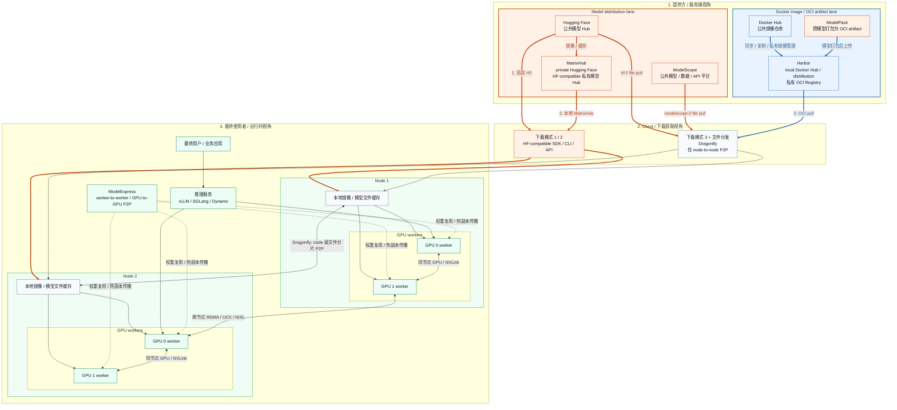
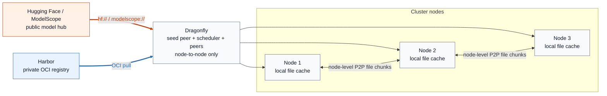
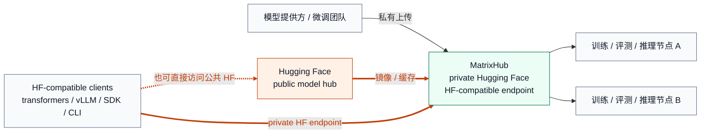
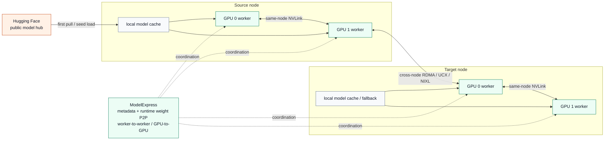

# 如何理解 Hugging Face、私有 Hugging Face、MatrixHub、Harbor + Dragonfly + ModelPack 与 ModelExpress

在讨论 AI 模型分发时，团队很容易把几类完全不同的系统混在一起：有些项目解决的是
**模型从哪里来**，有些解决的是 **模型在企业内部怎么托管和治理**，还有一些解决的是
**模型如何更快进入 GPU 集群并完成冷启动**。

这也是很多技术讨论容易“错位”的原因。一个人讲的是公共模型平台，另一个人讲的是
私有仓库，第三个人讲的是运行时权重传输，但所有人都在说“模型分发”。

本文尝试把下面这些常见名词放进同一张图里：

- Hugging Face
- ModelScope
- 私有 Hugging Face
- MatrixHub
- Harbor + Dragonfly + ModelPack
- ModelExpress

重点不是做简单产品介绍，而是回答两个更重要的问题：

1. 它们分别在模型分发链路里的哪一层？
2. 它们分别想解决什么问题，适合什么场景？

## 总体架构图

这张图可以从三个视角来读：

- **提供方 / 服务端视角**：蓝色背景代表 `Docker image / OCI artifact` 路线，Harbor 在这里更像企业内部的 `local Docker Hub / distribution`，ModelPack 负责把模型变成 OCI artifact；橙色背景代表 `model distribution` 路线，Hugging Face、ModelScope 和 MatrixHub 都属于这一侧。
- **下载获取视角**：这里明确区分三种下载模式。`HF-compatible SDK / CLI / API` 对应前两种：`1. 直连 Hugging Face`，`2. 访问本地 MatrixHub`；第三种是 `OCI 改造后通过 Docker Hub / Harbor 拉取`。Dragonfly 位于文件分发层，负责 node 级 P2P。
- **最终使用者视角**：模型文件先进入 node 本地缓存，再进入 GPU worker；`ModelExpress` 则位于更靠后的运行时层，处理 worker-to-worker、甚至 GPU-to-GPU 的权重共享与冷启动优化。

颜色也有含义：

- **橙色线**：HF-compatible / model hub 下载路径
- **蓝色线**：OCI pull 路径
- **灰色 node 间线**：Dragonfly 的 node 级文件分片传播
- **绿色 GPU 间线**：ModelExpress 关注的运行时权重共享路径

如果只用一句话概括：

- **模型下载有 3 种模式**：
  1. 直连 `Hugging Face`
  2. 走本地 `MatrixHub`
  3. 先做 `OCI` 改造，再走 `Docker Hub / Harbor`
- **P2P 分发有 2 种模式**：
  1. `Dragonfly`：**仅 node-to-node**
  2. `ModelExpress`：**worker-to-worker / GPU-to-GPU**

理解这一点之后，很多争论都会自然消失：这些项目大多不是彼此替代，而是站在不同层上解不同的问题。

## 三个单独方案图

除了总图，下面三张图分别只保留各自最关键的链路。

### 1. Dragonfly 方案：Harbor + 公共模型 Hub 即可

这张图强调的是：

- Dragonfly 可以同时接公共模型来源和私有 OCI registry
- 它解决的是 **node 级文件分发**
- 它的 P2P 语义是 **仅 node-to-node**
- 它不关心 GPU 权重是否已经加载

### 2. MatrixHub 方案：更像“私有 Hugging Face”

这张图强调的是：

- MatrixHub 更关注 **私有模型入口与治理**
- 它对应的是 **下载模式 2：本地 MatrixHub**
- 它尽量保留 Hugging Face 风格的使用方式
- 它不是专门做 GPU-to-GPU 权重搬运的组件

### 3. ModelExpress 方案：只保留 HF 公共模型来源

这张图强调的是：

- ModelExpress 关注的是 **运行时权重共享**
- 它的 P2P 语义是 **worker-to-worker / GPU-to-GPU**
- source node 先加载模型
- 后续 worker，尤其是跨 node 的 GPU worker，可以通过更快的路径复用权重状态

## 一、Hugging Face 与 ModelScope：它们首先是“公共模型来源”

### Hugging Face

Hugging Face 是今天最主流的公共模型 Hub。大量训练、评测和推理工作流默认围绕
`huggingface_hub`、`transformers` 以及各种兼容客户端构建。

它最大的价值是：

- 公共模型发现与共享
- 社区驱动的模型生态
- 对研究和开发工作流非常友好

但它并不是为企业内部大规模模型分发而设计的。尤其是在下面这些场景里，问题会迅速放大：

- 大模型需要分发到几十到几百个节点
- 集群会频繁扩缩容
- 企业需要私有权限、审计和内网隔离
- 同一个模型被反复拉取和重复传输

### ModelScope

ModelScope 在这个框架里，最接近的角色不是 MatrixHub，也不是 ModelExpress，而是
**另一类公共模型生态和平台入口**。

它和 Hugging Face 有相似的一面：

- 公共模型 Hub
- 数据集 Hub
- SDK / CLI / 下载能力

它又比传统意义上的公共模型仓库更平台化一些，因为它还强调：

- 在线体验与 Notebook / Studio 能力
- API-Inference
- 更偏中文和国内生态的模型覆盖

所以从模型分发链路上说，Hugging Face 和 ModelScope 首先解决的是：

**模型从哪里来，开发者如何访问公共模型生态。**

它们不是企业内部治理层，也不是集群内冷启动优化层。

## 二、私有 Hugging Face：这是“目标能力”，不是单一产品

很多团队说“我们想做一个私有 Hugging Face”，本质上表达的通常不是“想复制一遍
Hugging Face 网站”，而是想获得这样一组能力：

- 私有模型托管
- 权限控制与审计
- 内网 / air-gapped 环境可用
- 研发侧尽量不改现有 HF 工作流
- 模型能稳定、高效地分发到训练和推理环境

也就是说，**私有 Hugging Face 更像一个目标状态**。

不同团队会用不同方案去逼近这个状态：

- 有的会选择 `MatrixHub`
- 有的会选择 `Harbor + ModelPack + Dragonfly`
- 还有的会自己在通用存储或制品仓库前面封装一层兼容入口

但这些方案能提供的“兼容程度”和“运维复杂度”并不相同。

## 三、MatrixHub：更像“私有 Hugging Face”

如果你想在这些方案里找到一个最贴近“私有 Hugging Face”概念的项目，答案基本就是
`MatrixHub`。

它想解决的问题非常明确：

- 让企业内部拥有一个私有模型 Hub
- 尽量保留 Hugging Face 风格的访问体验
- 提供私有模型治理、缓存、同步和 air-gapped 支持

因此，MatrixHub 更适合下面这些场景：

- 现有训练、评测、推理代码大量依赖 HF 工作流
- 希望通过 `HF_ENDPOINT` 一类方式平滑切换
- 企业有模型权限、合规和多区域同步需求
- 想快速得到一个“面向模型团队”的私有入口

它的核心定位不是“通用制品仓库”，而是 **AI model hub**。这和 Harbor 的思路有明显差异。

## 四、Harbor + ModelPack + Dragonfly：这是一条 OCI-first 的企业分发栈

### 1. Harbor 解决什么问题

Harbor 是一个成熟的私有 OCI Registry。它擅长的是：

- RBAC
- 签名与验证
- 复制
- 保留策略
- 统一管理 OCI artifact

如果要用一句更容易代入的话来理解它，可以把 Harbor 看作：

**企业内部增强版的 Docker Hub / distribution。**

所以 Harbor 解决的不是“原生 HF-compatible 入口”，而是：

**企业内部如何以标准化方式托管和治理模型制品。**

### 2. ModelPack 解决什么问题

ModelPack 处在更前面一层，它是 **模型如何被封装为 OCI artifact** 的规范/打包路径。

它不解决：

- GPU-to-GPU
- 冷启动优化
- 集群内权重传输

它解决的是：

- 模型如何被标准化描述和打包
- 模型如何进入 OCI 生态

因此，ModelPack 更接近“包装和格式”层，而不是“传输和运行时”层。

### 3. Dragonfly 解决什么问题

Dragonfly 是这一条栈里最容易被低估的组件。它解决的是：

**同一个模型文件如何被高效分发到大量节点。**

在 AI 模型场景中，它的价值尤其明显，因为：

- 模型文件往往是 10 GB 到 100+ GB 级别
- 同一个版本会被几十到几百个节点重复拉取
- 源站经常受限于带宽、速率限制和出口成本

Dragonfly 的 P2P 更准确地说是：

- **仓库到节点的文件级 P2P**
- **piece/chunk 级传播**
- **Seed Peer 回源一次，其他节点通过 peer 网格传播**

随着 `hf://` 和 `modelscope://` 的原生支持，它已经不仅能做通用文件和 OCI artifact 分发，也能直接把 Hugging Face 和 ModelScope 当作上游模型来源。

### 4. 这条栈适合谁

`Harbor + ModelPack + Dragonfly` 特别适合：

- 企业已经是 OCI-first / Kubernetes-first
- 平台团队更看重标准化制品治理
- 可以接受模型工作流围绕 OCI artifact 来组织
- 不强求原生 Hugging Face 客户端语义

这是一条非常工程化、平台化的路径，但它不是“私有 Hugging Face 体验优先”的路径。

## 五、ModelExpress：它不解决“模型仓库”，而解决“运行时最后一跳”

ModelExpress 与前面几类项目最大的区别在于，它不是模型 Hub，也不是通用 registry，也不是单纯的节点分发层。

它真正瞄准的问题是：

**模型已经进入集群之后，如何更快地把权重送进新的推理副本和 GPU。**

这通常发生在下面这些场景：

- vLLM / Dynamo / TRT-LLM 等推理系统扩容
- 新 pod 启动时不想重新完整走一遍磁盘读取与权重加载
- 一个副本已经加载好的模型，希望其他副本复用其“热状态”

因此，ModelExpress 的 P2P 与 Dragonfly 的 P2P 不是一回事。

### Dragonfly 的 P2P

- 传的是模型文件
- 路径是 `源站 / 仓库 -> 节点`
- 目标是减少重复下载和源站压力

### ModelExpress 的 P2P

- 传的是运行时权重
- 路径是 `seed worker / source GPU -> target worker / target GPU`
- 目标是减少冷启动、磁盘读取和重复加载

从硬件视角看，ModelExpress 更依赖：

- InfiniBand / RoCE
- UCX
- RDMA
- NVLink / NVSwitch
- GPU-to-GPU 通信能力

所以它最自然的落点是：

- **集群内**
- **多节点 GPU 推理场景**
- **大模型副本扩容**
- **对冷启动时间非常敏感的系统**

它不是一个多集群统一模型仓库，也不是公共模型来源。

## 六、这些项目分别在尝试解决什么问题

如果把问题拆开，每个项目的目标会清楚很多。

### 1. “模型从哪里来？”

解决这个问题的是：

- Hugging Face
- ModelScope

它们提供公共模型来源、社区和开发者入口。

### 2. “企业内部如何托管与治理模型？”

解决这个问题的是：

- MatrixHub
- Harbor

两者的区别是：

- MatrixHub 更偏 **私有 Hugging Face**
- Harbor 更偏 **私有 OCI 制品底座**

### 3. “模型如何标准化打包并进入 OCI 生态？”

解决这个问题的是：

- ModelPack

### 4. “同一个模型如何高效分发到大量节点？”

解决这个问题的是：

- Dragonfly

### 5. “模型进入集群后，如何更快变成可服务的 GPU 副本？”

解决这个问题的是：

- ModelExpress

## 七、典型场景怎么选

### 场景 A：研发团队以 Hugging Face 工作流为中心

如果你的团队大量依赖：

- `huggingface_hub`
- `transformers`
- HF 风格的模型组织方式

而你的目标是最小改动切入企业私有模型分发，那么优先看：

- `MatrixHub`

如果后续还要进一步优化推理冷启动，再叠加：

- `ModelExpress`

### 场景 B：平台团队以 OCI artifact 和 Kubernetes 为中心

如果平台团队已经在做：

- Harbor
- OCI Registry
- Kubernetes 制品治理
- 镜像签名、复制、保留、审计

那么更自然的路径是：

- `ModelPack + Harbor + Dragonfly`

这条路的关键不是模拟 HF 体验，而是把模型纳入统一制品体系。

### 场景 C：大规模 GPU 集群频繁扩缩容

如果真正痛点是：

- 模型太大
- 节点太多
- 扩容时每个副本重新加载太慢

那就要区分两个阶段：

- **模型文件到节点**：`Dragonfly`
- **权重到 worker / GPU**：`ModelExpress`

两者可以叠加，不冲突。

### 场景 D：多来源模型生态

如果企业同时从下面这些地方拿模型：

- Hugging Face
- ModelScope
- 内部自研模型

那么更推荐做分层设计：

- 上游公共来源：`Hugging Face / ModelScope`
- 企业内部治理：`MatrixHub` 或 `Harbor`
- 节点级分发：`Dragonfly`
- 运行时加速：`ModelExpress`

## 八、一个更实用的结论

这些系统真正的差别，不在于“谁更强”，而在于它们分别假设你卡在不同的位置。

- Hugging Face / ModelScope 假设你需要的是 **公共模型入口**
- MatrixHub 假设你需要的是 **私有模型 Hub**
- Harbor + ModelPack 假设你需要的是 **标准化制品治理**
- Dragonfly 假设你需要的是 **节点级大规模分发**
- ModelExpress 假设你需要的是 **运行时权重加速和 GPU 冷启动优化**

因此，最应该避免的不是“选错单个项目”，而是**把不同层的问题交给错误的组件**。

把它们放在一张图里之后，一个更准确的心智模型应该是：

- `Hugging Face / ModelScope` 是上游来源
- `MatrixHub` 是私有 HF 路线
- `Harbor + ModelPack + Dragonfly` 是 OCI-first 路线
- `ModelExpress` 是集群内最后一跳运行时路线

很多时候，答案不是二选一，而是**分层组合**。

## 参考链接

- [Hugging Face](https://huggingface.co/)
- [ModelScope](https://modelscope.cn/)
- [MatrixHub](https://github.com/matrixhub-ai/matrixhub)
- [Harbor](https://goharbor.io/)
- [Dragonfly](https://d7y.io/)
- [ModelPack](https://modelpack.org/)
- [ModelExpress](https://github.com/ai-dynamo/modelexpress)
