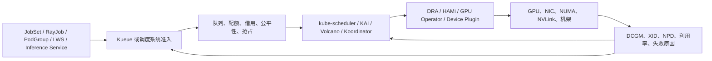
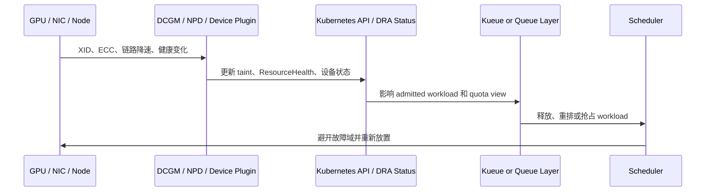

# 大规模 GPU 调度：拓扑、队列、公平性的系统化实践

本文对应 [issue #303](https://github.com/pacoxu/AI-Infra/issues/303)，补齐一篇面向平台团队的中文草稿。相关背景可继续阅读 [Kubernetes 调度优化](../../kubernetes/scheduling-optimization.md)、[DRA 整体设计](../../kubernetes/dra.md)、[GPU 故障检测与调度](../../kubernetes/gpu-fault-detection.md)、[Scheduler Framework 演进](../2026-05-21/2026-05-21-kubernetes-scheduler-framework-evolution_zh.md)、[Dynamo/Grove/KAI/DRA 生态拆解](../2026-05-11/2026-05-11-dynamo-grove-kai-dra-ecosystem-zh.md) 和 [训练作业管理](../2026-04-13/2026-04-13-ai-training-job-management-jobset-kueue-ray-gang_zh.md)。

## 大纲

1. 从 Pod 调度走向工作负载级准入。
2. 以 `DRA + Kueue` 建立单集群基线。
3. 说明 GPU/NIC/NUMA/NVLink/机架拓扑为什么重要。
4. 把队列、配额、公平性、抢占放到平台策略层。
5. 将 GPU 故障、健康状态和利用率反馈接回调度闭环。
6. 对比 Kueue、Volcano、KAI、Koordinator、HAMi，并给出训练、推理、混部选型矩阵。

## 先说结论

大规模 GPU 调度不是把 Pod 放到“最近的一组 GPU”这么简单。拓扑感知只能解决局部放置质量问题，不能回答谁应该先运行、哪个团队可以借用多少配额、是否允许抢占、故障卡如何从容量视图里消失、推理和训练是否应该共享同一组节点等平台问题。真正可落地的方案通常是五层闭环：工作负载级准入、队列与公平性、DRA 或设备插件表达资源、拓扑感知放置、故障与利用率反馈。

保守基线是 `Kueue + kube-scheduler + DRA/HAMi`。Kueue 负责队列、配额、借用、抢占和多集群派发；DRA 负责把 GPU、NIC、NUMA、分区设备和健康状态放进 Kubernetes 资源模型；HAMi 负责 vGPU、MIG/MPS 类共享和异构设备抽象；默认调度器继续完成 Pod 级调度。只有当训练作业强依赖 gang、拓扑、队列公平性，或者线上线下混部需要更强的资源画像时，才值得把 Volcano、KAI Scheduler、Koordinator 这类更完整的调度系统引入主路径。

## 从 Pod 调度走向工作负载调度

GPU 集群的基本单位不是单个 Pod，而是一个训练作业、一组 Ray worker、一个分布式推理服务，或者一批要同时启动的副本。单 Pod 调度最容易造成三类问题：第一，分布式训练只调度了一半副本，已占 GPU 却无法开跑；第二，小作业把同一节点上的高带宽 GPU 组合打散，后续大作业只能排队；第三，故障卡、降速链路、冷热节点没有及时反馈给准入层，导致作业反复失败。

因此，平台要先在工作负载入口做准入和排序，再把可运行的作业交给底层调度器。Kueue 的 ClusterQueue、LocalQueue、ResourceFlavor、Cohort 和 Fair Sharing 就是这一层；Volcano、KAI 的 Queue/PodGroup/Gang 能覆盖类似问题；Koordinator 更偏向混部、资源画像、NUMA/设备亲和和重调度。关键不是选一个“最强调度器”，而是先明确哪一层在做容量治理，哪一层在做放置优化。

## 单集群基线：DRA + Kueue

在单集群里，建议先把“容量是否允许运行”和“具体放到哪里”拆开。Kueue 可以在 Pod 创建或调度前决定 workload 是否被 admitted，并用队列策略控制 StrictFIFO、BestEffortFIFO、配额借用、Cohort、Fair Sharing、preemption 和 AdmissionCheck。这样平台可以先回答“这个团队现在能不能拿到 128 张 GPU”，再让调度器回答“这些 Pod 放到哪些节点”。

DRA 的价值是把设备从简单的整数扩展资源推进到结构化资源。到 Kubernetes v1.35，DRA 本身已经是 stable；到 v1.36，优先级资源列表、AdminAccess、分区设备、扩展资源兼容、设备 taint、设备健康状态、资源池可见性、工作负载级 ResourceClaim 等能力覆盖了 GPU 调度最关心的方向。不过边界也要写清楚：DRA 让资源表达更准确，但并不自动提供队列、公平性和完整的 gang 调度；Kubernetes 官方文档也明确 DRA 资源的 preemption 仍有限制。因此 DRA 更像资源模型底座，Kueue 或专用调度器才是平台策略层。

HAMi 则适合解决“设备怎么切、怎么共享、怎么支持异构 GPU”的问题。对推理服务、小训练和 Notebook，vGPU、MIG/MPS、资源配额 webhook、设备指标会直接影响利用率；但共享 GPU 不等于公平调度，仍需要 Kueue 或上层队列限制团队、租户和业务线的总使用量。

## 拓扑感知：重要但不能单独成立

拓扑感知在以下场景最有价值：多机多卡训练依赖 NVLink、NVSwitch、InfiniBand 或 RoCE；大模型推理需要把 prefill、decode、KV cache 传输和 NIC 位置统一考虑；节点内 NUMA、PCIe switch 和 GPU 亲和性会影响延迟；跨机架放置会放大网络 oversubscription 和故障域风险。

但拓扑感知本身不能解决队列公平。假设一个 8 卡训练作业需要同节点 NVLink，调度器可以选择最优节点；如果队列层没有保护，大量单卡推理 Pod 仍会持续打碎 8 卡节点。反过来，如果队列层已经把大作业 admitted，但拓扑层不知道 GPU/NIC/NUMA 组合，作业虽然能启动，通信效率也可能很差。正确做法是先用队列保护大资源形态，再用拓扑策略提高放置质量。

Kubernetes v1.36 的 Topology-Aware Workload Scheduling 仍是 alpha，围绕 PodGroup、TopologyPlacement、NodeResourcesFit 扩展和 PodGroupPodsCount 等插件演进。它说明 upstream 已经把问题从单 Pod 推向 workload，但生产平台仍要根据成熟度选择：简单场景可先用节点标签、ResourceFlavor、NodeAffinity；复杂训练集群再评估 KAI、Volcano 或 Koordinator 的拓扑能力。

## 队列、配额、公平性和抢占

队列层至少要回答四个问题。第一，准入顺序：是 StrictFIFO，还是允许短作业绕过长作业减少 head-of-line blocking。第二，配额边界：每个团队的 nominal quota、borrowing limit、lending limit 如何设置。第三，公平性：长期运行的大团队不能永久挤压小团队，小团队也不能靠短作业频繁抢占高价值资源。第四，抢占策略：抢占是否按 workload、queue、priority、运行时长和 checkpoint 成本综合判断。

Kueue 的 Cohort、Fair Sharing 和 preemption 适合把这套策略放在准入层。Volcano v1.15.0 增强了 gang-aware preemption、资源回收、DRA queue quota 和队列调度门控。KAI 则把 hierarchical queues、DRF、time-based fairshare、min-guaranteed-runtime、workload consolidation、DRA 和 topology-aware scheduling 放在一个 AI scheduler 里。它们都在解决同一个核心问题：GPU 是昂贵且形态敏感的资源，平台不能只看“此刻还有几张卡”。

## 故障感知调度：从告警到容量闭环

GPU 故障感知不能停在告警。平台需要把 XID、ECC、DCGM、NPD、驱动重置、链路降速、节点压力和训练失败原因转成调度信号：轻微故障可以降低优先级或避开新作业；严重故障要 taint、cordon 或从 ResourcePool 里移除；可恢复故障要触发排空、重启和重新准入；重复失败要写回 Workload 状态，避免调度器继续把作业送回同一类节点。

这也是为什么“拓扑最优”必须服从“健康可用”。一个理论上最短路径的 GPU 组合，如果最近 24 小时出现过高频 XID 或 NIC 降速，就不应该继续承载高优先级训练。平台指标要能回答：失败是否集中在某些卡、某个机架、某类镜像、某个训练框架版本，还是由队列等待和 checkpoint 频率引起。

## 项目分工

| 项目 | 更适合承担的角色 | 典型场景 | 注意边界 |
| --- | --- | --- | --- |
| Kueue | 队列准入、配额、公平性、多集群派发 | 多团队训练、批处理、Ray/JobSet、MultiKueue | 不替换 kube-scheduler；拓扑和 Pod 放置仍依赖调度器 |
| DRA | 结构化设备资源模型 | GPU/NIC/NUMA、分区设备、设备健康、ResourceClaim | 不是队列系统；DRA 资源 preemption 仍要关注限制 |
| HAMi | vGPU、MIG/MPS、异构设备共享 | 推理、小训练、Notebook、GPU 细粒度配额 | 解决设备共享，不单独解决跨团队公平 |
| Volcano | 批处理、PodGroup、gang、队列、AI/HPC 调度 | 训练、HPC、需要 gang-aware preemption 的集群 | 引入后要明确与 Kueue、默认调度器的职责边界 |
| KAI Scheduler | 面向 AI 的高吞吐调度器 | 大规模 GPU、fairshare、topology、DRA、层级队列 | 能力完整，也意味着平台策略要一起迁移 |
| Koordinator | 混部、资源画像、NUMA/设备、重调度 | 在线推理与离线训练共池、SLO 优先、资源超卖 | 更偏混部和运行时反馈，不只是批处理队列 |

## 训练、推理、混部的差异

| 维度 | 分布式训练 | 在线推理 | 在线离线混部 |
| --- | --- | --- | --- |
| 核心风险 | gang 不满足、拓扑差、长队列、抢占损失大 | 延迟抖动、冷启动、碎片化、共享 GPU 干扰 | SLO 被离线任务影响、节点压力不可控 |
| 调度重点 | PodGroup、队列、公平性、拓扑、checkpoint-aware preemption | 快速准入、容量预留、vGPU/MIG、热点隔离 | 资源画像、QoS、NUMA/设备、重调度、压制策略 |
| 推荐基线 | JobSet/RayJob + Kueue + DRA，必要时 Volcano/KAI | Kueue 管配额，HAMi/DRA 管设备，服务层管弹性 | Koordinator 或同类混部系统叠加 Kueue |
| 可接受抢占 | 低，除非有 checkpoint 和恢复预算 | 很低，通常用隔离或扩缩容代替 | 对离线任务较高，对在线服务接近不可接受 |

## 选型矩阵

| 信号 | 保持简单 | 深入调度定制 |
| --- | --- | --- |
| GPU 规模 | 几十张卡，单团队或少量团队 | 数百到数千张卡，多租户、多优先级 |
| 作业形态 | 单卡或少量卡，失败可快速重试 | 64/128/256 卡训练，gang 和 checkpoint 成本高 |
| 拓扑敏感度 | 通信不是瓶颈，节点标签足够 | NVLink/NIC/NUMA/机架显著影响吞吐或尾延迟 |
| 资源碎片 | 等待主要来自总量不足 | 大量空闲卡因形态错误无法被大作业使用 |
| 公平性 | 人工配额和 namespace quota 足够 | 需要 borrowing、lending、DRF、长期 fairshare |
| 故障模式 | 偶发节点故障，人工排障可接受 | 故障卡、降速链路、机架风险会反复影响作业 |
| 运维能力 | 调度团队较小，优先稳定 | 能维护 scheduler profile、插件、队列策略和 SLO |

一个可执行的推进顺序是：先把 Kueue 作为准入和配额层，接入 DRA/HAMi 表达设备；再用指标观察 pending reason、admission latency、GPU fragmentation、队列借用、抢占次数、作业恢复时间、GPU 利用率和故障复发率；最后再决定是否引入 KAI、Volcano 或 Koordinator。不要因为“拓扑感知很高级”就先重写调度链路。只有当队列公平性、资源碎片、拓扑瓶颈和故障复发都已经成为业务成本，复杂调度才值得上主路径。

## 事实校对

校对时间：2026-07-24。

- Kubernetes DRA：官方文档标记为 v1.35 stable；v1.36 继续加入 prioritized list stable、AdminAccess stable，以及分区设备、device taints、ResourceHealth、扩展资源兼容等 beta/alpha 能力。
- Kubernetes workload-aware scheduling：PodGroup、Gang Scheduling、Topology-Aware Workload Scheduling、Workload-Aware Preemption 在 v1.35/v1.36 仍以 alpha 为主，生产使用需要关注 feature gate 和 API 变化。
- Kueue：latest release 为 v0.19.0，文档覆盖 Fair Sharing、Cohort、preemption、
  DRA quota、MultiKueue、Topology-Aware Scheduling 等能力；Kueue 不替换底层调度器。
- KAI Scheduler：latest release 为 v0.16.6，项目定位是面向大规模 AI/GPU 集群的
  Kubernetes native scheduler，强调 hierarchical queues、fairness、DRA、
  topology-aware scheduling 和 GPU sharing。
- Volcano：latest release 为 v1.15.0，包含 gang-aware preemption、资源回收、DRA queue quota、multi-sharding、Kubernetes 1.35 支持等调度增强。
- Koordinator：latest release 为 v1.8.0，关注混部、资源画像、DeviceShare、Coscheduling、NUMA/topology、reservation、preemption 和调度诊断。
- HAMi：latest release 为 v2.9.0，继续推进 HAMi-core、HAMi-DRA、Volcano vGPU device plugin、Ascend 910C 支持、quota webhook 和 metrics。

## 相关 issue

本文与 #285、#297、#300、#359、#309 共享同一条 AI Infra 调度主线：先厘清 workload abstraction，再区分队列准入、设备资源表达、拓扑放置、推理编排和运行时反馈。后续如果继续拆分，可以把 Kueue MultiKueue 多集群批处理、HAMi vGPU、KAI/Grove/DRA 以及 Koordinator 混部各自扩成案例文章。
