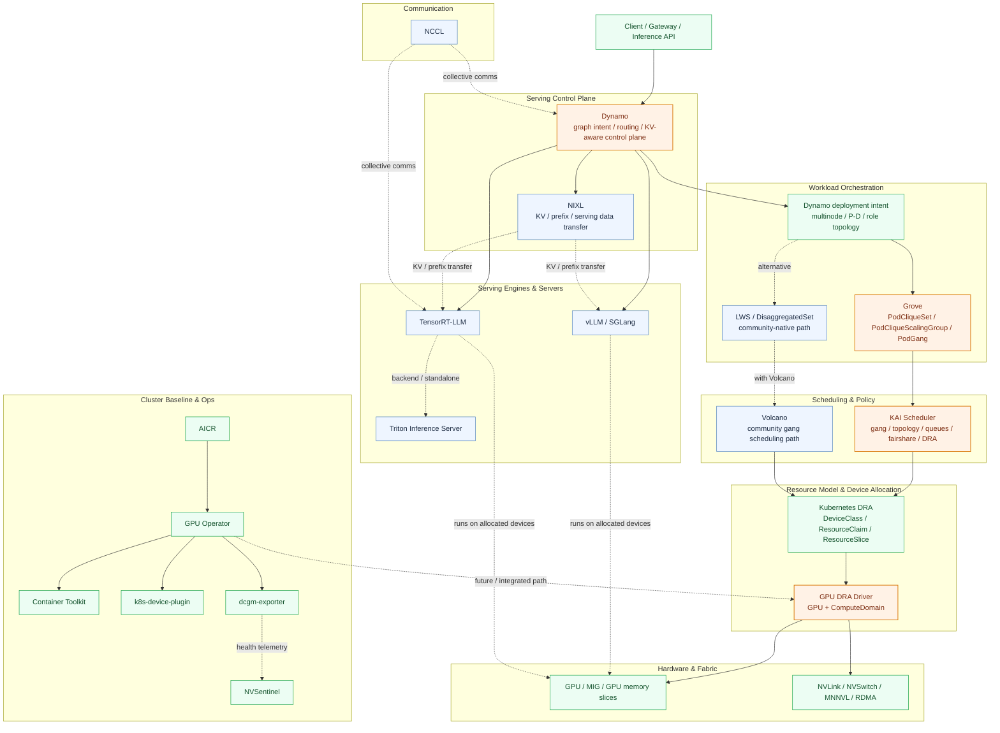

# NVIDIA 推理编排主线拆解：Dynamo、Grove、KAI Scheduler 与 GPU DRA Driver

之前在仓库里写过一版
[NVIDIA 云原生开源全景图](../../../case-study/nvidia.md)，那一版更像“项目地图”。
如果现在把镜头收紧到 **NVIDIA 在 Kubernetes 上的大模型推理主线**，我会把重点放在
四层能力栈上：

- **Dynamo**：推理控制面与运行时编排入口
- **Grove**：多组件推理工作负载的 Kubernetes 编排 API
- **KAI Scheduler**：面向 AI 工作负载的调度策略与拓扑决策层
- **GPU DRA Driver**：把 GPU / ComputeDomain 变成可声明、可约束、可共享的资源对象

如果只看这条线，一个更准确的结论是：

> 它们不是四个并列竞争项目，而是从“推理系统意图”一路往下，逐层落到
> “工作负载抽象 -> 调度策略 -> 设备资源模型 -> GPU / NVLink fabric”的一条主链路。

截至 **2026 年 5 月 11 日**，NVIDIA Dynamo 官方 Kubernetes 安装文档仍然把
**两条 multinode 路径** 并列列出来：

- **Grove + KAI Scheduler**：更完整、也是更贴近 NVIDIA 主推路线的方案
- **LWS + Volcano**：更社区原生、更轻量的替代路径

这也是为什么要把 `LWS`、`DRA` 和 `vLLM` 一起放进来看，而不能只盯着 `Dynamo`
本身。

## 先说结论

- **Dynamo 不是 vLLM 的同义词。** 它更像分布式推理控制面，下面可以挂
  `vLLM`、`SGLang`、`TensorRT-LLM` 等引擎。
- **Grove 不是调度器。** 它负责把“prefill / decode / router / leader / worker”
  这些角色关系，声明成一个能被 Kubernetes 理解的多层工作负载对象。
- **KAI 不是设备驱动。** 它负责基于 gang、拓扑、队列、公平性和 DRA claim
  做真正的放置决策。
- **GPU DRA Driver 不只是“新版 device plugin”。** 它真正重要的地方在于，把
  `GPU` 和 `ComputeDomain` 这类对象，抬升成 Kubernetes 原生资源模型的一部分。
- **NIXL 和 NCCL 不是一回事。** `NIXL` 更偏推理系统里的 `KV / prefix / serving
  data movement`，`NCCL` 更偏 GPU 间 collective communication。
- **LWS 正在成为社区通用基线。** Grove 可以理解成 NVIDIA 在这个方向上的更强意见版：
  更强调多组件、层次化 gang、显式启动顺序和拓扑约束。
- **vLLM 更偏数据面。** vLLM core 解决推理引擎问题，`production-stack` 解决
  router + observability + Helm 部署问题；但多节点、多角色、强拓扑约束的集群编排，
  仍然需要更上层的工作负载抽象。
- **AICR / GPU Operator / Container Toolkit / device plugin / DCGM / NVSentinel**
  不是这条主线的“抽象中心”，但它们决定这条主线能否稳定装起来、跑起来、观测起来、
  隔离起来。

## 一张图看主线



这张图里最关键的不是项目多少，而是**控制权是如何逐层下沉的**：

1. **Dynamo** 负责表达“我要什么样的推理系统”。
2. **Grove / LWS** 负责表达“这些 Pod 之间是什么关系，哪些要一起起，哪些要分层扩缩”。
3. **KAI / Volcano** 负责决定“到底放到哪，怎么保证 gang、拓扑和公平性”。
4. **DRA + GPU DRA Driver** 负责把“GPU / ComputeDomain 到底是什么、能否共享、能否切分”
   编进 Kubernetes 的资源语义里。
5. **AICR / GPU Operator / Toolkit / DCGM / NVSentinel** 则负责把这套东西装起来、
   观测起来，并在出问题时给出治理抓手。

## 1. 四个核心项目分别解决什么问题

| 层次 | 项目 | 它真正做什么 | 为什么重要 |
| --- | --- | --- | --- |
| 推理控制面 | **Dynamo** | 多节点分布式推理框架，强调 disaggregated serving、路由、KV 管理、NIXL 传输 | 把推理平台从“单引擎部署”提升到“整套分布式推理系统” |
| 工作负载抽象 | **Grove** | 用单个 CR 表达 prefill / decode / router / leader / worker 等组件关系 | 让多角色推理系统成为 Kubernetes 可声明对象 |
| 调度策略 | **KAI Scheduler** | 提供 batch/gang、拓扑感知、层次化 PodGroups、fairshare、DRA 支持 | 让 AI 工作负载真正得到“按拓扑和队列目标放置”的能力 |
| 资源模型 | **GPU DRA Driver** | 暴露 `GPU` 与 `ComputeDomain`，用 DRA 做资源声明、约束与分配 | 让 GPU 与 NVLink 域不再只是“nvidia.com/gpu=8” 这种粗粒度计数 |

如果只看仓库名字，很容易误判这几个项目是“各做各的”。其实它们更像：

```text
推理系统意图
  -> 工作负载图
  -> 调度约束
  -> 资源声明
  -> 设备分配
  -> 引擎运行
```

## 2. 为什么说 Grove 是这条主线里的关键转折点

Grove 当前 GitHub README 的定位很明确：**“One API. Any inference architecture.”**
它的目标不是只做 leader-worker 控制器，而是要把整个推理系统作为一个
**单一声明式对象** 管起来。

它当前公开强调的几个核心抽象是：

- `PodClique`
- `PodCliqueScalingGroup`
- `PodCliqueSet`
- `PodGang`

这意味着 Grove 的重点不是“帮你多起几个 Pod”，而是让下面这些事情成为一等能力：

- **层次化 gang scheduling**
- **显式启动顺序**
- **多层扩缩容**
- **拓扑感知放置**
- **把 prefill / decode / router 当作同一系统内不同角色来建模**

这和普通 Deployment / StatefulSet 的思路完全不同。后者默认把 Pod 当成独立副本；
Grove 则把 **“一个可工作的推理实例”** 当成基本扩缩单元。

这正好解释了它和 Dynamo 的关系：

- **Dynamo** 负责推理平台能力本身，如分布式运行时、KV 路由、NIXL 等；
- **Grove** 负责把这套系统在 Kubernetes 上“怎么组装、怎么扩、怎么一起起”表达清楚。

官方 Grove 文档也明确写了：

- Grove 主要面向 **disaggregated inference**
- 可以把 `prefill`、`decode`、`routing` 放在 **一个 CR**
- 默认与 **KAI Scheduler** 搭配来做资源分配与调度

所以如果你问“在这条主线里，Grove 到底值钱在哪里”，答案是：

> 它不是又造了一个控制器，而是把 `多角色推理系统` 从“脚本和 YAML 拼装件”
> 升级成了 `Kubernetes 原生抽象`。

## 3. KAI Scheduler 才是把 Grove 设计落到地上的那一层

很多人看到 Grove 后，会自然以为“既然 CR 都有了，问题就差不多解决了”。
其实没有。真正难的是：**谁来做最终放置决策？**

截至 2026-05-11，KAI README 里公开强调的关键能力包括：

- **Batch / Gang scheduling**
- **Hierarchical Queues**
- **Time-based Fairshare**
- **Topology-Aware Scheduling**
- **Hierarchical PodGroups**
- **DRA support**
- **DRA support for NVIDIA ComputeResources (GB200/GB300)**

这几项放在一起看，信号非常强：

### 3.1 KAI 不是“另一个通用调度器”

它是按 **AI workload at scale** 去设计的，重点就是：

- GPU 资源很贵
- 工作负载经常是 gang 的
- 拓扑影响巨大
- 需要跨团队做公平性与回收
- inference / training / reservation 可能共用一个集群

这和普通 Web workload 调度逻辑完全不是一回事。

### 3.2 KAI 和 Grove 是强耦合关系，不是可有可无的搭配

KAI README 直接把 **Grove & Dynamo integration** 列进最新动态里。
NVIDIA Dynamo 文档也明确说：

- Grove 提供多节点 AI 工作负载的声明式编排
- 在 Grove 路径上，KAI 提供 GPU-aware scheduling 和 topology optimization，
  安装指南把它定位为 **optional but recommended**

换句话说，**Grove 负责描述系统关系，KAI 负责在真实集群里满足这些关系。**
两者拆开都能存在，但放在一起才形成 NVIDIA 这条主线的完整调度闭环。

### 3.3 KAI 的真正差异化，不只是 gang，而是“hierarchical + topology + DRA”

只会 gang scheduling 的项目并不稀缺。真正更难替代的是三件事的组合：

- **层次化 PodGroups**
- **拓扑感知**
- **DRA 资源语义**

这套组合对 `DeepSeek-R1`、`Llama-4-Maverick`、GB200/GB300、
MNNVL/ComputeDomain 这种场景尤其关键，因为这时调度目标已经不再是
“给我 8 张卡”，而是：

- 哪些卡在同一个 NVLink / NVSwitch 域
- 哪些角色必须同一批启动
- 哪些 Pod 组可以拆分，哪些不可以
- 哪些队列应该优先吃到高质量拓扑

## 3.4 `NIXL` 和 `NCCL` 在这条主线里分别属于哪一层

这两个名字很容易被一起提，但它们在这张图里的角色并不一样。

### `NIXL`

按仓库内现有资料，`NIXL` 更适合放在 **serving data plane / KV transfer**
这一层。它服务的是：

- shared prefix caching
- 跨请求 KV / prefix 共享
- 推理组件之间的数据搬运

所以它跟 `Dynamo` 的关系更近，和 `vLLM / TensorRT-LLM` 这类引擎也有交集。
它解决的是：**推理系统内部的数据怎么搬得更聪明。**

### `NCCL`

`NCCL` 则更明确属于 **GPU collective communication** 基础设施。它服务的是：

- 多 GPU collective
- 多节点 GPU 间通信
- 更底层的 distributed runtime / engine 通信原语

所以它和 `TensorRT-LLM`、多 GPU `Dynamo` runtime 更近。它解决的是：
**卡和卡之间怎么高效协同。**

一个更简洁的记法是：

```text
NIXL = inference-serving data movement
NCCL = GPU collective communication
```

## 4. GPU DRA Driver 是这条链路里最容易被低估的一环

如果说 Grove / KAI 解决的是“系统怎么排”，那 GPU DRA Driver 解决的是
“调度器到底在排什么”。

当前 `kubernetes-sigs/dra-driver-nvidia-gpu` README 有两个很重要的点：

1. 它管理 **两类资源**：
   - `GPU`
   - `ComputeDomain`
2. `ComputeDomain` 被定义成面向 **Multi-Node NVLink (MNNVL)** 的抽象

这意味着 NVIDIA 正在把过去很多“藏在驱动、脚本或 out-of-band 配置里”的硬件语义，
逐步推到 Kubernetes 的资源面上。

### 4.1 为什么 `ComputeDomain` 特别关键

普通 `device plugin` 时代，GPU 常常只是一个整数资源：

```text
nvidia.com/gpu: 8
```

但对现代多节点推理来说，这远远不够，因为系统真正关心的是：

- 这些 GPU 之间是否有足够好的互联
- 是否属于同一个可用 NVLink / NVSwitch 域
- 是否应该和其他工作负载隔离

`ComputeDomain` 的价值就在这里。它不是单卡计数，而是把
**“一组具备特定互联与隔离语义的 GPU 域”** 变成可声明资源。

### 4.2 为什么说这不是简单替代 device plugin

当前 README 还给了一个很关键的现实信号：

- `ComputeDomain` 路径已经 **officially supported**
- GPU allocation 方向还在继续演进
- 一些 GPU kubelet plugin 功能在 Helm 安装里默认仍然关闭

这说明这个项目当前最成熟、也最具战略价值的部分，未必是
“把所有 GPU 功能都用 DRA 重写”，而是先把 **高价值拓扑语义**
和 **多节点 NVLink 编排** 做对。

换句话说，GPU DRA Driver 的战略地位不在于“取代老插件”四个字，
而在于：

> 它让高端 GPU 拓扑不再只是节点内隐含事实，而成为 Kubernetes 可以参与决策的对象。

## 5. DRA 为什么在 2026 年这个时间点尤其值得放进主线

如果是 2024 年看 DRA，它更像一个“值得关注的新资源框架”。
但截至 **2026-05-11**，上游 Kubernetes 的 DRA 状态已经明显不同了：

- DRA 文档当前标注为 **Kubernetes v1.35 stable**
- v1.36 又继续推进了多项关键能力

对这条主线最相关的，不是 DRA “可不可用”，而是它正在快速长出什么语义。

### 5.1 对这条主线最重要的几个新能力

#### 1. `Partitionable devices`（v1.36 beta）

上游明确把“一个物理设备切成多个逻辑实例”的能力放进 DRA 语义里。
这对 GPU 切分、MIG、一类“逻辑设备共享底层物理资源”的场景非常关键。

#### 2. `Consumable capacity`（v1.36 beta）

同一设备可以被多个 `ResourceClaim` 消费，只要总消耗不超过设备容量。
这让 DRA 更接近“设备级别的可度量共享”，而不只是独占分配。

#### 3. `Workload ResourceClaims`（v1.36 alpha）

这是一个容易被忽视但非常关键的变化。上游开始支持把
`ResourceClaim / ResourceClaimTemplate` 挂到 **PodGroup**
这类工作负载对象上，而不是只绑定单 Pod。

这对 AI 工作负载的意义很直接：

- multi-pod group 可以共享一组声明好的设备资源
- 复杂工作负载扩缩时，不必自己手写 claim 生命周期控制器
- `PodGroup` 与 `gang / topology` 的语义开始和 DRA 对齐

### 5.2 这和 Grove / KAI 的关系是什么

这几项进展合在一起，意味着一件很重要的事：

> Grove / KAI 这类上层编排与调度项目，终于开始有机会建立在更强的上游资源语义之上，
> 而不必长期只靠“整数 GPU + 私有约定”。

从架构视角看，这会带来三层变化：

- **Grove** 可以把更复杂的设备/角色关系表达成 workload intent
- **KAI** 可以基于更丰富的 claim 与拓扑信息做调度决策
- **GPU DRA Driver** 则把 NVIDIA 硬件特性映射成 Kubernetes 可理解对象

这就是为什么我认为 `DRA` 现在不是旁支，而是这条主线的**底层语义加速器**。

## 6. LWS 在这张图里应该怎么摆

如果只看最早期印象，LWS 很容易被理解为：

> “一个 leader + worker 的轻量控制器”

但截至 **2026-05-11**，这个判断已经不够了。

LWS 当前 README 里公开强调的能力包括：

- **group of pods as a unit**
- **gang scheduling**（alpha）
- **topology-aware placement**
- **group-level rollout / scale**
- **DisaggregatedSet**

这里最值得注意的是 `DisaggregatedSet`。LWS README 现在把它明确描述为：

- 面向 **advanced multi-node inference**
- 由多个 LWS 组成
- 支持统一 lifecycle、rollout、failure handling
- 和 **llm-d** 共设计

这意味着 LWS 正在从“super pod”抽象，往更完整的 **多角色分布式推理工作负载 API**
演化。

### 6.1 所以 Grove 和 LWS 的关系不是“谁替代谁”

更准确地说：

- **LWS / DisaggregatedSet** 是社区更通用、更中性的演进方向
- **Grove** 是 NVIDIA 面向高端推理集群的一条更强意见、更强拓扑耦合的路线

你可以把它们理解成两种不同层级的答案：

| 维度 | LWS / DisaggregatedSet | Grove |
| --- | --- | --- |
| 站位 | 社区通用 API | NVIDIA 推理主线 API |
| 核心对象 | group / leader-worker / disaggregated set | pod clique / scaling group / pod gang |
| 调度搭配 | 常见是 `Volcano` | 主推 `KAI Scheduler` |
| 目标 | 给多节点推理一个可复用 API 基线 | 给复杂推理系统一个更完整的层次化编排模型 |
| 生态风格 | 更上游、更中性 | 更贴近 Dynamo / NVIDIA 拓扑优化路线 |

### 6.2 为什么 Dynamo 还保留 `LWS + Volcano` 路径

NVIDIA 官方安装文档现在仍然把 `LWS + Volcano` 列为 multinode 选项，
这说明两个现实：

1. **社区抽象不能被忽视。**
   企业用户和上游社区都会希望有更通用的 API，而不是把所有东西锁死在单一家族里。
2. **NVIDIA 也知道 adoption 需要梯度。**
   不是所有用户都准备好直接引入 Grove + KAI 这一整套路线。

所以在生态图里，LWS 最合适的位置不是“竞争对手”，而是：

> **社区侧的标准化基线**，同时也是 Grove 这条路线的重要参照系。

## 7. vLLM 应该放在这张图的哪里

`vLLM` 容易让人混淆的地方在于：它既是最强势的开源推理引擎之一，也在不断往
“更完整的推理平台”方向长。

截至 2026-05-11，vLLM 主仓 README 已明确把这些列进核心能力：

- `PagedAttention`
- `continuous batching`
- `chunked prefill`
- `prefix caching`
- **disaggregated prefill, decode, and encode**

这说明从 **引擎能力** 看，vLLM 已经不是“只能做单体推理服务”。

但同时，`vLLM production-stack` 的定位也很清晰：它是一个
**K8S-native cluster-wide deployment reference stack**，主要包含：

- serving engine
- request router
- observability stack

而且 README 里仍然把这些列在 roadmap / recent work 中：

- autoscaling based on vLLM-specific metrics
- support for disaggregated prefill
- KV-aware router improvements

### 7.1 这说明什么

说明 vLLM 生态当前更像：

- **底层引擎已经很强**
- **部署栈和路由栈也在快速补齐**
- **但多角色、多层次、强拓扑约束的 cluster orchestration 抽象**
  仍然不是它的核心主战场

所以把 vLLM 放进这张图时，比较准确的位置应该是：

- 在 **Dynamo 下方**，作为可能的 runtime engine
- 在 **旁侧**，作为独立的 `engine + router + helm stack` 生态

而不应该把 `vLLM` 和 `Grove / KAI / DRA` 混成同一层。

### 7.2 一个更实用的判断

如果你的问题是“我已经有 vLLM 了，还需要看 Dynamo / Grove / KAI 吗？”

答案取决于你现在卡在哪一层：

- 如果你卡在 **单实例吞吐、模型支持、KV cache、本地路由**，优先看 `vLLM`
- 如果你卡在 **多角色 deployment、拓扑感知、群组扩缩、跨节点 orchestration**，
  就必须往 `Dynamo / Grove / KAI / DRA` 这一层走

## 8. 这条开源主线真正想建立的，不是“又一套推理平台”

我更倾向于把这条路线理解为：

> **把高端 GPU 集群的物理现实，逐层翻译成 Kubernetes 的声明式对象。**

从上到下分别是：

- **Dynamo**：把推理系统意图显式化
- **Grove**：把多角色系统关系显式化
- **KAI**：把 gang / topology / fairness 显式化
- **GPU DRA Driver**：把 GPU / ComputeDomain / NVLink 域显式化

这件事的长期价值，比“再多一个 inference framework”要大得多。

因为真正难替代的，并不是 engine API 本身，而是下面这类能力的组合：

- 多节点、多角色推理系统如何声明
- 调度器如何理解拓扑质量差异
- 设备资源如何切分、共享、绑定到工作负载组
- 控制面如何把这些东西组合成稳定可运维的系统

## 9. 把之前全景图里的 NVIDIA 项目放回这张图

如果把之前
[NVIDIA 云原生开源全景图](../../../case-study/nvidia.md) 里的周边项目一起放回来，
这条主线会更完整。

| 项目 | 更适合放在哪一层 | 在这条主线里的角色 |
| --- | --- | --- |
| **AICR** | Cluster baseline / recipe layer | 生成经过验证的 recipe，把 GPU Operator、Network Operator、监控栈等组合成可复现工件 |
| **GPU Operator** | Node runtime lifecycle | 管驱动、toolkit、device plugin、DCGM，并承接未来 DRA 集成 |
| **NVIDIA Container Toolkit** | Container runtime bridge | 让容器真正拿到 GPU runtime、driver 和 CDI 相关能力 |
| **k8s-device-plugin** | Legacy / current default resource exposure | 旧路径和现役默认路径，提供 `nvidia.com/gpu` 这类粗粒度资源暴露，也是迁移到 DRA 的对照组 |
| **dcgm-exporter** | Observability | GPU 指标、健康和故障信号入口 |
| **NVSentinel** | Fault governance / remediation | 更偏 GPU 故障发现、隔离和治理，而不是推理编排本身 |
| **TensorRT-LLM** | NVIDIA-native engine layer | NVIDIA 路线下最关键的高性能引擎之一，可直接运行，也可挂到 Triton 或更上层控制面后面 |
| **Triton Inference Server** | Serving server layer | 更像模型服务承载层和统一 serving 外壳，不是多角色工作负载抽象层 |
| **NIXL** | KV / prefix transfer plane | 为 distributed serving 提供 KV / prefix 数据搬运能力 |
| **NCCL** | GPU communication plane | 提供多 GPU / 多节点 collective communication 基础设施 |

如果压缩成一句话：

- `AICR / GPU Operator / Toolkit / device-plugin / DCGM / NVSentinel`
  负责 **把 NVIDIA GPU 集群运行时装起来、暴露出来、观测起来、治理起来**
- `TensorRT-LLM / Triton / NIXL / NCCL`
  负责 **把 NVIDIA 推理数据面跑起来、传起来、协同起来**

所以它们不是偏离主线，而是主线的 **实现条件**。

## 10. 我会怎么画这块生态的结论图

如果要给这块生态下一个最简总结，我会这样表述：

```text
vLLM / SGLang / TensorRT-LLM
    = 推理数据面与引擎层

Dynamo
    = 分布式推理控制面

Grove / LWS / DisaggregatedSet
    = 多角色工作负载抽象层

KAI / Volcano
    = 调度与队列策略层

DRA + GPU DRA Driver
    = 设备资源模型层

GPU / NVLink / MNNVL / RDMA
    = 真实硬件拓扑层

AICR / GPU Operator / Toolkit / DCGM / NVSentinel
    = 集群运行时与治理层

NIXL / NCCL
    = 数据搬运与 GPU 通信层
```

其中 NVIDIA 真正最有辨识度的开源差异化，不是在最上面的 engine，而是在中下层这条链：

```text
Grove + KAI Scheduler + GPU DRA Driver
```

因为这三者合起来，才是在回答：

> **如何把 GB200 / NVLink / 多节点推理 / disaggregated serving 这种“硬件拓扑极强约束”的系统，
> 真正放进 Kubernetes 原生控制面里。**

## 参考资料

- [ai-dynamo GitHub 组织](https://github.com/ai-dynamo)
- [Dynamo GitHub](https://github.com/ai-dynamo/dynamo)
- [Grove GitHub](https://github.com/ai-dynamo/grove)
- [NIXL GitHub](https://github.com/ai-dynamo/nixl)
- [NVIDIA Dynamo: Grove 文档](https://docs.nvidia.com/dynamo/latest/kubernetes-deployment/multinode/grove)
- [NVIDIA Dynamo: Installation Guide](https://docs.nvidia.com/dynamo/dev/kubernetes-deployment/deployment-guide/installation-guide)
- [KAI Scheduler GitHub](https://github.com/kai-scheduler/KAI-Scheduler)
- [LWS GitHub](https://github.com/kubernetes-sigs/lws)
- [DRA Driver for NVIDIA GPUs](https://github.com/kubernetes-sigs/dra-driver-nvidia-gpu)
- [NVIDIA AICR GitHub](https://github.com/NVIDIA/aicr)
- [NVIDIA GPU Operator GitHub](https://github.com/NVIDIA/gpu-operator)
- [NVIDIA Device Plugin GitHub](https://github.com/NVIDIA/k8s-device-plugin)
- [NVIDIA Container Toolkit GitHub](https://github.com/NVIDIA/nvidia-container-toolkit)
- [NVIDIA DCGM Exporter GitHub](https://github.com/NVIDIA/dcgm-exporter)
- [NVIDIA NVSentinel GitHub](https://github.com/NVIDIA/NVSentinel)
- [TensorRT-LLM GitHub](https://github.com/NVIDIA/TensorRT-LLM)
- [Triton Inference Server GitHub](https://github.com/triton-inference-server/server)
- [NCCL GitHub](https://github.com/NVIDIA/nccl)
- [Kubernetes DRA 文档](https://kubernetes.io/docs/concepts/scheduling-eviction/dynamic-resource-allocation/)
- [Kubernetes v1.36 DRA 更新博客](https://kubernetes.io/blog/2026/05/07/kubernetes-v1-36-dra-136-updates/)
- [vLLM GitHub](https://github.com/vllm-project/vllm)
- [vLLM Production Stack GitHub](https://github.com/vllm-project/production-stack)
