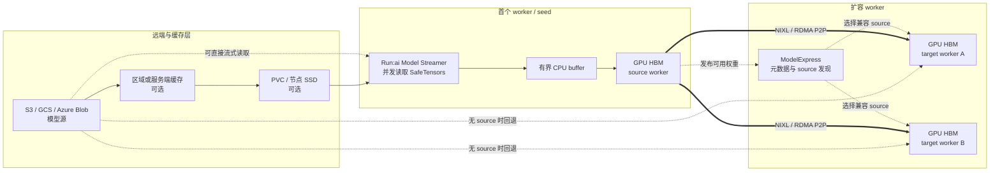
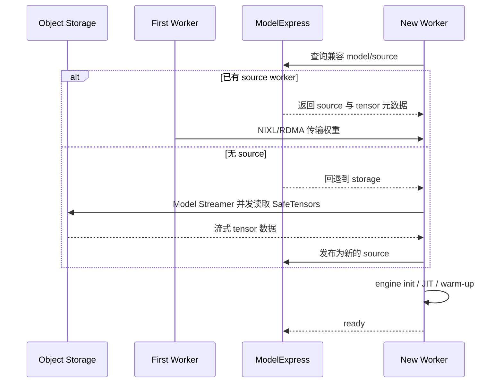

# Cache Offload 深入：Run:ai Model Streamer、Dynamo ModelExpress 与大模型加载加速

大模型服务的“首请求慢”，经常被笼统地归因于冷启动。但从 Pod 创建到第一个 token
返回，中间至少还有镜像拉取、GPU 分配、进程初始化、权重读取、CPU 到 GPU 搬运、
JIT/内核编译、CUDA Graph 捕获和预热等阶段。只优化其中一段，不一定能改善最终的
`Pod Ready`、扩容生效时间或首 token 延迟。

本文聚焦其中最重的一段：**模型权重如何从对象存储或文件系统进入 GPU 显存**，并把
三类常见方案放在同一条链路里比较：

1. 权重预拉取与分层缓存；
2. Run:ai Model Streamer 从存储并发、流式装载；
3. Dynamo ModelExpress 从已有副本复用权重，并用 Model Streamer 为首副本提供种子。

先澄清一个术语：这里讨论的是 **model weight loading / weight distribution**，不是
运行期的 **KV Cache offload**。KV Cache 是请求执行过程中产生的状态；模型权重则是
启动推理 worker 前必须准备的静态制品。两者都会经过 HBM、主机内存、SSD 或远端存储，
但生命周期、复用粒度和失败语义都不同。

## 先说结论

- **小规模、更新不频繁**：优先使用下载 Job/Init Container + PVC 或节点本地 SSD，
  方案简单、故障面小。
- **模型在对象存储，首副本慢**：Run:ai Model Streamer 适合把 SafeTensors 并发读取并
  流式送入 GPU，减少“完整下载后再加载”的串行等待。
- **同一模型需要扩到很多副本**：ModelExpress 让后续 worker 优先从已有 source worker
  通过 NIXL/RDMA 获取兼容 tensor，而不是每个副本重新打对象存储。
- **大规模 Dynamo 集群**：组合通常比二选一更有价值——Model Streamer 负责
  `object storage -> first worker`，ModelExpress 负责 `ready worker -> new workers`。
- **不要直接照搬公开 benchmark**：模型分片、对象存储限流、CPU buffer、NIC、PCIe、
  NVLink/RDMA 拓扑和并发度都会改变结果，应分别观测下载、装载、初始化和 Ready 时间。

## 一张图看完整加载路径



这张图表达的关键不是“所有组件都要装”，而是两类加速点不同：

- Model Streamer 优化的是**存储读取和 GPU 装载流水线**；
- ModelExpress 优化的是**副本之间重复读取同一份权重**。

## 三类方案分别解决什么问题

| 方案 | 数据路径 | 主要收益 | 主要代价/边界 |
| --- | --- | --- | --- |
| 预拉取 + PVC/SSD | 对象存储 -> 磁盘 -> CPU -> GPU | 简单、可审计；运行时不依赖远端存储 | 下载和装载通常仍是两阶段；每节点可能重复占盘 |
| 分层缓存 | 对象存储 -> 区域缓存 -> 节点缓存 -> GPU | 降低远端读取与跨区流量，适合热点模型 | 需要预热、容量、淘汰和版本一致性策略 |
| Model Streamer | 文件/对象存储 -> 有界 CPU buffer -> GPU | 并发读取 tensor，减少完整落盘与串行等待 | 仍受源端吞吐、限流、CPU/网络和 SafeTensors 布局约束 |
| ModelExpress | 已就绪 worker -> NIXL/RDMA -> 新 worker | 大规模扩容时避免每个副本重复读存储；可复用兼容 JIT cache | 需要 source 发现、版本兼容和高速网络；首副本仍需来源 |
| Model Streamer + ModelExpress | 对象存储 -> 首副本 -> 后续副本 | 同时优化首副本和 fleet scale-out | 组件、镜像、指标与故障回退路径更多 |

### 1. 预拉取与分层缓存：仍然是可靠基线

下载 Job、Init Container、PVC、节点 SSD 和对象存储缓存并没有因为“流式加载”出现而
过时。它们把模型准备从推理进程中拆出来，便于校验哈希、扫描制品、控制发布批次，
也能避免推理容器直接持有云存储凭证。

它们的限制是数据路径经常串行化：先把整个模型下载到本地，再由 loader 读入 CPU，
最后搬到 GPU。模型越大、扩容副本越多，重复落盘与重复读取越明显。分层缓存能降低
远端流量，却不能自动消除 `disk -> CPU -> GPU` 的装载时间。

### 2. Run:ai Model Streamer：把 tensor 读取变成流水线

[Run:ai Model Streamer](https://github.com/run-ai/runai-model-streamer) 是面向
SafeTensors 的加载库。它并发读取 tensor，并在有限 CPU buffer 的约束下持续向 GPU
内存推进，而不是要求先把整份 checkpoint 完整下载后再开始 GPU 装载。

vLLM 已提供正式扩展入口。安装 `vllm[runai]` 后，本地文件、S3、GCS 与 Azure Blob
可以使用相同的 loader 入口：

```bash
vllm serve gs://my-model-bucket/Llama-3.1-70B-Instruct \
  --load-format runai_streamer \
  --model-loader-extra-config \
  '{"distributed":true,"concurrency":16,"memory_limit":5368709120}'
```

三个参数不能只按“越大越快”理解：

- `distributed`：让多 GPU 进程协同读取并交换各自取得的权重；vLLM 当前文档把这一
  路径限定在 CUDA/ROCm 设备上。
- `concurrency`：控制读取线程/对象存储客户端数量；过高会触发限流、抢占 CPU，甚至
  让尾延迟更差。
- `memory_limit`：限制中间 CPU buffer，避免加载阶段把节点内存打满。

对于已经按 rank 预分片的模型，vLLM 还支持
`--load-format runai_streamer_sharded`。其价值是 TP/PP worker 只读取自己的 shard，
而不是每个进程读取完整 checkpoint 后再丢弃无关部分。

Model Streamer 的收益边界也要说清楚：它不会减少模型的总字节数，不会替代对象存储
容量规划，也不会自动解决镜像拉取、JIT 编译或引擎 warm-up。如果瓶颈已经在 kernel
编译或 GPU 初始化，继续增加下载并发帮助有限。

### 3. Dynamo ModelExpress：让已加载副本成为权重源

[ModelExpress](https://github.com/ai-dynamo/modelexpress) 是 Dynamo 生态中的模型
权重分发服务。它维护可用 source 的元数据；当新 worker 加入时，如果已有兼容副本，
新 worker 可以通过 NIXL/RDMA 拉取 tensor。P2P 模式下，正在服务的权重本身就是缓存，
无需再创建一份专用的权重存储副本。

ModelExpress 并不是模型 registry，也不是 KV Cache 管理器。它解决的是集群内的
“谁已经有这份权重、下一副本从哪里拿最快”。没有 source 时仍要回退到存储；这正是
它与 Model Streamer 可以组合的原因。

Dynamo 当前文档推荐在较新的 ModelExpress/runtime 镜像中使用统一的 `mx` loader：

```yaml
services:
  VllmWorker:
    extraPodSpec:
      mainContainer:
        image: <runtime-with-modelexpress-and-modelstreamer>
        command: ["python3", "-m", "dynamo.vllm"]
        args:
          - --model
          - meta-llama/Llama-3.1-70B-Instruct
          - --load-format
          - mx
        env:
          - name: VLLM_PLUGINS
            value: modelexpress
          - name: MX_MODEL_URI
            value: s3://my-model-bucket/Llama-3.1-70B-Instruct
          - name: RUNAI_STREAMER_CONCURRENCY
            value: "8"
```

平台安装时可通过 Dynamo Operator 的 `modelExpressURL` 配置把
`MODEL_EXPRESS_URL` 注入 worker。旧镜像可能仍暴露 `mx-source`/`mx-target`，因此升级
时必须以 runtime image 与 ModelExpress 版本的实际支持矩阵为准。

如果 ModelExpress server 使用 RWO PVC、与 worker 不共享文件系统，或集群没有可用的
RDMA fabric，可设置 `MODEL_EXPRESS_NO_SHARED_STORAGE=1`，让客户端从 server 通过 gRPC
流式读取。这提供了回退路径，但官方文档也明确指出，共享文件系统可用时通常更快。

### 版本与特性阶段（校对至 2026-07-16）

- Run:ai Model Streamer 仓库的最新 release 是 `v0.16.1`（2026-07-13）。
- NVIDIA Dynamo 在线文档当前标记的 latest 版本是 `v1.2.1`。
- ModelExpress `v0.3+` 文档使用统一的 `mx` loader；旧 runtime image 可能仍使用
  `mx-source`/`mx-target`。
- vLLM stable 文档已列出 `runai_streamer` 与 `runai_streamer_sharded`，但具体对象存储
  SDK、设备与分布式加载能力仍应以部署镜像内的实际依赖版本为准。

## 组合后的扩容时序



这个时序强调：**加载完成不等于服务就绪**。权重进入 HBM 后仍可能有 JIT、CUDA Graph
捕获与 warm-up。Kubernetes readiness probe 应对准“能够接收真实推理请求”的状态，
而不是只检查进程端口已经监听。

## 生产实践：从指标而不是口号开始

### 1. 把冷启动拆成可观测阶段

至少记录：调度等待、镜像拉取、模型源解析、远端读取、CPU buffer 等待、H2D/P2P
传输、模型初始化、JIT/Graph、warm-up、readiness 生效。最终同时看：

- `time_to_process_start`
- `time_to_weights_loaded`
- `time_to_ready`
- 首请求 `TTFT`
- 扩容期间对象存储读流量与 GPU 空闲时间

### 2. 先确认瓶颈在哪一层

- 对象存储吞吐不足：先解决 bucket 限流、区域/可用区距离或服务端缓存。
- 本地盘慢：Model Streamer 可能减少中间落盘，但要验证 CPU 和网络是否接得住。
- 多副本重复读取：优先评估 ModelExpress P2P。
- JIT 占比高：仅优化权重读取不够；ModelExpress 对兼容 JIT cache 的复用能力才更相关。
- Pod 调度慢或节点现开：需要与 GPU 预留、节点池预热、镜像分发一起治理。

### 3. 安全和一致性不能后补

对象存储凭证由 worker 内的存储 SDK 消费，不应经过 ModelExpress server。Kubernetes 上
优先使用 IRSA、GKE Workload Identity 或 Azure Managed Identity，避免长效密钥进入
YAML。模型 URI 还应绑定不可变版本或 digest，并在 source/target 之间校验模型、dtype、
分片布局、TP/PP 配置与 JIT cache 兼容性，防止“同名模型”被误当作同一份权重。

### 4. 压测必须覆盖冷、温、扩容三种状态

- **冷启动**：没有节点缓存、没有 ModelExpress source；
- **温启动**：PVC/SSD 或服务端缓存已经命中；
- **横向扩容**：已有 source worker，验证 P2P 路径与并发扩容；
- **故障回退**：source 消失、RDMA 不可用、对象存储限流时是否能正确 fallback。

## 最后的选择建议

不要把 Model Streamer 和 ModelExpress 当成两个互斥 loader。更实用的决策方式是：

1. **先保留可靠基线**：不可变模型版本 + 可观测下载 Job/PVC 缓存；
2. **首副本仍慢**：为对象存储到 GPU 的路径引入 Model Streamer；
3. **扩容扇出导致重复 I/O**：再引入 ModelExpress，让 ready worker 成为 source；
4. **最后做端到端验证**：以 `time_to_ready`、TTFT、对象存储流量和 GPU 空闲成本判断
   是否值得承担额外组件复杂度。

一句话概括：**Model Streamer 把“读入一份模型”做成高并发流水线，ModelExpress 把
“给很多副本重复读同一份模型”改造成集群内复用。** 前者优化首程，后者优化扇出，
两者组合才构成 Dynamo 大规模扩缩容时更完整的权重加载路径。

## 参考资料

- [Issue #305：Cache Offload 深入](https://github.com/pacoxu/AI-Infra/issues/305)
- [Run:ai Model Streamer](https://github.com/run-ai/runai-model-streamer)
- [vLLM：Loading models with Run:ai Model Streamer](https://docs.vllm.ai/en/stable/models/extensions/runai_model_streamer/)
- [Dynamo ModelExpress](https://github.com/ai-dynamo/modelexpress)
- [Dynamo：ModelExpress Kubernetes deployment](https://docs.nvidia.com/dynamo/latest/kubernetes-deployment/model-loading/model-express)
- [Google Cloud：Accelerate model downloads on GKE with NVIDIA Run:ai Model Streamer](https://cloud.google.com/blog/products/containers-kubernetes/nvidia-runai-model-streamer-supports-cloud-storage)
- [Model lifecycle management](../../inference/model-lifecycle.md)
- [Caching in LLM inference](../../inference/caching.md)
- [Model distribution stack](../../inference/model-distribution-stack.md)
