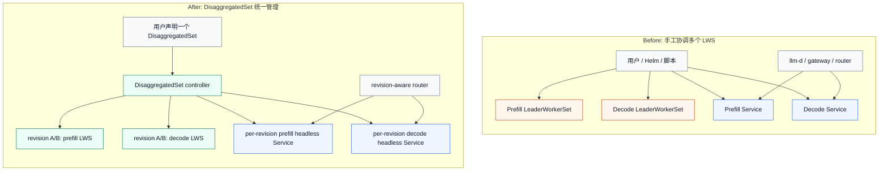
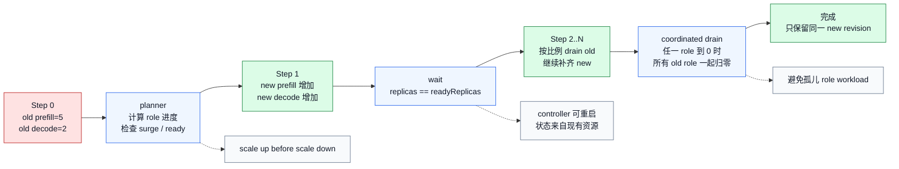

# KEP-766 DisaggregatedSet 深入解读：为何对 AI 工作负载重要

本文按 **2026-06-15** 的内容排期写作，事实状态核对到
**2026-06-22**。这点需要先说明清楚：`KEP-766` 的 proposal PR 在
**2026-03-26** 合并，后续实现与 chart 也已进入 LWS 主线，并包含在
**2026-06-17** 发布的 `LeaderWorkerSet v0.9.0` 中。因此，今天再看
`DisaggregatedSet`，它已经不只是一个草案，而是 LWS 生态里开始落地的
alpha 级多角色 workload API。

## 先说结论

`DisaggregatedSet` 不是一个完整推理平台，也不是替代 `KServe`、`llm-d`、
`AIBrix`、`Kthena` 或 `Dynamo` 的 control plane。它更准确的位置是：
**站在 LeaderWorkerSet 之上的多角色 workload primitive**。

它要解决的问题很具体：当一个 AI 推理服务被拆成 `prefill`、`decode`、
`router` 或其他角色时，平台不应该再让用户手工维护多个彼此相关的
`LeaderWorkerSet`，也不应该把升级一致性、revision 对齐和 Service 生命周期都交给
Helm 模板或人工脚本处理。`DisaggregatedSet` 把这些角色收敛成一个 Kubernetes
对象，并由 controller 协调底层 LWS、headless Service 和 rolling update。

从 AI workload 角度看，它重要的不是“多了一个 CRD”，而是把分离式推理里最容易出错的
控制面语义固化下来了：

- 多个 role 作为一个逻辑服务统一管理
- 多个 LWS 按同一个 revision 协同升级
- `prefill` 和 `decode` 可以保持不同副本数，但 rollout 不能各走各的
- 上层路由器可以基于 per-revision Service 做版本感知后端发现
- controller 可以从已有资源推导状态，重启后继续推进，不依赖脆弱的本地内存状态

## 1. 问题背景：双 LWS 模式为什么会变复杂

PD disaggregation 的基本思路很清楚：把 LLM 推理中的 prefill 和 decode 两类计算拆到
不同 worker 或不同节点上。`prefill` 更偏并行计算和 prompt 处理，`decode` 更偏长尾
token 生成和 KV cache 复用。拆开之后，平台可以分别调度、扩缩和优化这两类资源。

但是，一旦落到 Kubernetes workload 层，问题就没有这么简单。一个常见部署会有两个
`LeaderWorkerSet`：

- `prefill` LWS：负责 prompt 处理和 KV 生成
- `decode` LWS：负责持续 token 生成

这两个 LWS 表面上可以独立声明，实际上却高度绑定：

- 它们要使用兼容的模型、镜像、并行参数和协议
- 它们的升级必须保持版本一致，否则路由器可能把请求送到不兼容的 role 组合
- 它们的 Service 和 EndpointSlice 要等相关 role 都 ready 后才适合接流量
- 它们的副本数可能不同，但 rollout 不能让其中一个 role 过早归零，留下孤儿 workload
- 如果中途 controller 重启或用户连续提交 A -> B -> C 更新，系统需要能继续推导正确状态

这也是 KEP-766 要补的空缺：LWS 已经能表达 leader-worker group，但原生 LWS 不负责把多个
role 组织成一个分离式推理服务。



## 2. API 设计：一个对象描述多个 role

从当前上游实现看，`DisaggregatedSet` 使用独立 API group。这个值来自
`api/disaggregatedset/v1/groupversion_info.go` 里的 `GroupVersion`，上游 sample
也已经使用同一个 group/version：

```yaml
# config/samples/disaggregatedset_v1_disaggregatedset.yaml
apiVersion: disaggregatedset.x-k8s.io/v1 # current upstream GroupVersion
kind: DisaggregatedSet
metadata:
  name: disaggregatedset-sample
spec:
  roles:
    - name: prefill
      spec:
        replicas: 2
        leaderWorkerTemplate:
          size: 1
          leaderTemplate: {}
          workerTemplate: {}
    - name: decode
      spec:
        replicas: 2
        leaderWorkerTemplate:
          size: 1
          leaderTemplate: {}
          workerTemplate: {}
```

核心字段是 `spec.roles`。每个 role 有自己的名字，并内嵌
`LeaderWorkerSetTemplateSpec`。这意味着 `DisaggregatedSet` 并没有重新发明
leader-worker group，而是复用了 LWS 已有 workload 语义：每个 role 最终仍然会落成一个或多个
LWS。

API 里有几个约束值得注意：

- `roles` 最少 2 个，最多 10 个
- role 名称必须唯一，并符合 Kubernetes DNS label 风格
- role 的 `replicas` 要么全部为 0，要么全部大于 0
- role 内部 LWS 的 rollout 不能再设置 partition，因为跨 role rollout 由
  `DisaggregatedSet` controller 统一负责

上游定义的关键 label 也说明了它的设计重心。当前实现里，这些常量定义在
`api/disaggregatedset/v1/disaggregatedset_types.go`：

- `disaggregatedset.x-k8s.io/name` (`SetNameLabelKey`)
- `disaggregatedset.x-k8s.io/role` (`RoleLabelKey`)
- `disaggregatedset.x-k8s.io/revision` (`RevisionLabelKey`)

这三个 label 把“属于哪个 DisaggregatedSet”“属于哪个 role”“属于哪个 revision”明确落到
子资源上。对运维和路由来说，这比在一堆 LWS 名字里猜版本状态可靠得多。

## 3. N 维 rolling update：重点不是滚动，而是协调

如果只有一个 Deployment，rolling update 的语义相对简单：新副本逐步增加，旧副本逐步减少。
但分离式推理不是一个 Deployment，而是多个 role 共同组成一个服务。

以 `prefill=5`、`decode=2` 为例，两个 role 的目标副本数不同，扩缩步长也不同。朴素做法是让两个
LWS 各自 rolling update，但这会带来版本不一致：某些时刻，新版 prefill 已经很多，而 decode 仍然主要是旧版。
如果数据协议、KV cache 格式或 runtime 参数有变化，这种状态就可能导致请求失败。

KEP-766 的思路是把 rollout 看成 N 维空间里的同步推进。每个 role 都有 old revision 和 new
revision，controller 计算每一步应该保留多少 old、副本增加多少 new，并遵守 `maxSurge` 和
`maxUnavailable` 约束。



这里最关键的不是算法公式本身，而是几个不变量：

- **先扩后缩**：先让新 revision 补容量，再减少旧 revision，避免容量突然掉下去。
- **按 role 同步推进**：prefill 和 decode 可以有不同副本数，但 rollout 进度要保持同一逻辑 revision。
- **等待 ready**：controller 在下一步前检查副本是否 ready，避免盲目推进。
- **协调 drain**：如果某个 role 的旧 revision 归零，其他 role 的旧 revision 也要一起收敛，避免留下不能独立服务的残缺组合。
- **无状态控制器**：controller 通过现有 LWS、Service、label 和 annotation 推导状态，重启后仍能继续。

这类设计对 AI workload 很重要，因为 AI 服务的“可用容量”通常不是单个 Pod 数量，而是一组 role 是否能共同完成请求。

## 4. Service 编排：为 revision-aware routing 铺路

`DisaggregatedSet` 还会为每个 role、每个 revision 创建 headless Service。KEP 中给出的命名模式是：

```text
{disaggregatedset-name}-{revision}-{role}-prv
```

这个设计看起来只是自动创建 Service，实际含义更深。分离式推理的路由器需要知道：

- 当前有哪些 prefill 后端属于 revision A
- 当前有哪些 decode 后端属于 revision A
- revision B 是否已经具备完整 role 组合
- rollout 中不同 revision 的后端比例如何

如果只有一个跨版本混杂的 Service，路由器很难做版本感知。如果每个 role、每个 revision 都有独立
headless Service，路由器就可以从 EndpointSlice 视角看到更清晰的后端集合。

这也是 KEP-766 选择“每个 revision 创建独立 LWS 和 Service”的原因之一。相比直接操作 LWS
partition，独立 revision 资源带来更多 Kubernetes 对象，但换来更好的路由可见性、运维可观测性和故障定位能力。

## 5. 为什么这对 AI workload 重要

### 5.1 角色解耦不再只停留在架构图上

很多 PD 架构图都会把 prefill 和 decode 画成两个框，但真正落地时，角色解耦需要 Kubernetes API
能表达不同 role 的副本数、模板、调度约束和生命周期。`DisaggregatedSet` 的价值就在于把这些 role
放进一个对象，而不是散落在多个 LWS 和脚本里。

### 5.2 扩缩策略有了更清楚的边界

KEP 明确把 HPA/VPA 和自动 scaling 放在 non-goal 里。这不是缺点，而是边界清楚。`DisaggregatedSet`
解决的是多 role 的声明、升级和服务发现；基于延迟、队列长度、KV 命中率或 GPU 利用率的自动扩缩，仍然应该由上层平台或独立 autoscaler 处理。

这种边界对平台团队很重要。否则一个 workload primitive 如果同时试图解决 runtime 指标、路由策略、容量预测和多集群调度，API 很快会变得不可维护。

### 5.3 升级风险从“人为约定”变成 controller 语义

AI 推理服务升级经常不只是镜像替换。模型格式、KV cache 格式、runtime 参数、并行配置、router 兼容性都可能变化。
如果 prefill 与 decode 分别升级，就需要人为保证它们不会进入不兼容组合。

`DisaggregatedSet` 至少把这件事推进了一层：所有 role 的模板 hash 共同形成 revision，rolling update
也围绕 revision 推进。这样平台可以把“兼容组合”当成一个可观察的状态，而不是靠发布流程口头约束。

### 5.4 运维视角更直接

多个 LWS 手工组合时，排查 rollout 卡住往往要看多个对象、多个 Service、多个 EndpointSlice。
`DisaggregatedSet` 通过 label、role status 和条件，把这组资源拉回一个逻辑视图。运维人员仍然可以下钻到底层
LWS，但日常判断不再需要从一组无关对象里还原拓扑。

## 6. 和 RBG、Grove、AIBrix、Kthena 的关系

`DisaggregatedSet` 容易被误解成“又一个推理编排方案”。更合理的看法是分层：

- `DisaggregatedSet`：LWS 生态里的多角色 workload primitive，后端明确是 LWS。
- `RBG`：更通用的 role-based workload API，可以支持 StatefulSet、Deployment、LeaderWorkerSet 等不同 backend。
- `Grove`：NVIDIA Dynamo 生态里的推理 workload abstraction，重点包括 hierarchical gang scheduling、topology-aware placement 和多层 autoscaling。
- `AIBrix`、`Kthena`、`KServe + llm-d`：更接近平台或 serving stack，覆盖入口、路由、可观测、扩缩、模型治理或调度集成。

所以它们不是简单替代关系。已经采用 LWS 和 llm-d 路线的团队，会更自然地关注
`DisaggregatedSet`。如果团队需要跨 backend 的通用 role abstraction，`RBG` 可能更适合。如果团队希望平台直接处理更多路由、autoscaling 和硬件拓扑策略，则应该继续看 AIBrix、Kthena、Dynamo/Grove 或 KServe 这类更高层方案。

## 7. 实践建议

可以优先关注 `DisaggregatedSet` 的场景：

- 已经使用 LWS 管理多节点推理 workload
- 有明确的 prefill/decode 或多 role 架构
- rollout 中最担心 role 版本不一致
- 上层已有 llm-d、gateway 或自研 router，需要 revision-aware 后端发现
- 希望 Kubernetes API 里有一个对象代表完整分离式推理服务

暂时不应把它当成完整解决方案的场景：

- 主要问题是自动扩缩策略，而不是多 LWS 协调
- 需要跨集群管理同一推理服务
- 后端 workload 不想绑定 LWS
- 强依赖 service mesh 或 ingress 级流量切分
- 需要平台统一处理模型发布、灰度策略、SLO、成本和租户治理

一句话总结：`DisaggregatedSet` 把 LWS 从“能表达单个 leader-worker group”推进到“能表达一个由多个 LWS 组成的分离式推理服务”。它不是 AI inference 平台的终点，但很可能成为 LWS 路线里重要的底层积木。

## 事实校对

| 项目 | 状态 |
| --- | --- |
| KEP 编号 | `KEP-766` |
| KEP 名称 | `DisaggregatedSet` |
| KEP metadata | `status: implementable`，`stage: alpha` |
| KEP 创建日期 | `2026-03-05` |
| Proposal PR | [`kubernetes-sigs/lws#767`](https://github.com/kubernetes-sigs/lws/pull/767)，`2026-03-26` 合并 |
| 初始实现 PR | [`kubernetes-sigs/lws#773`](https://github.com/kubernetes-sigs/lws/pull/773)，`2026-03-26` 合并 |
| API types PR | [`kubernetes-sigs/lws#815`](https://github.com/kubernetes-sigs/lws/pull/815)，`2026-04-20` 合并 |
| Controller PR | [`kubernetes-sigs/lws#836`](https://github.com/kubernetes-sigs/lws/pull/836)，`2026-05-31` 合并 |
| Helm chart PR | [`kubernetes-sigs/lws#871`](https://github.com/kubernetes-sigs/lws/pull/871)，`2026-06-03` 合并 |
| LWS release | [`v0.9.0`](https://github.com/kubernetes-sigs/lws/releases/tag/v0.9.0)，`2026-06-17` 发布 |
| 当前 API group/version | `disaggregatedset.x-k8s.io/v1`，见 `api/disaggregatedset/v1/groupversion_info.go` |
| 当前明确边界 | 不覆盖 HPA/VPA、多集群、非 LWS backend、service mesh/ingress 流量切分 |

## 参考资料

- [KEP-766: DisaggregatedSet](https://github.com/kubernetes-sigs/lws/blob/main/keps/766-DisaggregatedSet/README.md)
- [KEP-766 metadata](https://github.com/kubernetes-sigs/lws/blob/main/keps/766-DisaggregatedSet/kep.yaml)
- [DisaggregatedSet group/version definition](https://github.com/kubernetes-sigs/lws/blob/main/api/disaggregatedset/v1/groupversion_info.go)
- [DisaggregatedSet type and label constants](https://github.com/kubernetes-sigs/lws/blob/main/api/disaggregatedset/v1/disaggregatedset_types.go)
- [DisaggregatedSet sample YAML](https://github.com/kubernetes-sigs/lws/blob/main/config/samples/disaggregatedset_v1_disaggregatedset.yaml)
- [KEP-766 proposal PR](https://github.com/kubernetes-sigs/lws/pull/767)
- [DisaggregatedSet implementation PR](https://github.com/kubernetes-sigs/lws/pull/773)
- [DisaggregatedSet API types PR](https://github.com/kubernetes-sigs/lws/pull/815)
- [DisaggregatedSet controller PR](https://github.com/kubernetes-sigs/lws/pull/836)
- [LWS README update for DisaggregatedSet](https://github.com/kubernetes-sigs/lws/pull/840)
- [DisaggregatedSet Helm chart integration](https://github.com/kubernetes-sigs/lws/pull/871)
- [LeaderWorkerSet v0.9.0 release](https://github.com/kubernetes-sigs/lws/releases/tag/v0.9.0)
