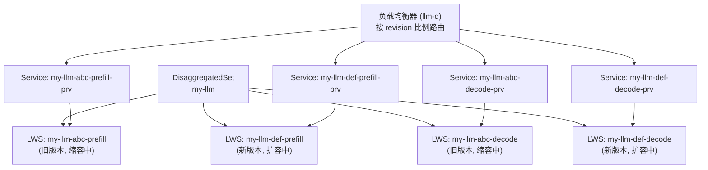

# KEP-766 DisaggregatedSet 深入解读：为何对 AI 工作负载重要

## 先说结论

DisaggregatedSet 是 LeaderWorkerSet（LWS）项目提出的一个新 CRD，
专门为 **解耦角色（prefill/decode/router 等）的大模型推理部署** 设计。

它解决的核心问题不是"怎么跑推理"，而是"多角色推理部署在 Kubernetes 上，
运维动作（升级、扩缩）为什么难以协调"。

如果只记一句话：

> DisaggregatedSet 把原本需要人工协调的多个 LeaderWorkerSet，
> 收敛为一个统一资源对象，并提供 N 维协调式滚动更新，
> 确保 prefill 与 decode 等角色在版本和副本数上始终保持一致。

---

## 问题定义：LWS 单独处理 PD 分离推理的痛点

### PD 分离推理的资源形态

现代大模型推理的最佳实践之一是 **Prefill-Decode（PD）分离**：

- **Prefill 阶段**：并行处理输入 prompt，计算量大，对计算密集型 GPU（如 H100 SXM）友好；
- **Decode 阶段**：逐 token 自回归生成，受 KV Cache 带宽限制，对内存带宽友好的 GPU 更合适。

在 Kubernetes 上实现 PD 分离，通常的做法是为每个角色（prefill、decode、router 等）
独立创建一个 LeaderWorkerSet。

### 手动管理多个 LWS 的问题

| 问题类型 | 具体表现 |
| --- | --- |
| 运维复杂 | 每次更新模型版本，需手动协调所有角色的 LWS 同步升级 |
| 滚动更新失控 | 无内置机制保证 prefill 和 decode 同步推进，容易造成版本不一致 |
| 服务路由混乱 | 缺少统一的 Service 生命周期管理，负载均衡器难以按版本路由流量 |
| 配置漂移 | 多个独立资源难以保证模板同步，容易出现隐性不兼容 |

以一个典型的三角色推理集群为例（prefill × 5 pods、decode × 2 pods、router × 1 pod），
用户在升级时需要独立操作 3 个 LWS，并手动确保：

1. 新旧版本之间流量路由正确；
2. 任一角色崩溃时，其他角色不形成孤儿工作负载；
3. 升级中途控制器重启后，仍能正确恢复。

这些在手动模式下都是高风险操作。

---

## 技术拆解

### DisaggregatedSet API 设计

DisaggregatedSet 的核心是 `spec.roles` 字段——一个角色列表，
每个角色内嵌一个完整的 `LeaderWorkerSetTemplateSpec`：

```yaml
apiVersion: leaderworkerset.x-k8s.io/v1alpha1
kind: DisaggregatedSet
metadata:
  name: my-llm
spec:
  roles:
    - name: prefill
      spec:
        replicas: 5
        leaderWorkerTemplate:
          size: 8
          leaderTemplate:
            spec:
              containers:
                - name: vllm
                  image: vllm/vllm-openai:v0.8.0
                  args: ["--role=prefill", "--tensor-parallel-size=8"]
    - name: decode
      spec:
        replicas: 2
        leaderWorkerTemplate:
          size: 8
          leaderTemplate:
            spec:
              containers:
                - name: vllm
                  image: vllm/vllm-openai:v0.8.0
                  args: ["--role=decode", "--tensor-parallel-size=8"]
```

**API 约束（由 CEL 校验器强制执行）**：

- 角色数量：最少 2 个，最多 10 个；
- 角色名称必须唯一，且符合 DNS 标签规范；
- 所有角色的 `replicas` 要么全为 0，要么全大于 0（避免只有部分角色启动的半工作状态）。

**命名约定**：

控制器创建的 LeaderWorkerSet 遵循 `{name}-{revision}-{role}` 命名，
其中 `revision` 是所有角色模板的截断哈希值。这个设计使"版本一致性"从约定变成可验证事实——
只要任一角色的模板被修改，所有角色都会获得新的 revision，并触发协调式更新。

### N 维协调式滚动更新算法

这是 DisaggregatedSet 最核心的技术设计，也是它区别于手动管理的根本所在。

**算法基本思路**：

用线性插值计算每一步新旧副本的目标数量：

```text
新副本目标(步骤 i) = ceil(i × target / totalSteps)   // 从 0 扩容到目标数
旧副本目标(步骤 i) = source - floor(i × source / totalSteps)  // 从原始数缩容到 0
```

**N 维协调的关键**：

- **扩容时**：取所有角色中 `step` 最小的那个为基准，确保没有角色跑得过快；
- **缩容时**：取所有角色中 `step` 最大的那个为基准，确保所有角色一起排空；
- **协调排空**：任一角色副本数降至 0，强制所有角色归零，避免出现只剩一个角色的孤儿状态。

**更新示例（prefill 5 副本、decode 2 副本，maxSurge=2，maxUnavailable=1）**：

| 步骤 | 旧 decode | 旧 prefill | 新 decode | 新 prefill | 总量 | 操作 |
| --- | --- | --- | --- | --- | --- | --- |
| 0 | 2 | 5 | 0 | 0 | 7 | 初始状态 |
| 1 | 2 | 5 | 1 | 2 | 10 | 新 decode +1, 新 prefill +2 |
| 2 | 2 | 4 | 1 | 2 | 9 | 旧 prefill -1 |
| 3 | 2 | 3 | 1 | 2 | 8 | 旧 prefill -1 |
| 4 | 2 | 3 | 2 | 4 | 11 | 新 decode +1, 新 prefill +2 |
| 5 | 1 | 2 | 2 | 4 | 9 | 旧 decode -1, 旧 prefill -1 |
| 6 | 1 | 2 | 2 | 5 | 10 | 新 prefill +1 |
| 7 | 0 | 0 | 2 | 5 | 7 | 旧 decode -1, 旧 prefill -2 |

可以看到，decode 和 prefill 的更新步骤是**耦合的**——decode 副本数少，
每轮变动更小，但始终与 prefill 保持同步前进，而不是各自独立推进。

**安全性保证**：

- 始终先扩容新副本，再缩容旧副本（capacity 不低于目标）；
- 等待 `replicas == readyReplicas` 才推进下一步（稳定性校验）；
- 控制器无状态，重启后从观测资源中恢复进度（通过 `initial-replicas` 注解）。

### 服务编排：版本感知的流量路由基础

每个角色的每个 revision，控制器都会自动创建一个 headless Service：

- **命名**：`{name}-{revision}-{role}-prv`（例如 `my-llm-abc12345-prefill-prv`）；
- **选择器**：精确匹配对应 revision 的 LeaderWorkerSet 下的 Pod；
- **生命周期**：随 DisaggregatedSet 删除而自动回收（owner reference 管理）。

这个设计使上层负载均衡器（如 llm-d）能够**按 revision 计算每个角色的 Pod 数量**，
实现更新过程中的按版本比例路由，而不是盲目地把流量打到混合版本的 Pod 上。



---

## 与现有方案对比

| 维度 | 手动多 LWS | Helm/Kustomize | DisaggregatedSet |
| --- | --- | --- | --- |
| 统一资源入口 | ❌ 无 | ❌ 无（仅模板） | ✅ 单一 CRD |
| 协调式滚动更新 | ❌ 手动 | ❌ 无运行时协调 | ✅ N 维算法 |
| 版本感知 Service | ❌ 手动创建 | ❌ 静态配置 | ✅ 自动管理 |
| 控制器重启安全 | ⚠️ 依赖操作者 | ⚠️ 依赖操作者 | ✅ 无状态控制器 |
| 孤儿工作负载防护 | ❌ 无 | ❌ 无 | ✅ 协调排空机制 |
| 支持 Kueue 集成 | ✅（LWS 层） | ✅（LWS 层） | ✅（通过 LWS 层） |

---

## 实践建议

### 什么场景适合迁移到 DisaggregatedSet

DisaggregatedSet 目前处于 **Alpha 阶段**（v0.1，截至 KEP 草案，2026-03-23），
适合以下场景先行尝试：

1. **生产级 PD 分离推理**：prefill 和 decode 已经分开部署，且有频繁的模型版本升级需求；
2. **多角色推理系统**：除 prefill/decode 外，还有 router、aggregator 等独立角色；
3. **需要版本感知路由的集群**：上层负载均衡器（如 llm-d）需要按 revision 比例路由流量。

### 当前不在 DisaggregatedSet 范围内的能力

以下能力**不在**当前 KEP 范围，使用前需确认替代方案：

- **自动扩缩（HPA/VPA）**：目前不支持，需要手动调整 `replicas`；
- **多集群联邦**：仅支持单集群场景；
- **非 LWS 后端**：StatefulSet、Deployment 等不受支持；
- **流量管理**：不集成 Service Mesh 或 Ingress，路由依赖上层工具（如 llm-d）。

### 迁移路径建议

从手动多 LWS 迁移到 DisaggregatedSet 的最小路径：

```text
1. 确认当前各角色 LWS 的 replicas 和 template 配置
2. 创建 DisaggregatedSet，将各角色配置迁移到 spec.roles
3. 验证控制器自动创建的 LWS 和 Service 是否符合预期
4. 逐步将旧 LWS 的流量切换到新 Service
5. 删除旧 LWS（DisaggregatedSet 接管后不再需要手动维护）
```

### 与调度层的协同

DisaggregatedSet 通过 LWS 层透传标签，原生支持与调度工具协同：

- **Kueue**：在 `roles[*].metadata.labels` 中设置 `kueue.x-k8s.io/queue-name`；
- **独占拓扑**：通过 `leaderworkerset.sigs.k8s.io/exclusive-topology` 标签控制调度亲和；
- **Gang 调度**：LWS 本身已提供 Gang 语义，DisaggregatedSet 在此之上增加跨角色协调。

---

## 特性阶段与参考资料

| 项目 | 状态 |
| --- | --- |
| KEP-766 DisaggregatedSet | Alpha (v0.1)，KEP 草案，2026-03-23 |
| LeaderWorkerSet | [kubernetes-sigs/lws](https://github.com/kubernetes-sigs/lws) |
| 实现 PR | [lws#767](https://github.com/kubernetes-sigs/lws/pull/767) |
| KEP 原文 | [keps/766-DisaggregatedSet/README.md](https://github.com/kubernetes-sigs/lws/blob/main/keps/766-DisaggregatedSet/README.md) |

> **注意**：本文基于 2026-03-23 的 KEP 草案（`lws/pull/767`）整理，
> 特性阶段和 API 细节以最终 release 为准，使用前请核对最新仓库状态。
