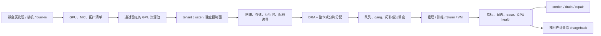

# 在 Kubernetes 上构建 AI Factory：从 GPU 集群走向多租户 AI 云

本文是对 CNCF 文章
[Building an AI factory on Kubernetes](https://www.cncf.io/blog/2026/08/27/building-an-ai-factory-on-kubernetes/)
的中文架构梳理，并结合 AI-Infra 仓库做一次项目覆盖度审计。它不是逐句翻译；重点是把原文的
分层、边界和对本仓库的增量信息整理成可继续维护的结构。

## 先说结论

AI Factory 不是某个新的模型服务产品，而是一种在 Kubernetes 上运营 GPU 基础设施的方式：
同一批昂贵的加速器要同时服务训练、微调、推理和评测团队，并让每个租户获得可隔离、可计量、
可自助申请的计算环境。

这套系统真正要共同优化的是三个变量：

1. **密度**：避免低负载 Pod 长期独占整张 GPU。
2. **隔离**：控制面、网络、存储、运行时和物理设备边界都要与租户信任级别匹配。
3. **成本**：利用率必须能够按租户归属，最终形成 GPU-seconds、存储和网络等成本线。

只部署 `vLLM + Kubernetes` 还不能称为 AI Factory。模型服务只是工作负载层；裸金属交付、
租户集群、拓扑感知调度、故障处置、身份策略和计费才决定 GPU 池能否成为真正的共享平台。

## 完整能力栈

| 层次 | 需要解决的问题 | 文章给出的主要构件 |
| --- | --- | --- |
| 硬件生命周期 | 发现、装机、烧机、验证、回收裸金属 | Metal3 / Ironic、Tinkerbell、Redfish、NetBox，或 vMetal |
| 集群生命周期 | 创建、升级和版本化集群，以 GitOps 交付配置 | Cluster API、Argo CD、Flux、NVIDIA AICR |
| 节点清单 | 暴露 GPU、NIC、MIG、NUMA 和拓扑信息 | Node Feature Discovery、GPU Operator、Network Operator |
| 租户隔离 | 让多团队共享基础设施但拥有独立 Kubernetes API | vCluster 等 tenant cluster、vNode 等沙箱运行时 |
| GPU 分配 | 表达整卡、设备属性、分片与共享策略 | DRA、MIG、HAMi、time-slicing |
| 队列与调度 | 处理 gang、拓扑、准入、配额和公平性 | KAI Scheduler、Volcano、Kueue |
| 推理服务 | 把模型作为稳定 API 对外提供 | vLLM、KServe、llm-d、NVIDIA Dynamo |
| Batch / HPC | 承载已有 Slurm 训练与 HPC 工作流 | Slinky、Pyxis、Enroot |
| 虚拟机 | 给仍需要 VM 的租户提供同一资源池 | KubeVirt |
| 网关与扩缩容 | 统一模型 API、路由并随负载扩容 | Gateway API、Envoy、LiteLLM、KEDA、HPA |
| 高性能网络 | 同时满足网络隔离和 GPU 数据快路径 | Cilium、Multus、SR-IOV、RoCE / InfiniBand / RDMA |
| 存储与数据 | 持久化数据集、模型和 checkpoint | CSI、Rook / Ceph、并行文件系统 CSI、对象存储 |
| 可观测性 | 关联基础设施、GPU 和租户指标、日志、链路 | Prometheus、OpenTelemetry、DCGM exporter、VictoriaLogs |
| 身份与策略 | OIDC、授权、配额和准入护栏 | Keycloak、ResourceQuota / Kueue、Kyverno / OPA |
| Secret 与安全 | Secret、运行时检测和供应链扫描 | OpenBao、External Secrets Operator、Falco、Trivy |
| 可靠性与修复 | 在租户感知前发现并隔离坏卡、坏节点 | DCGM health check、Node Problem Detector、cordon / drain |
| 自助服务与计费 | 用 API / GitOps 交付租户环境并完成分摊 | OpenTofu、OpenCost、DCGM GPU-seconds |

这里有一个容易混淆的地方：表中既有独立开源项目，也有 Kubernetes API、硬件能力、协议和通用
运维动作。它们不应被当作同一种选型对象。例如 DRA 负责表达和分配设备，但不会自动把 GPU
切成分片；实际密度仍来自 MIG、HAMi 或 time-slicing 等设备层能力。

## 从裸金属到租户账单

### 1. 硬件交付本身是一条生产流水线

可用 GPU 容量并不等于“服务器已经通电”。节点进入资源池前，至少要经历硬件发现、BMC 控制、
网络启动、OS/驱动/CUDA/NCCL 镜像安装、BIOS 配置、ECC 检查、burn-in 和 NCCL 带宽验证。
NetBox 一类 source of truth 还要记录资产、NIC、InfiniBand GUID 和 IPAM。回收时则反向执行：
擦盘、重置 BMC 凭证，再把干净节点放回池中。

开源组装路线可以由 Metal3 / Ironic 或 Tinkerbell承担；vMetal 是原文提到的集成方案。这里是
AI-Infra 当前最明显的内容空白之一：仓库对节点进入 Kubernetes **之后**的设备管理介绍很多，
对进入集群**之前**的裸金属验证流水线介绍很少。

### 2. GPU 密度与租户安全不能使用同一个默认答案

同一信任域内，可以使用 MIG 或 HAMi 提高密度；面对互不信任的外部租户，保守基线仍是整卡、
独占节点或硬件支持的隔离。MIG 能提供内存与故障域隔离，但不应未经威胁建模就被宣传为敌对
租户之间的完整安全边界。

因此平台最好明确两种容量池：

- **强隔离池**：租户独占 GPU 或节点，必要时使用 DPU、TEE 或机密容器。
- **共享密度池**：只承载同一信任域工作负载，在 MIG、HAMi 或 time-slicing 上做装箱。

调度器负责“放在哪里”，设备层负责“怎样切分和限制”，Kueue 一类准入层负责“何时允许进入”。
三者不可互相替代。

### 3. tenant cluster 只解决了控制面的一半问题

vCluster 一类 tenant cluster 可以给每个团队独立 API server、CRD、admission webhook、版本和
RBAC；但工作负载最终仍运行在数据面，所以还需要网络、存储、Pod Security、RuntimeClass、
quota 和硬件边界。只创建虚拟控制面，不代表已经完成多租户隔离。

生产平台通常至少提供两个等级：高信任或监管场景使用独立集群 / 私有节点；内部团队或成本敏感
场景使用共享底座上的 tenant cluster。每个底座承载多少租户还决定控制面和节点故障的爆炸半径。

### 4. Slurm 与 VM 不是历史包袱，而是工作负载入口

AI Factory 不能要求所有用户先重写工作流。Slinky 让 Slurm 控制组件和计算节点通过 Kubernetes
管理；Pyxis 与 Enroot 承接容器化 Slurm 作业。KubeVirt 则让 VM 与 Pod 共享 Kubernetes 的
RBAC、配额和硬件池。这两条路径让平台能够接住已有 HPC 和虚拟机租户，而不只是云原生推理。

### 5. 可观测不等于可计费

DCGM exporter 输出 GPU 指标只是起点。指标必须携带 tenant、cluster、namespace、workload、
GPU UUID / MIG instance 等稳定维度，才能汇聚为按租户归属的 GPU-seconds；OpenCost 再把资源
使用转成 allocation / chargeback。OpenTelemetry 适合做中立采集层，Prometheus、VictoriaLogs
等后端则负责相应的指标和日志存储与查询。

## AI-Infra 仓库覆盖度审计

以下结论以 **2026-08-28 补充本文之前**的仓库为基线，对 Markdown、JSON 和生成脚本执行
不区分大小写的精确名称扫描。它回答的是“项目是否被提到”，不代表仓库已经有完整教程，也不把
通用关键词的模糊命中当作覆盖。

### 已进入主要文档的能力

- **资源与调度**：DRA、MIG、HAMi、KAI Scheduler、Volcano、Kueue、GPU Operator。
- **推理**：vLLM、KServe、llm-d、Dynamo。
- **网关与扩缩容**：Gateway API、Envoy、KEDA、HPA。
- **基础设施**：KubeVirt、Cilium、SR-IOV、Ceph。
- **可观测与安全**：Prometheus、OpenTelemetry、DCGM exporter、OPA、Kyverno、Falco、
  Node Problem Detector。

### 有提及，但尚未进入主学习路径

| 项目 | 补充前出现位置 | 建议 |
| --- | --- | --- |
| Metal3 | Red Hat case study | 与 Ironic / Tinkerbell 合并为“裸金属生命周期”专题 |
| Cluster API | 归档博客和多集群 radar | 恢复到集群生命周期主线 |
| vCluster | 归档的多租户文章和多集群 radar | 与数据面隔离边界一起更新，不只介绍虚拟控制面 |
| LiteLLM | Agent Infra 文档和 `project_watchlist.json` | 放入 AI Gateway 对比，说明它与 Gateway API 的层次差异 |
| Keycloak | planning 文档 | 放入租户身份、OIDC 和 API 自助服务链路 |

### 补充前完全未提及的 16 个项目 / 产品

| 领域 | 未提及项 | 推荐补充位置 |
| --- | --- | --- |
| 裸金属与资产 | Ironic、Tinkerbell、NetBox、vMetal | 新增 bare-metal / capacity lifecycle 文档 |
| 租户运行时 | vNode | `docs/kubernetes/isolation.md`，并标注其产品边界 |
| Slurm / HPC | Slinky、Pyxis、Enroot | `docs/training/` 新增 Slurm on Kubernetes 专题 |
| 网络与存储 | Multus、Rook | Kubernetes 网络 / 存储专题 |
| 日志 | VictoriaLogs | `docs/observability/README.md`，作为可替换后端示例 |
| Secret 与供应链 | OpenBao、External Secrets Operator、Trivy | 多租户安全专题 |
| 自助服务与 FinOps | OpenTofu、OpenCost | 新增 self-service / GPU chargeback 专题 |

其中 vMetal 和 vNode 是 vCluster 产品栈中的能力，不能在没有许可证、代码可得性和支持边界检查的
前提下，与 CNCF 托管的开源项目视为同一类。它们仍计入“原文点名但仓库未提及”的审计结果。

### 原文出现、但不计入“缺失项目”的构件

- **标准或协议**：Redfish、CSI、SR-IOV、RDMA、RoCEv2、InfiniBand、OIDC。
- **Kubernetes API / 控制动作**：HPA、ResourceQuota、RuntimeClass、cordon、drain。
- **设备或硬件能力**：MIG、time-slicing、BlueField、Pensando、NVLink / NVSwitch。
- **泛化服务类别**：对象存储、并行文件系统 CSI、NAT、L4 LoadBalancer。

这些内容仍值得写进架构文档，但不能被统计成“又缺少一个开源项目”。

## 本次纳入策略

本仓库按与 AI Infra 主线的相关性分两档维护，避免把全景图扩成通用云平台软件清单：

1. **进入主学习路径**：Slinky / Pyxis / Enroot 纳入训练与 HPC 互操作；Multus 纳入 GPU
   高性能网络数据面；vCluster 纳入多租户控制面与隔离边界；OpenCost 纳入 GPU 成本归属与
   chargeback。
2. **作为相邻依赖简要提及**：Ironic、Tinkerbell、NetBox、vMetal、Rook、OpenBao、
   External Secrets Operator、Trivy、VictoriaLogs 和 OpenTofu。它们对完整 AI Factory 有用，
   但不是 GPU 调度、训练或推理运行时的核心学习对象。
3. **保留产品边界**：vNode 与 vMetal 归入 vCluster 产品栈评估，不与独立 CNCF / Kubernetes
   开源项目混列；采用前需单独核对代码、许可证、支持范围与硬件兼容性。

## 最终判断

这篇 CNCF 文章对 AI-Infra 仓库最大的补充，不是又增加一个推理项目，而是把关注点从
“GPU 上如何运行模型”推进到“怎样经营一个多租户 GPU 云”。后续全景图如果继续扩展，建议增加
**硬件生命周期、租户隔离、安全与 FinOps** 四条纵向能力，而不是把所有项目继续挤入推理和调度
两个区域。

生产级 AI Factory 的验收标准也应该随之改变：不仅检查 tokens/s 和 GPU 利用率，还要检查
节点从入池到回收的可重复性、租户逃逸面、网络与存储隔离、坏卡修复时延、单位 GPU-hour 成本
以及每一笔成本是否能够归属到正确租户。
