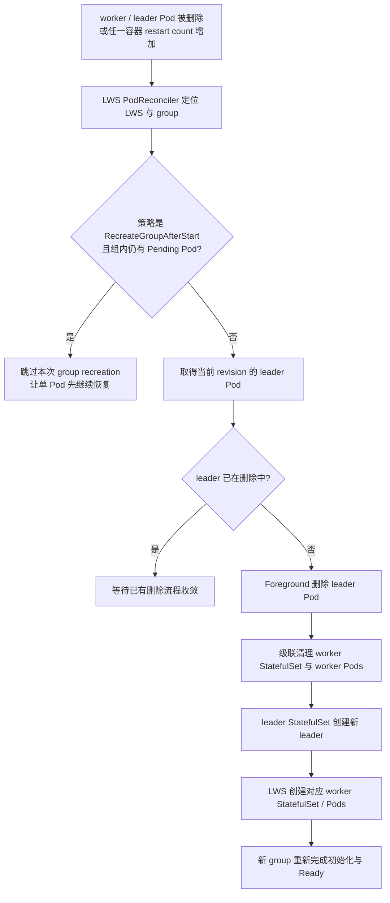
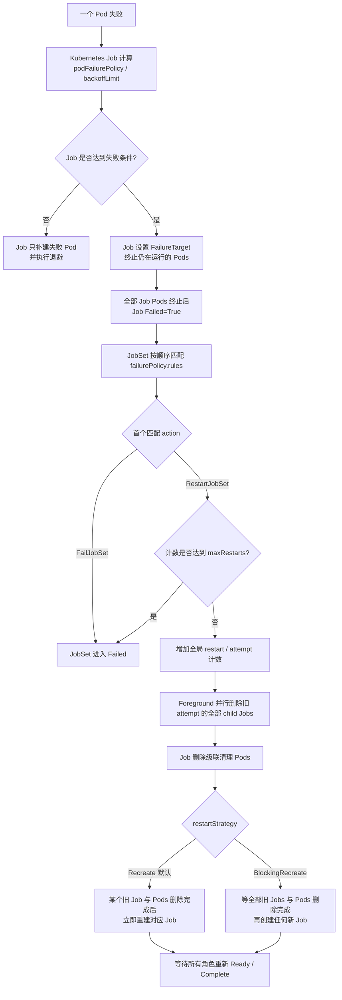
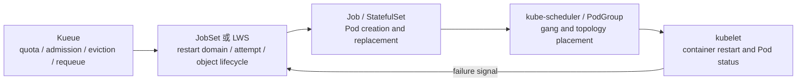

# 从单 Pod 故障到整组重建：LWS 与 JobSet 的 Group Restart 设计、状态机与边界

在 tensor parallel、pipeline parallel、PyTorch DDP、MPI 或多机推理中，
一组进程通常共享同一个通信域、rank 空间和 checkpoint 进度。
其中一个 Pod 退出后，只把这个 Pod 拉起来，其他进程可能仍停在旧的 NCCL communicator、
旧的 rendezvous epoch 或已经失效的缓存状态中。Kubernetes 传统的“单 Pod 自愈”在这里不一定是正确答案；
应用真正需要的是：**一个成员失败，整个故障域回到同一个执行代次（execution attempt）**。

LeaderWorkerSet（LWS）和 JobSet 都支持这种恢复思路，但两者不是同一种状态机：

- LWS 直接观察 Pod 删除和容器重启，重建的是发生故障的一个 leader-worker replica group。
- JobSet 等待子 Job 进入 `Failed`，再通过 `failurePolicy` 决定是否重建全部子 Job。
- Kubernetes 原生 Job 能终止一个 Job 中的所有 Pod，但 Job 失败后不会自动重新创建整个 Job。
- Kueue 能做准入、驱逐和重新排队，却不负责替业务控制器重新创建失败的 Pod group。

本文按 **2026-09-04** 的公开信息核对，版本基线为
[Kubernetes v1.37.0](https://kubernetes.io/releases/1.37/)、
[LWS v0.10.0](https://github.com/kubernetes-sigs/lws/releases/tag/v0.10.0)、
[JobSet v0.12.0](https://github.com/kubernetes-sigs/jobset/releases/tag/v0.12.0) 和
[Kueue v0.19.3](https://github.com/kubernetes-sigs/kueue/releases/tag/v0.19.3)。

## 先说结论

| 控制器 / 机制 | 直接观察的失败信号 | 自动恢复范围 | 是否重建对象 | 重试预算 |
| --- | --- | --- | --- | --- |
| LWS `RecreateGroupOnPodRestart` | Pod 被删除，或任一 init / app container 发生重启 | **一个 LWS replica group**：leader + workers | 删除并重建该组 Pod | v0.10.0 仍无已发布的组级上限 |
| LWS `RecreateGroupAfterStart` | 同上，但组内存在 `Pending` Pod 时跳过整组重建 | 一个 LWS replica group | 条件满足时重建 | 同上 |
| JobSet `RestartJobSet` | 一个子 Job 进入 `Failed` | **整个 JobSet** 的所有子 Job | 前台删除并重建全部子 Job / Pod；是否等待旧组全部消失由 restart strategy 决定 | `failurePolicy.maxRestarts` |
| JobSet `RestartJob` | 一个子 Job 进入 `Failed` | 仅失败的子 Job | 只重建该 Job / Pod | 共用 JobSet 重启上限；v0.12 Alpha、默认关闭 |
| Kubernetes Job `FailJob` | Pod exit code 或 Pod condition 匹配 | 终止该 Job 的所有运行中 Pod | 不自动重建已经失败的 Job | `backoffLimit` 只管理 Job 内 Pod 重试 |
| Kueue `waitForPodsReady.recoveryTimeout` | 已运行 workload 长时间存在 NotReady Pod | 驱逐并重新排队 workload | 由 JobSet / Job 等 owner 恢复 | `backoffLimitCount` 管理重新排队次数 |
| Kueue plain Pod group | Pod group / Workload 状态 | 可整组删除 | **不会重建失败 Pod** | 依赖外部 controller |

这里最容易误解的是“group”范围。假设一个 LWS 配置为 `replicas: 2`、`size: 4`，
它包含两个相互独立的四 Pod group。group 0 中一个 worker 失败，默认只重建 group 0 的四个 Pod，
不会重建 group 1。相反，一个 JobSet 的 `RestartJobSet` 会重建所有 `ReplicatedJob` 下的全部子 Job，
包括已经完成的子 Job。

## 先把四种“整组”语义分开

### 1. Group restart 不是 gang scheduling

Gang scheduling 解决的是“这一批 Pod 能否一起获得资源并完成绑定”；group restart 解决的是
“已经运行后，一个成员失败，谁必须跟着回到新代次”。
[Kubernetes KEP-4671](https://github.com/kubernetes/enhancements/blob/master/keps/sig-scheduling/4671-gang-scheduling/README.md)
和 [LWS KEP-407](https://github.com/kubernetes-sigs/lws/blob/main/keps/407-gang-scheduling/README.md)
属于前者。它们不会因为一个应用进程崩溃，就替 JobSet 或 LWS 执行生命周期重建。

### 2. Group restart 不是 Pod 内全部容器重启

[KEP-5307](https://github.com/kubernetes/enhancements/blob/master/keps/sig-node/5307-container-restart-policy/README.md)
扩展单容器 restart rule；
[KEP-5532](https://github.com/kubernetes/enhancements/blob/master/keps/sig-node/5532-restart-all-containers-on-container-exits/README.md)
提供 `RestartAllContainers`，可以保留 Pod UID、IP、sandbox、设备和 volume，原地重启一个 Pod
中的全部容器。它们仍然不是“跨 Pod barrier”。要让多个 Pod 同时进入新代次，仍需要 LWS、JobSet
或应用侧协议来广播、确认并解除 barrier。

### 3. “删除重建”也不等于“状态恢复”

控制器可以重建 Pod，但无法自动恢复训练进度、参数服务器状态或内存缓存。
真正的恢复路径通常还需要：一致 checkpoint、幂等的数据读取、稳定的 rank / DNS、
PVC 保留策略，以及应用在新代次启动时拒绝旧成员重新加入。

### 4. 调度故障域与运行故障域可以不同

一个工作负载可以按 64 个 Pod 做 gang scheduling，却按 8 个 Pod 的 LWS replica group 做故障恢复；
也可以按多个 Job 分配到不同机架，任何一个 Job 失败时重建整个 JobSet。
因此平台 API 最好分别表达 scheduling group、restart group 和 checkpoint domain，
不要把一个 `pod-group-name` 同时当成三种语义。

## LWS：以 leader Pod 为组锚点的直接重建

### 对象结构决定了重建范围

[LWS 架构文档](https://lws.sigs.k8s.io/docs/concepts/leaderworkerset/)说明，
`LeaderWorkerSet` 并不直接替代 StatefulSet，而是组合两层 StatefulSet：

```text
LeaderWorkerSet（replicas = 2, size = 4）
└── leader StatefulSet（replicas = 2）
    ├── group 0: leader-0
    │   └── worker StatefulSet leader-0（3 workers）
    └── group 1: leader-1
        └── worker StatefulSet leader-1（3 workers）
```

leader StatefulSet 提供 replica ordinal；每个 leader Pod 又对应一个 worker StatefulSet。
因此 leader Pod 不只是 rank 0，也是该 group 的生命周期锚点。
LWS 可以通过删除 leader，把该 leader 所属的 worker 对象一起清理，再由 StatefulSet 和 LWS
重建相同 ordinal、相同稳定名称的新组。

### 三种 restart policy

[官方 failure handling 文档](https://lws.sigs.k8s.io/docs/concepts/leaderworkerset/failure-handling/)
给出了三种策略：

| `leaderWorkerTemplate.restartPolicy` | 行为 | 适用场景 |
| --- | --- | --- |
| `RecreateGroupOnPodRestart` | 默认值；任一 Pod 被重新创建，或任一容器发生重启，删除并重建整个 replica group | 强耦合训练 / 推理，希望严格清空通信状态 |
| `RecreateGroupAfterStart` | 只有组内没有 `Pending` Pod 时才执行整组重建 | 大镜像、慢调度、初始化阶段容易超时的服务 |
| `None` | 不扩大故障域，只依赖 Kubernetes / StatefulSet 恢复单 Pod | 应用能独立重连或自身具有弹性容错 |

一个典型配置如下：

```yaml
apiVersion: leaderworkerset.x-k8s.io/v1
kind: LeaderWorkerSet
metadata:
  name: tp-serving
spec:
  replicas: 2
  leaderWorkerTemplate:
    size: 4
    restartPolicy: RecreateGroupOnPodRestart
    workerTemplate:
      spec:
        restartPolicy: Always
        containers:
        - name: server
          image: example.com/model-server:v1
```

### 从容器失败到四个 Pod 全部换代

LWS 当前主干的
[`handleRestartPolicy`](https://github.com/kubernetes-sigs/lws/blob/main/pkg/controllers/pod_controller.go#L305-L372)
把 Pod 删除和容器 restart count 变化都视为 group recreation 信号。逻辑状态机可以概括为：



这个设计有几个值得注意的细节：

1. **触发很直接。** LWS 不需要等待上层 Job 进入终态；容器被 kubelet 重启也会触发。
2. **leader 是单一删除入口。** worker 失败时，controller 不是逐个删除 peer，而是前台删除 leader，
   利用 owner reference 和 StatefulSet 收敛整个 group。
3. **revision 必须一致。** 滚动更新期间，旧 revision 的 group 发生重建，不能混入 live spec 的新 size、
   network config 或 PVC 设置。[PR #963](https://github.com/kubernetes-sigs/lws/pull/963)
   修复了这类“旧 Pod template + 新组配置”混用问题；它在 v0.10.0 发布后才合入主干。
4. **重建的是 group，而不是整个 LWS。** 其他 replica group 可以继续提供服务。

### `RecreateGroupAfterStart` 为什么存在

严格的 `RecreateGroupOnPodRestart` 在启动阶段可能形成反馈环：

1. worker A 已经启动，但等待 peer 超时并重启；
2. worker B 还在 `Pending` / 拉取大镜像；
3. A 的 restart count 触发整组删除；
4. B 的镜像拉取和初始化再次被打断；
5. 新组重复同样的过程。

[Issue #495](https://github.com/kubernetes-sigs/lws/issues/495) 中的 worker
`ErrImageNeverPull` 是这类启动期故障的一个具体案例。
[PR #725](https://github.com/kubernetes-sigs/lws/pull/725) 最初用 annotation 引入
“存在 Pending Pod 时不做整组重建”，
[PR #757](https://github.com/kubernetes-sigs/lws/pull/757) 将其正式加入 API；
官方文档标记为 LWS v0.9.0+ 支持。

它是一个实用的启动保护，但不是严格 barrier：如果故障发生时组里恰好有一个 Pod 仍为 `Pending`，
本次 group recreation 会被**跳过**；API 并不承诺一定在该 Pod 后续 Running 后补做一次重建。
应用仍需能容忍启动阶段的成员暂时不同步。

## JobSet：先把 Pod 故障提升为 Job 失败，再创建新 execution attempt

### JobSet 的故障信号来自子 Job

JobSet 的对象层级通常是：

```text
JobSet
├── ReplicatedJob: leader
│   └── Job 0
└── ReplicatedJob: workers
    ├── Job 0
    ├── Job 1
    └── ...
        └── Pods
```

JobSet controller 只在发现子 Job 的 `Failed=True` 终态后执行 failure policy。
所以“一个 Pod 失败立即重建整个 JobSet”实际上是两层策略的组合：

1. Kubernetes Job 的 `restartPolicy`、`backoffLimit`、`podFailurePolicy` 决定 Pod 失败何时升级成 Job 失败；
2. JobSet 的 `failurePolicy` 决定 Job 失败后是终止、重建整个 JobSet，还是只重建失败 Job。

如果不配置 `failurePolicy`，JobSet 会在任一子 Job 失败后直接失败；
如果配置了 `failurePolicy` 但没有规则匹配，默认 action 才是 `RestartJobSet`。

### `RestartJobSet` 的完整状态机



实现上，
[`failure_policy.go`](https://github.com/kubernetes-sigs/jobset/blob/main/pkg/controllers/failure_policy.go)
先增加 `status.restarts` 和 `status.restartsCountTowardsMax`；新的 restart attempt 使旧 Job
被分类为 previous attempt。
[`deleteJobs`](https://github.com/kubernetes-sigs/jobset/blob/main/pkg/controllers/jobset_controller.go#L893-L915)
再以 `Foreground` propagation 并行删除旧 Job，删除事件触发后续 reconcile 创建新 Job。

这不是对 JobSet 对象本身做 delete/create。JobSet CR、其 status、网络配置和 restart counter
保留下来；被换代的是 child Job 和 Pod。

#### `Recreate` 与 `BlockingRecreate`：有没有真正的全组删除 barrier

`RestartJobSet` 是 failure policy action，`restartStrategy` 则决定这个 action 怎样执行删除重建。
两者是正交的：

| `failurePolicy.restartStrategy` | 新旧 attempt 的关系 | 取舍 |
| --- | --- | --- |
| `Recreate`（默认） | 每个旧 Job 及其 Pods 删除完成后，就可以重建对应 Job；不等待其他旧 Job | 恢复更快，但不同角色可能短暂存在 old/new overlap |
| `BlockingRecreate` | 所有旧 Jobs 及其 Pods 都删除完成后，才创建任何新 Job | 提供真正的全组删除 barrier，但会被最慢的 Pod termination 阻塞 |
| `InPlaceRestart` | 健康 Pod 原地重启，失败 Pod 补建；异常时可回落到 recreation | Alpha，依赖 agent、kubelet 能力和组 barrier |

[Issue #684](https://github.com/kubernetes-sigs/jobset/issues/684) 描述了默认 `Recreate` 的典型风险：
新角色可能连接到另一个仍在终止的旧角色，随后再次失败。
[PR #686](https://github.com/kubernetes-sigs/jobset/pull/686) 增加了 `BlockingRecreate`。
如果“整组重建”的安全要求是 **任何新进程启动前，全部旧 Pod 必须已经退出 Kubernetes 生命周期**，
应选择 `BlockingRecreate`；如果应用有 execution epoch、能拒绝旧 peer，默认 `Recreate` 可以缩短恢复时间。

即使使用 `BlockingRecreate`，它也只能证明旧对象已经从 Kubernetes 删除，不能证明失联节点上的旧进程
已被物理停止。硬故障场景仍需要 fencing。

### 怎样让第一个 Pod 故障尽快触发整组重建

下面的例子把“可恢复的运行时 / 基础设施故障”提升为 `PodFailurePolicy`，让 JobSet 重建所有角色；
其他失败则直接结束 JobSet，避免应用 bug 消耗全部重试预算：

```yaml
apiVersion: jobset.x-k8s.io/v1alpha2
kind: JobSet
metadata:
  name: distributed-train
spec:
  failurePolicy:
    maxRestarts: 3
    # 严格等待全部旧 Job / Pod 删除后再创建新 attempt；
    # 若应用允许 old/new 短暂重叠，可使用默认 Recreate。
    restartStrategy: BlockingRecreate
    rules:
    - name: restart-retriable-failures
      action: RestartJobSet
      onJobFailureReasons:
      - PodFailurePolicy
    - name: fail-non-retriable-failures
      action: FailJobSet
  replicatedJobs:
  - name: coordinator
    replicas: 1
    template:
      spec:
        parallelism: 1
        completions: 1
        backoffLimit: 0
        template:
          spec:
            restartPolicy: Never
            containers:
            - name: coordinator
              image: example.com/trainer:v1
  - name: workers
    replicas: 1
    template:
      spec:
        parallelism: 8
        completions: 8
        backoffLimit: 0
        podFailurePolicy:
          rules:
          - action: FailJob
            onExitCodes:
              containerName: trainer
              operator: In
              values: [75]
          - action: FailJob
            onPodConditions:
            - type: DisruptionTarget
        template:
          spec:
            restartPolicy: Never
            containers:
            - name: trainer
              image: example.com/trainer:v1
```

这里如果任一 worker 触发 `RestartJobSet`，`coordinator` 和 `workers` 的 child Jobs
都会进入新 attempt；`BlockingRecreate` 保证新 coordinator 不会连接到仍在退出的旧 workers。

这个例子里的关键点不是 exit code `75` 本身，而是三层预算必须有意对齐：

- `restartPolicy: Never`：让容器失败表现为 Pod 失败，也是使用 Job `podFailurePolicy` 的要求。
- `backoffLimit: 0`：未被更具体规则处理的第一次 Pod 失败即可使 Job 失败；否则 Job 可能先独立补建 Pod。
- `maxRestarts: 3`：控制 JobSet 全局重建次数，第四次匹配时进入终态失败。

Kubernetes [KEP-3329](https://github.com/kubernetes/enhancements/tree/master/keps/sig-apps/3329-retriable-and-non-retriable-failures)
提供了 Job `podFailurePolicy`。它的 `FailJob` 会终止该 Job 内所有运行中 Pod，
但[原生 Job 文档](https://kubernetes.io/docs/concepts/workloads/controllers/job/#pod-failure-policy)
明确说明：Job 一旦 `Failed`，不会自动重建 Job 对象。JobSet 正好消费这个终态信号，
把恢复范围扩展到一个或多个子 Job。

### FailurePolicy 的动作与预算

[JobSet failure policy 文档](https://jobset.sigs.k8s.io/docs/tasks/failure_policy/)当前列出五种动作：

| action | 删除范围 | 是否计入 `maxRestarts` | 当前状态 |
| --- | --- | --- | --- |
| `FailJobSet` | 不创建新 attempt，并清理仍活跃的子 Job | 不适用 | 已发布 |
| `RestartJobSet` | 全部 child Jobs | 是 | 已发布，整组重建主路径 |
| `RestartJobSetAndIgnoreMaxRestarts` | 全部 child Jobs | 否 | 已发布，但可能无限循环 |
| `RestartJob` | 仅失败的 child Job | 是 | v0.12.0 Alpha，`RestartJob` feature gate 默认关闭 |
| `RestartJobAndIgnoreMaxRestarts` | 仅失败的 child Job | 否 | v0.12.0 Alpha，默认关闭 |

规则按照声明顺序求值，只执行第一个匹配项。可以按 `targetReplicatedJobs`、
Job failure `reason` 和 failure message 的 RE2 正则缩小范围。
没有匹配项时会执行 `RestartJobSet`，因此生产配置通常应在最后放一个明确的
`FailJobSet` catch-all，避免拼错 reason 或新增 failure reason 后意外扩大重建范围。

## LWS 与 JobSet 的关键差异

| 维度 | LWS | JobSet |
| --- | --- | --- |
| 核心抽象 | 可复制的 leader-worker Pod group | 一组 Kubernetes Jobs |
| 最小恢复单元 | 一个 LWS replica group | 默认整个 JobSet；Alpha 可只重建一个 Job |
| 观察点 | Pod 删除、container / initContainer restart | child Job `Failed=True` |
| 故障分类 | restart policy 粒度较粗，不按 exit code 区分 | 可组合 Job `podFailurePolicy` 与 JobSet rule |
| 启动阶段保护 | `RecreateGroupAfterStart` 跳过存在 Pending Pod 的组 | 由 Job backoff、failure policy、startup dependency 等组合 |
| 已发布预算 | 无 group restart 上限 | `maxRestarts` |
| 稳定身份 | StatefulSet ordinal、group DNS | Indexed Job / JobSet headless service |
| 典型用途 | 多机推理 replica、固定 leader-worker 服务 | 分布式批训练、MPI、多角色有限作业 |

选择时可以使用一个简单原则：

- 如果“组”是可水平复制的服务副本，故障隔离应停留在单个 replica，LWS 更自然。
- 如果“组”代表一次训练 attempt，任一角色失败都应从 checkpoint 重新跑完整拓扑，
  JobSet 的 `RestartJobSet` 更直接。
- 如果 worker 真能独立恢复，不要为了“看起来一致”强制全量重建；LWS `None` 或
  JobSet v0.12 的 `RestartJob` 可以显著缩小 blast radius。

## 仍然存在的问题

### 1. LWS v0.10.0 没有已发布的 restart budget

默认 `RecreateGroupOnPodRestart` 可以无限重建，而且删除 Pod 会清空 kubelet 在原 Pod 上累积的
restart count 和容器退避。持续崩溃的应用可能不停创建新 Pod、重复拉起通信域，
既难保留上一轮日志，也没有稳定的终态供 Kueue 或上层平台判断。

[LWS KEP-820](https://github.com/kubernetes-sigs/lws/blob/main/keps/820-distributed-preflight-check/README.md)
为此提出 `maxGroupRestarts`。KEP PR
[#813](https://github.com/kubernetes-sigs/lws/pull/813) 已合并，
实现 PR [#877](https://github.com/kubernetes-sigs/lws/pull/877) 截至本文日期仍为 Open，
所以 `maxGroupRestarts` **不能视为 v0.10.0 已发布 API**。

这里还存在一个值得跟踪的设计漂移：已合并 KEP 文本描述超过预算后设置 `Failed=True`；
开放中的实现 PR 当前描述的是保留现场、停止该 replica 的自动重建，并设置
`Degraded=True / ReplicaRestartBudgetExceeded`。这说明终态语义仍在评审中，平台暂时不应
根据提案里的 condition 名称编写不可变自动化。

### 2. LWS 的删除事件存在同名 Pod 竞态

StatefulSet 可能在 LWS Pod controller 消费 delete event 之前，用相同 namespace/name 创建替代 Pod。
如果 workqueue 只有 namespaced name，delete 与 replacement create 会折叠成同一个 key，
reconcile 读到新 Pod 后可能跳过 `RecreateGroupOnPodRestart`。

[Issue #998](https://github.com/kubernetes-sigs/lws/issues/998) 记录了这个问题；
[PR #999](https://github.com/kubernetes-sigs/lws/pull/999) 通过在 typed request 中携带被删除 Pod 的
UID、labels 和 owner identity 修复，并于 **2026-09-02** 合入主干。
但 v0.10.0 发布于 2026-08-11，时间上不包含该修复。使用 v0.10.0 时需要把它当成已知风险，
等待包含该提交的新 release，而不是因为 PR 已 merged 就假设安装包已经修复。

### 3. 不可达节点让“已经删除”变得不确定

节点网络分区时，API server 能把 Pod 标为 NotReady 或 Terminating，却无法证明原节点上的进程
已经停止、GPU context 已释放、RWO volume 已卸载。LWS 的
[Issue #508](https://github.com/kubernetes-sigs/lws/issues/508) 就反映过故障 Pod 长时间 Terminating、
同组 peer 未能及时停止的问题。

这不只是 controller bug，也是分布式系统的 fencing 问题。强制删除并在健康节点重建可能让
旧进程和新进程短暂并存，造成重复写 checkpoint、存储损坏或两个 rank 使用同一逻辑身份。
生产方案需要 node fencing / power-off 证明、存储侧租约或应用 epoch，而不能只依赖 force delete。

### 4. JobSet 的失败检测至少跨两次状态机

JobSet 不观察第一个容器退出，而是等待 `Pod -> Job Failed -> JobSet`。
如果保留 Job 默认 `backoffLimit: 6`，Pod 会先按指数退避重试；如果使用 `podFailurePolicy`，
Job controller 只在 Pod 进入 terminal phase 后匹配规则。

另外，从 Kubernetes v1.31 开始，Job controller 要等该 Job 的全部 Pod 终止后才添加最终
`Failed` condition。JobSet 当前查找的正是 `JobFailed`，所以慢 `preStop`、长
`terminationGracePeriodSeconds`、volume detach 或失联节点，都可能推迟整组 restart 的开始时间。

### 5. 两层重试预算容易相乘

Job 的 `backoffLimit` 与 JobSet 的 `maxRestarts` 是独立计数器。例如 Job 内先允许 6 次失败，
JobSet 又允许 3 次全局重建，最坏执行次数并不是直觉上的 3 次。
再叠加 Kueue `recoveryTimeout` 后的 requeue，系统可能同时存在 Pod retry、JobSet restart 和
Workload requeue 三层循环。

平台应明确哪个层负责哪种故障：

- 应用进程错误：快速 `FailJobSet`，不要不断重试。
- 预期可恢复的 Pod / node disruption：Job 快速失败，由 JobSet 从 checkpoint 重建。
- 资源暂时不足或整组迟迟不 Ready：由 Kueue eviction / requeue 退避。

### 6. 全量重建的控制面与数据面成本都很高

`RestartJobSet` 会删除已经健康甚至已经成功的 Job。大规模作业会重新经历 Pod 删除、scheduler
排队、网络与存储初始化、镜像检查、设备分配和 gang admission。若资源已被其他 workload 使用，
新 attempt 还可能无法重新获得原拓扑。

JobSet v0.12 的 `RestartJob` 正是为缩小这一范围而增加，但它是 Alpha、默认关闭，
且单个 `ReplicatedJob` 在使用该动作时最多 1024 replicas。更重要的是，只有应用允许某个 Job
独立回到当前 epoch 时才应该使用它；对严格 collective training，局部恢复可能比全量重建更危险。

### 7. In-place restart 更快，但不是删除重建的等价替代

JobSet [KEP-467](https://github.com/kubernetes-sigs/jobset/blob/main/keps/467-InPlaceRestart/README.md)
引入 `restartStrategy: InPlaceRestart`：健康 Pod 原地重启容器，真正失败的 Pod 仍由 Job 补建，
controller 通过 agent 和 barrier 协调整组。
[PR #1083](https://github.com/kubernetes-sigs/jobset/pull/1083)、
[#1096](https://github.com/kubernetes-sigs/jobset/pull/1096) 和
[#1099](https://github.com/kubernetes-sigs/jobset/pull/1099) 已实现并随 v0.11.0 以 Alpha 发布，
feature gate 默认关闭。

它保留 node、Pod UID、IP、设备和 volume，省掉重新调度成本，但也意味着：

- 无法通过重调度逃离故障节点或坏的拓扑域；
- 不会自动重新挂载有问题的 volume，也不会获得不同设备；
- 依赖 sidecar / kubelet restart rule 和 barrier 正确协同；
- `RestartAllContainers` 不应被假设等同于一次有完整优雅终止语义的 Pod delete。

LWS 也讨论过 [Issue #715](https://github.com/kubernetes-sigs/lws/issues/715) 和实现
[PR #936](https://github.com/kubernetes-sigs/lws/pull/936)，但二者均已在 2026-08-18 关闭且 PR 未合并。
因此截至本文日期，LWS 的 in-place group restart 不是已发布能力。

### 8. 日志、checkpoint 与 PVC 生命周期必须单独设计

删除 Pod 后，`kubectl logs --previous` 无法跨 Pod UID 保留上一轮容器日志；
删除 Job 也可能触发日志采集、owner reference 和 TTL 的连锁清理。必须在 controller 删除前就把
日志和失败原因送到外部系统，并以 `attempt` / `restart` 维度索引。

LWS 的 `volumeClaimTemplates` / PVC retention policy，以及 JobSet v0.11 的
[KEP-572 Stateful JobSet](https://github.com/kubernetes-sigs/jobset/blob/main/keps/572-stateful-jobset/README.md)
可以控制存储对象生命周期，但“PVC 还在”不代表 checkpoint 一致。应用仍要采用原子提交、
manifest / epoch 校验，并确保所有新成员从同一个完整 checkpoint 恢复。

## Kueue 和 Kubernetes Workload API 放在哪一层

### Kueue 是恢复放大器，不是 Pod 重建 owner

Kueue 的
[`waitForPodsReady.recoveryTimeout`](https://kueue.sigs.k8s.io/docs/tasks/manage/setup_wait_for_pods_ready/)
可以观察已经运行的 Workload：若一个 Pod 失败后，owner 没能在期限内恢复 Ready，Kueue 会驱逐并
重新排队 Workload。对 JobSet 等受支持的 workload，Kueue 通过 suspend / readmit 与原 controller
协同；真正创建下一批 child Job / Pod 的仍是 JobSet。

对于 [Kueue plain Pod group](https://kueue.sigs.k8s.io/docs/tasks/run/plain_pods/)，
官方文档明确限制：Kueue 不重新创建失败 Pod；发生 preemption 时它会删除整组 Pod，
替代 Pod 必须由用户或外部 controller 创建。plain Pod group 因而不应被当成轻量版 JobSet。

Kueue 的
[`FailureRecoveryPolicy`](https://kueue.sigs.k8s.io/docs/tasks/manage/setup_failure_recovery/)
解决的是另一个窄问题：将不可达节点上长期 Terminating 的、显式标记
`safe-to-forcefully-delete` 的 Pod 强制推进到 `Failed`，从而解除 Job replacement 的阻塞。
文档同时警告，控制面无法确认旧进程已经停止；使用前必须证明重复调度不会导致数据损坏。

### Kubernetes Workload API 不会自动补上生命周期语义

[KEP-4671 Gang Scheduling](https://github.com/kubernetes/enhancements/blob/master/keps/sig-scheduling/4671-gang-scheduling/README.md)
和 [KEP-5547 Job 集成 Workload API](https://github.com/kubernetes/enhancements/tree/master/keps/sig-apps/5547-integrate-workload-with-job)
正在把 group scheduling 和 disruption 语义推向上游。`disruptionMode: All` 可以要求调度器按组处理
抢占 / 调度 disruption，但应用容器崩溃后是否重建一组 Pod，仍属于 workload controller 的职责。

一个合理的组合关系是：



## 上游 KEP、Issue 与 PR 进展

### LWS

| 主题 | 设计 / Issue | 实现进展（截至 2026-09-04） |
| --- | --- | --- |
| 默认 group recreation | [Failure handling 文档](https://lws.sigs.k8s.io/docs/concepts/leaderworkerset/failure-handling/) | `RecreateGroupOnPodRestart` 已发布且为默认策略 |
| 启动后才扩大故障域 | [Issue #726](https://github.com/kubernetes-sigs/lws/issues/726) | [PR #725](https://github.com/kubernetes-sigs/lws/pull/725) annotation、[PR #757](https://github.com/kubernetes-sigs/lws/pull/757) API；v0.9.0+ |
| 有界 group recovery | [KEP-820](https://github.com/kubernetes-sigs/lws/blob/main/keps/820-distributed-preflight-check/README.md)、[KEP PR #813](https://github.com/kubernetes-sigs/lws/pull/813) | KEP 已合并；实现 [PR #877](https://github.com/kubernetes-sigs/lws/pull/877) 仍 Open，未进入 v0.10.0 |
| Pod 同名替换竞态 | [Issue #998](https://github.com/kubernetes-sigs/lws/issues/998) | [PR #999](https://github.com/kubernetes-sigs/lws/pull/999) 已合入 main，尚晚于 v0.10.0 |
| rolling update 中重建旧 revision | [Issue #280](https://github.com/kubernetes-sigs/lws/issues/280) | [PR #963](https://github.com/kubernetes-sigs/lws/pull/963) 已合入 main，尚晚于 v0.10.0 |
| 失联节点 / Terminating 缺口 | [Issue #508](https://github.com/kubernetes-sigs/lws/issues/508) | Issue 已关闭；底层 fencing 风险仍需平台处理 |
| in-place group restart | [Issue #715](https://github.com/kubernetes-sigs/lws/issues/715) | [PR #936](https://github.com/kubernetes-sigs/lws/pull/936) 关闭且未合并 |
| group gang scheduling | [KEP-407](https://github.com/kubernetes-sigs/lws/blob/main/keps/407-gang-scheduling/README.md) | 解决调度原子性，不等于故障后整组重建 |

### JobSet 与 Kubernetes Job

| 主题 | 设计 / Issue | 实现进展（截至 2026-09-04） |
| --- | --- | --- |
| 可配置 failure policy | [JobSet KEP-262](https://github.com/kubernetes-sigs/jobset/blob/main/keps/262-ConfigurableFailurePolicy/README.md)、[Issue #262](https://github.com/kubernetes-sigs/jobset/issues/262) | [PR #381](https://github.com/kubernetes-sigs/jobset/pull/381) 合并 KEP，[PR #537](https://github.com/kubernetes-sigs/jobset/pull/537) 实现；v0.6.0+ |
| 全组删除 barrier | [Issue #684](https://github.com/kubernetes-sigs/jobset/issues/684) | [PR #686](https://github.com/kubernetes-sigs/jobset/pull/686) 增加 `BlockingRecreate`，当前已发布 |
| 单 Job 重建 action | [Issue #1129](https://github.com/kubernetes-sigs/jobset/issues/1129)、KEP 更新 [PR #1152](https://github.com/kubernetes-sigs/jobset/pull/1152) | [PR #1177](https://github.com/kubernetes-sigs/jobset/pull/1177)、[#1191](https://github.com/kubernetes-sigs/jobset/pull/1191)；v0.12.0 Alpha、默认关闭 |
| JobSet in-place restart | [JobSet KEP-467](https://github.com/kubernetes-sigs/jobset/blob/main/keps/467-InPlaceRestart/README.md)、[Issue #876](https://github.com/kubernetes-sigs/jobset/issues/876) | [PR #1083](https://github.com/kubernetes-sigs/jobset/pull/1083)、[#1096](https://github.com/kubernetes-sigs/jobset/pull/1096)、[#1099](https://github.com/kubernetes-sigs/jobset/pull/1099)；v0.11.0 Alpha |
| Job Pod failure classification | [Kubernetes KEP-3329](https://github.com/kubernetes/enhancements/tree/master/keps/sig-apps/3329-retriable-and-non-retriable-failures) | `podFailurePolicy` 已稳定，是 JobSet 失败分类的主要下游信号 |
| Pod 内全部容器原地重启 | [Kubernetes KEP-5532](https://github.com/kubernetes/enhancements/blob/master/keps/sig-node/5532-restart-all-containers-on-container-exits/README.md) | Kubernetes v1.35 起 Alpha；只解决单 Pod 内重启，需要上层 group barrier |

## 生产落地建议

1. **先画清 restart domain。** 明确是单 Pod、一个 LWS replica、一个 child Job，还是整个 JobSet；
   不要让 controller 默认值替平台做这个决定。
2. **只让可恢复错误进入重启路径。** 用 exit code、Pod condition 和 Job failure reason 区分
   infrastructure disruption 与确定性的应用错误；规则最后增加 `FailJobSet` catch-all。
3. **只保留一层主要预算。** 例如 Job `backoffLimit: 0`、JobSet `maxRestarts: 3`，
   Kueue requeue 再设置独立但较小的上限；把三层计数一起暴露到告警。
4. **把“删除成功”与“旧进程已停止”分开。** 对硬件故障、节点分区和 RWO storage，
   在 force deletion 前建立 fencing 与租约策略。
5. **外部化日志和 checkpoint。** 标签至少包含 workload UID、replica / job index、
   global attempt、individual restart attempt 和 checkpoint epoch。
6. **对大规模重建做故障演练。** 测量的不是单 Pod restart latency，而是
   detection、termination、resource reacquisition、image / volume init、barrier release、
   checkpoint load 到重新产出有效 token / step 的端到端时间。
7. **按 release 而不是 main 文档判定能力。** 尤其是 LWS PR #999 / #963 和 #877；
   merged PR、开放 PR 与当前安装镜像是三个不同状态。

建议至少观察这些信号：

- LWS `RecreateGroup` Events、group ready 数、Pod UID 集合变化和每小时 group recreation 次数；
- JobSet `Restarting` / `Failed` conditions、`status.restarts`、
  `restartsCountTowardsMax` 与 `replicatedJobsStatus[].jobRestarts`；
- child Job 的 `FailureTarget` / `Failed` reason、message 和从二者产生到 JobSet action 的延迟；
- Kueue Workload 的 `PodsReady`、`Evicted`、requeue count 和 admission wait time；
- 同一逻辑 rank 是否在两个 node / Pod UID 上同时活跃，用来发现 fencing 失败。

## 结语

LWS 和 JobSet 都能把“一个 Pod 坏了”提升成“一个分布式执行域重新开始”，但它们的边界不同：
LWS 是直接、快速、以 replica group 为范围的 Pod 生命周期控制；JobSet 是以 child Job 终态为输入、
以 execution attempt 和 failure policy 为核心的批作业控制。

真正可靠的 group restart 不是简单的 `delete all pods`。它至少需要五个要素：
**明确的失败分类、稳定的重建范围、有限重试预算、旧实例 fencing、可验证的 checkpoint / epoch**。
调度器和 Kueue 可以保证资源与队列层面的原子性，但最终仍要由 LWS、JobSet 或其他 workload
controller 把这些要素组合成闭环。
