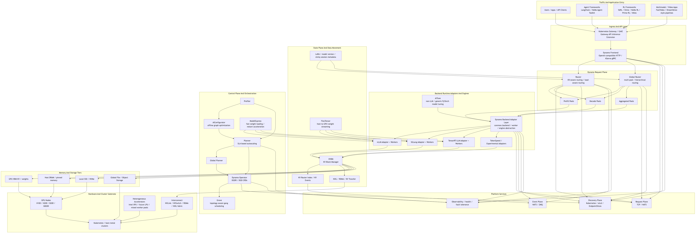
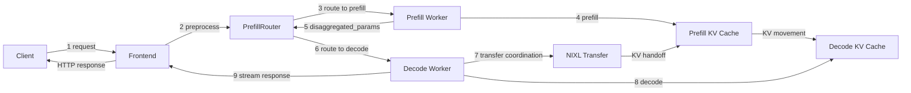

# NVIDIA Dynamo: Panorama Architecture

[`Dynamo`](https://github.com/ai-dynamo/dynamo) is best understood as a
distributed inference orchestration layer above model engines rather than as
another standalone engine. It coordinates request routing, KV-aware state
management, autoscaling, deployment, and data movement across large GPU
clusters.

This page presents a top-down panorama of the Dynamo ecosystem, starting from
traffic entry and ending at storage tiers and hardware.

## Top-Down Panorama

```mermaid
flowchart TB
    subgraph L0["Traffic And Application Entry"]
        U1["Users / Apps / API Clients"]
        U2["Agent Frameworks<br/>LangChain / NeMo Agent Toolkit"]
        U3["RL Frameworks<br/>VeRL / Slime / NeMo RL / Prime-RL / Miles"]
        U4["Multimodal / Video Apps<br/>FastVideo / DreamVerse-style pipelines"]
    end

    subgraph L1["Ingress And API Layer"]
        G1["Kubernetes Gateway / GAIE<br/>Gateway API Inference Extension"]
        F1["Dynamo Frontend<br/>OpenAI-compatible HTTP / KServe gRPC"]
    end

    subgraph L2["Dynamo Request Plane"]
        R1["Router<br/>KV-aware routing / load-aware routing"]
        R2["Global Router<br/>multi-pool / hierarchical routing"]
        P1["Prefill Pools"]
        D1["Decode Pools"]
        A1["Aggregated Pools"]
    end

    subgraph L3["Backend Runtime Adapters And Engines"]
        B0["Dynamo Backend Adapter Layer<br/>common.backend / worker / engine abstraction"]
        B1["vLLM Adapter + Workers"]
        B2["SGLang Adapter + Workers"]
        B3["TensorRT-LLM Adapter + Workers"]
        B4["TokenSpeed / Experimental Adapters"]
        B5["AITune<br/>non-LLM / generic PyTorch model tuning"]
    end

    subgraph L4["State Plane And Data Movement"]
        K1["KVBM<br/>KV Block Manager"]
        K2["KV Router Index / KV Events"]
        K3["NIXL / RDMA / KV Transfer"]
        K4["FlexTensor<br/>host-to-GPU weight streaming"]
        K5["LoRA / model version / sticky session metadata"]
    end

    subgraph L5["Control Plane And Orchestration"]
        C1["Profiler"]
        C2["AIConfigurator<br/>offline graph optimization"]
        C3["Planner<br/>SLA-based autoscaling"]
        C4["Global Planner"]
        C5["Dynamo Operator<br/>DGDR / DGD CRDs"]
        C6["Grove<br/>topology-aware gang scheduling"]
        C7["ModelExpress<br/>source discovery / P2P weight distribution"]
        C8["Run:ai Model Streamer<br/>storage-to-GPU tensor streaming"]
    end

    subgraph L6["Platform Services"]
        S1["Request Plane<br/>TCP / NATS"]
        S2["Discovery Plane<br/>Kubernetes / etcd / EndpointSlices"]
        S3["Event Plane<br/>NATS / ZMQ"]
        S4["Observability / health / fault tolerance"]
    end

    subgraph L7["Memory And Storage Tiers"]
        M1["GPU HBM KV / weights"]
        M2["Host DRAM / pinned memory"]
        M3["Local SSD / NVMe"]
        M4["Global File / Object Storage"]
    end

    subgraph L8["Hardware And Cluster Substrate"]
        H1["GPU Nodes<br/>H100 / H200 / B200 / GB200"]
        H2["Interconnect<br/>NVLink / NVSwitch / RDMA / NIXL fabric"]
        H3["Heterogeneous Accelerators<br/>Intel XPU / future LPU / mixed worker pools"]
        H4["Kubernetes / bare metal clusters"]
    end

    U1 --> G1
    U2 --> G1
    U3 --> G1
    U4 --> G1
    G1 --> F1
    F1 --> R1
    F1 --> R2

    R1 --> P1
    R1 --> D1
    R2 --> P1
    R2 --> D1
    R2 --> A1

    P1 --> B0
    D1 --> B0
    A1 --> B0

    B0 --> B1
    B0 --> B2
    B0 --> B3
    B0 --> B4
    B5 --> B0

    B1 --> K1
    B2 --> K1
    B3 --> K1
    B4 --> K1
    K1 --> K2
    K1 --> K3
    K4 --> B1
    K4 --> B2
    K4 --> B3
    K5 --> R1
    K5 --> R2

    C1 --> C2
    C1 --> C3
    C2 --> C3
    C3 --> C4
    C3 --> C5
    C4 --> C5
    C5 --> C6
    C7 --> B1
    C7 --> B3
    C8 --> C7
    M4 --> C8

    F1 --> S1
    R1 --> S1
    R2 --> S1
    B0 --> S1

    F1 --> S2
    R1 --> S2
    R2 --> S2
    B0 --> S2
    C5 --> S2

    R1 --> S3
    B0 --> S3
    K2 --> S3

    F1 --> S4
    R1 --> S4
    B0 --> S4
    C3 --> S4
    C5 --> S4

    K1 --> M1
    K1 --> M2
    K1 --> M3
    K1 --> M4
    K3 --> H2

    M1 --> H1
    M2 --> H1
    M3 --> H1
    M4 --> H4
    H1 --> H4
    H2 --> H4
    H3 --> H4
```





## End-To-End Request Flow

The official
[dynamo-flow.md](https://github.com/ai-dynamo/dynamo/blob/main/docs/design-docs/dynamo-flow.md)
adds the dynamic view that the panorama alone does not show: how a single
disaggregated request moves through the system.

### Request Lifecycle In 9 Steps

1. **Request**: the client sends an HTTP request to the Dynamo Frontend.
2. **Preprocess**: the Frontend validates, templates, and tokenizes the input.
3. **Route to prefill**: the PrefillRouter selects a prefill worker using
   KV-aware routing or load balancing.
4. **Prefill**: the prefill worker computes prompt KV state.
5. **Return metadata**: the prefill worker sends back
   `disaggregated_params`, which contain transfer metadata.
6. **Route to decode**: the router injects the prefill result into the decode
   request and selects a decode worker.
7. **KV transfer**: the decode worker coordinates direct KV movement from the
   prefill side, typically through NIXL.
8. **Decode**: the decode worker generates output tokens using the transferred
   KV cache.
9. **Response**: tokens stream back through the Frontend to the client.

### Flow Diagram



### How The Flow Maps To The Panorama

| Flow stage | Panorama layer | Why it matters |
| --- | --- | --- |
| Request + preprocess | Ingress and API layer | Frontend is the normalization point for OpenAI-compatible traffic |
| Prefill and decode routing | Dynamo request plane | Router and Global Router decide worker placement and pool selection |
| KV handoff | State plane and data movement | KVBM, KV metadata, and NIXL keep reuse local and reduce recomputation |
| Token generation | Backend runtime adapters and engines | vLLM, SGLang, or TRT-LLM do the actual forward passes |
| Discovery, metrics, autoscaling | Platform services and control plane | worker registration, planner metrics, and scaling run beside the request path |

## How To Read The Diagram

| Layer | What it owns | Main projects or components |
| --- | --- | --- |
| Traffic entry | User traffic and upper-layer frameworks | Applications, agent frameworks, RL rollout frameworks |
| Ingress | API normalization and cluster entry | Gateway API Inference Extension, Dynamo Frontend |
| Request plane | Request routing and worker selection | Router, Global Router, prefill pools, decode pools |
| Engine layer | Execution against concrete model runtimes | vLLM, SGLang, TensorRT-LLM, experimental adapters |
| State plane | KV lifecycle, reuse, and transfer | KVBM, KV events, NIXL, sticky-session metadata |
| Control plane | Profiling, planning, deployment, and scaling | Profiler, AIConfigurator, Planner, Operator, Grove |
| Platform services | Transport, discovery, observability | TCP/NATS request plane, Kubernetes or etcd discovery, NATS/ZMQ event plane |
| Storage tiers | Memory hierarchy for KV and weights | HBM, host DRAM, local SSD, object or file storage |
| Hardware | Physical execution substrate | GPU nodes, NVLink, RDMA fabrics, heterogeneous accelerators |

## Model Loading Plane: Model Streamer And ModelExpress

Dynamo's model-loading path has two complementary acceleration points:

- **Run:ai Model Streamer** concurrently reads SafeTensors from local files,
  S3, GCS, or Azure Blob and streams tensors through a bounded CPU buffer
  toward GPU memory. In vLLM this is exposed through the
  `runai_streamer`/`runai_streamer_sharded` loaders.
- **ModelExpress** coordinates model sources inside the cluster. When a
  compatible worker already holds the weights, a new worker can receive them
  over NIXL/RDMA rather than reading the full model from storage again.

The combined path is therefore:

```text
object storage -> Model Streamer -> first/source worker
               -> ModelExpress + NIXL/RDMA -> later workers
```

ModelExpress is not a model registry or a KV-cache manager, and Model Streamer
does not remove engine initialization, JIT compilation, CUDA Graph capture, or
warm-up from the cold-start critical path. See
[Cache Offload 深入：Run:ai Model Streamer、Dynamo ModelExpress 与大模型加载加速](../blog/2026-05-18/2026-05-18-model-streamer-modelexpress-model-loading-zh.md)
for the vLLM/Dynamo configuration, comparison matrix, and production
guardrails.

## KVBM: The Center Of Dynamo's State Plane

The official
[KVBM design doc](https://github.com/ai-dynamo/dynamo/blob/main/docs/design-docs/kvbm-design.md)
makes it clear that KVBM is not just a cache container. It is the state-plane
orchestration layer that tracks block lifecycle, memory tier placement, and
cross-node movement.

### KVBM Tiering Model

| Tier | Role | What it stores |
| --- | --- | --- |
| G1 | Device pool | GPU-resident KV blocks in HBM |
| G2 | Host pool | CPU pinned-memory KV blocks for offload and recall |
| G3 | Disk pool | Local SSD or NVMe-backed KV blocks |
| G4 | Remote storage | Shared object or file storage accessed through NIXL |

This is why the panorama puts KVBM between worker runtimes and storage tiers:
it is the component that makes `GPU -> host -> SSD -> remote` a managed memory
hierarchy rather than a set of ad hoc engine-specific features.

### KVBM Core Mechanics

- **KvBlockManager / KvBlockManagerState** own the block pools, layout config,
  metrics, and event hooks.
- **TransferManager** coordinates asynchronous movement across paths such as
  Device→Host, Host→Disk, Host→Device, and Disk→Device.
- **Block lifecycle** follows a state machine from `Reset` to `Partial`,
  `Complete`, and `Registered`, which is what enables deduplication and safe
  reuse by `sequence_hash`.
- **RAII-based publish/remove handles** push block registration and removal
  into the event plane, so other components can keep a consistent view of
  reusable KV state.

### Why NIXL Matters Here

KVBM uses NIXL not just as a transport, but as the mechanism that makes remote
KV visibility and transfer portable:

- it registers memory regions for remote access
- it serializes layout metadata so workers with different TP layouts can still
  agree on block geometry
- it enables host and disk onboarding flows, including remote storage access

That is the architectural reason NIXL sits next to KVBM in the panorama rather
than under the engine layer.

## Discovery Plane: How Components Find Workers

The official
[discovery-plane.svg](https://github.com/ai-dynamo/dynamo/blob/main/docs/assets/img/discovery-plane.svg)
shows a simple but important split:

- **components** such as `Frontend`, `Router`, and `Planner` need to
  **discover**
- **workers** need to **register**
- the actual discovery backend is either **Kubernetes-native** or **etcd**

### Discovery Backends

| Backend | Mechanism | Operational meaning |
| --- | --- | --- |
| Kubernetes | `DynamoWorkerMetadata` CRDs + `EndpointSlices` + API watch | First-class K8s-native discovery path |
| etcd | `/services/{namespace}/{component}/{endpoint}` + lease cleanup | Default non-Kubernetes discovery backend |

Two details from the official discovery-plane diagram are worth calling out:

1. **Kubernetes discovery is not a sidecar feature.** It is a real discovery
   backend built around `DynamoWorkerMetadata`, pod readiness, and
   `EndpointSlices`.
2. **etcd discovery is lease-driven.** Workers register into a stable key
   hierarchy and disappear automatically when the lease expires, which is how
   stale endpoints are cleaned up after failure.

This also explains one of the most meaningful shifts described in the roadmap:
the Dynamo team has been reducing the mandatory dependency on `etcd` and
`NATS`, especially for the request and discovery planes in Kubernetes
deployments.

## Roadmap Context: 1.0 Hardening To 2.0 Expansion

The current architecture reads differently if you line it up with the two
roadmap issues the Dynamo team published in 2026.

### Issue #5506: H1 '26 Roadmap

Issue
[#5506](https://github.com/ai-dynamo/dynamo/issues/5506),
created on **2026-01-20**, is the bridge from the pre-1.0 releases to the
1.0 launch period. It focuses on five areas:

- performance
- production-grade serving and scaling
- core router and KV caching
- agents
- multimodality and diffusion

Architecturally, the most important signals in that issue are:

- **request and discovery plane decoupling**: `NATS` and `etcd` become
  optional in more deployments, with TCP and Kubernetes-native discovery
  taking over more of the base path
- **KVBM deepening**: HBM→host→local SSD offload is treated as a core
  production feature, and comments on the issue explicitly confirm that local
  SSD offload is the intended meaning
- **distributed KV direction**: the roadmap calls out P2P mesh plus global
  object/file storage, and issue comments confirm that cross-node disk-backed
  storage is in scope
- **SGLang KVBM support**: comments on the issue confirm that "Support for
  SGLang" means Dynamo KVBM support for SGLang

### Issue #9208: Toward Dynamo 2.0

Issue
[#9208](https://github.com/ai-dynamo/dynamo/issues/9208),
created on **2026-05-06**, shifts the framing from "shipping 1.0" to
"expanding the system boundary." The stated direction is to cover essentially
all GPU usage except pre-training.

This changes how to read the panorama:

- **Agents** move from request hints to workflow-aware scheduling and tracing
- **RL post-training** turns Dynamo into a rollout engine rather than a pure
  inference layer
- **Omni** broadens the runtime to multimodal, diffusion, voice, and video
- **Heterogeneous hardware** stops being a future curiosity and becomes a
  first-class placement concern

Issue #9208 also explains why `AITune`, `FlexTensor`, and `ModelExpress` are
placed around the engine and control layers in the diagram. They are not
incidental side projects; they are part of the path from LLM serving toward a
broader inference and post-training platform.

## Surrounding Projects And Their Roles

- **Inference engines**: Dynamo orchestrates engines such as
  [vLLM](https://github.com/vllm-project/vllm),
  [SGLang](https://github.com/sgl-project/sglang), and
  [TensorRT-LLM](https://github.com/NVIDIA/TensorRT-LLM) rather than replacing
  them.
- **Kubernetes orchestration**:
  [Grove](https://github.com/ai-dynamo/grove) provides the topology-aware,
  gang-scheduled workload model for multinode deployments.
- **Configuration and planning**:
  [AIConfigurator](https://github.com/ai-dynamo/aiconfigurator) explores
  deployment candidates offline, while Planner and Global Planner apply
  scaling decisions online.
- **Model startup and memory**:
  [ModelExpress](https://github.com/ai-dynamo/modelexpress) reduces model
  startup latency, and
  [FlexTensor](https://github.com/ai-dynamo/flextensor) extends model fit by
  streaming tensors between host and GPU memory.
- **Non-LLM coverage**:
  [AITune](https://github.com/ai-dynamo/aitune) expands Dynamo toward generic
  PyTorch inference, especially for bespoke non-LLM models.

## Key Takeaways

- Dynamo is a **system layer** for distributed inference, not a standalone
  replacement for model engines.
- Its most distinctive capabilities sit in the **request plane**, the
  **state plane** around KVBM and NIXL, and the **control plane** around
  Planner, Operator, and Grove.
- The surrounding `ai-dynamo` projects extend Dynamo in three directions:
  **planning**, **Kubernetes orchestration**, and **memory / weight movement**.

## References

- [ai-dynamo/dynamo](https://github.com/ai-dynamo/dynamo)
- [Dynamo KVBM Design](https://github.com/ai-dynamo/dynamo/blob/main/docs/design-docs/kvbm-design.md)
- [Dynamo Discovery Plane SVG](https://github.com/ai-dynamo/dynamo/blob/main/docs/assets/img/discovery-plane.svg)
- [Dynamo Issue #5506: H1 '26 roadmap](https://github.com/ai-dynamo/dynamo/issues/5506)
- [Dynamo Issue #9208: Toward Dynamo 2.0](https://github.com/ai-dynamo/dynamo/issues/9208)
- [ai-dynamo/grove](https://github.com/ai-dynamo/grove)
- [ai-dynamo/aiconfigurator](https://github.com/ai-dynamo/aiconfigurator)
- [ai-dynamo/modelexpress](https://github.com/ai-dynamo/modelexpress)
- [ai-dynamo/aitune](https://github.com/ai-dynamo/aitune)
- [ai-dynamo/flextensor](https://github.com/ai-dynamo/flextensor)
