# NVIDIA Dynamo: Panorama Architecture

[`Dynamo`](https://github.com/ai-dynamo/dynamo) is best understood as a
distributed inference orchestration layer above model engines rather than as
another standalone engine. It coordinates request routing, KV-aware state
management, autoscaling, deployment, and data movement across large GPU
clusters.

This page presents a top-down panorama of the Dynamo ecosystem, starting from
traffic entry and ending at storage tiers and hardware.

## Top-Down Panorama

```mermaid
flowchart TB
    subgraph L0["Traffic And Application Entry"]
        U1["Users / Apps / API Clients"]
        U2["Agent Frameworks<br/>LangChain / NeMo Agent Toolkit"]
        U3["RL Frameworks<br/>VeRL / Slime / NeMo RL / Prime-RL / Miles"]
        U4["Multimodal / Video Apps<br/>FastVideo / DreamVerse-style pipelines"]
    end

    subgraph L1["Ingress And API Layer"]
        G1["Kubernetes Gateway / GAIE<br/>Gateway API Inference Extension"]
        F1["Dynamo Frontend<br/>OpenAI-compatible HTTP / KServe gRPC"]
    end

    subgraph L2["Dynamo Request Plane"]
        R1["Router<br/>KV-aware routing / load-aware routing"]
        R2["Global Router<br/>multi-pool / hierarchical routing"]
        P1["Prefill Pools"]
        D1["Decode Pools"]
        A1["Aggregated Pools"]
    end

    subgraph L3["Backend Runtime Adapters And Engines"]
        B0["Dynamo Backend Adapter Layer<br/>common.backend / worker / engine abstraction"]
        B1["vLLM Adapter + Workers"]
        B2["SGLang Adapter + Workers"]
        B3["TensorRT-LLM Adapter + Workers"]
        B4["TokenSpeed / Experimental Adapters"]
        B5["AITune<br/>non-LLM / generic PyTorch model tuning"]
    end

    subgraph L4["State Plane And Data Movement"]
        K1["KVBM<br/>KV Block Manager"]
        K2["KV Router Index / KV Events"]
        K3["NIXL / RDMA / KV Transfer"]
        K4["FlexTensor<br/>host-to-GPU weight streaming"]
        K5["LoRA / model version / sticky session metadata"]
    end

    subgraph L5["Control Plane And Orchestration"]
        C1["Profiler"]
        C2["AIConfigurator<br/>offline graph optimization"]
        C3["Planner<br/>SLA-based autoscaling"]
        C4["Global Planner"]
        C5["Dynamo Operator<br/>DGDR / DGD CRDs"]
        C6["Grove<br/>topology-aware gang scheduling"]
        C7["ModelExpress<br/>fast weight loading / restart acceleration"]
    end

    subgraph L6["Platform Services"]
        S1["Request Plane<br/>TCP / NATS"]
        S2["Discovery Plane<br/>Kubernetes / etcd / EndpointSlices"]
        S3["Event Plane<br/>NATS / ZMQ"]
        S4["Observability / health / fault tolerance"]
    end

    subgraph L7["Memory And Storage Tiers"]
        M1["GPU HBM KV / weights"]
        M2["Host DRAM / pinned memory"]
        M3["Local SSD / NVMe"]
        M4["Global File / Object Storage"]
    end

    subgraph L8["Hardware And Cluster Substrate"]
        H1["GPU Nodes<br/>H100 / H200 / B200 / GB200"]
        H2["Interconnect<br/>NVLink / NVSwitch / RDMA / NIXL fabric"]
        H3["Heterogeneous Accelerators<br/>Intel XPU / future LPU / mixed worker pools"]
        H4["Kubernetes / bare metal clusters"]
    end

    U1 --> G1
    U2 --> G1
    U3 --> G1
    U4 --> G1
    G1 --> F1
    F1 --> R1
    F1 --> R2

    R1 --> P1
    R1 --> D1
    R2 --> P1
    R2 --> D1
    R2 --> A1

    P1 --> B0
    D1 --> B0
    A1 --> B0

    B0 --> B1
    B0 --> B2
    B0 --> B3
    B0 --> B4
    B5 --> B0

    B1 --> K1
    B2 --> K1
    B3 --> K1
    B4 --> K1
    K1 --> K2
    K1 --> K3
    K4 --> B1
    K4 --> B2
    K4 --> B3
    K5 --> R1
    K5 --> R2

    C1 --> C2
    C1 --> C3
    C2 --> C3
    C3 --> C4
    C3 --> C5
    C4 --> C5
    C5 --> C6
    C7 --> B1
    C7 --> B2
    C7 --> B3

    F1 --> S1
    R1 --> S1
    R2 --> S1
    B0 --> S1

    F1 --> S2
    R1 --> S2
    R2 --> S2
    B0 --> S2
    C5 --> S2

    R1 --> S3
    B0 --> S3
    K2 --> S3

    F1 --> S4
    R1 --> S4
    B0 --> S4
    C3 --> S4
    C5 --> S4

    K1 --> M1
    K1 --> M2
    K1 --> M3
    K1 --> M4
    K3 --> H2

    M1 --> H1
    M2 --> H1
    M3 --> H1
    M4 --> H4
    H1 --> H4
    H2 --> H4
    H3 --> H4
```

## How To Read The Diagram

| Layer | What it owns | Main projects or components |
| --- | --- | --- |
| Traffic entry | User traffic and upper-layer frameworks | Applications, agent frameworks, RL rollout frameworks |
| Ingress | API normalization and cluster entry | Gateway API Inference Extension, Dynamo Frontend |
| Request plane | Request routing and worker selection | Router, Global Router, prefill pools, decode pools |
| Engine layer | Execution against concrete model runtimes | vLLM, SGLang, TensorRT-LLM, experimental adapters |
| State plane | KV lifecycle, reuse, and transfer | KVBM, KV events, NIXL, sticky-session metadata |
| Control plane | Profiling, planning, deployment, and scaling | Profiler, AIConfigurator, Planner, Operator, Grove |
| Platform services | Transport, discovery, observability | TCP/NATS request plane, Kubernetes or etcd discovery, NATS/ZMQ event plane |
| Storage tiers | Memory hierarchy for KV and weights | HBM, host DRAM, local SSD, object or file storage |
| Hardware | Physical execution substrate | GPU nodes, NVLink, RDMA fabrics, heterogeneous accelerators |

## Surrounding Projects And Their Roles

- **Inference engines**: Dynamo orchestrates engines such as
  [vLLM](https://github.com/vllm-project/vllm),
  [SGLang](https://github.com/sgl-project/sglang), and
  [TensorRT-LLM](https://github.com/NVIDIA/TensorRT-LLM) rather than replacing
  them.
- **Kubernetes orchestration**:
  [Grove](https://github.com/ai-dynamo/grove) provides the topology-aware,
  gang-scheduled workload model for multinode deployments.
- **Configuration and planning**:
  [AIConfigurator](https://github.com/ai-dynamo/aiconfigurator) explores
  deployment candidates offline, while Planner and Global Planner apply
  scaling decisions online.
- **Model startup and memory**:
  [ModelExpress](https://github.com/ai-dynamo/modelexpress) reduces model
  startup latency, and
  [FlexTensor](https://github.com/ai-dynamo/flextensor) extends model fit by
  streaming tensors between host and GPU memory.
- **Non-LLM coverage**:
  [AITune](https://github.com/ai-dynamo/aitune) expands Dynamo toward generic
  PyTorch inference, especially for bespoke non-LLM models.

## Key Takeaways

- Dynamo is a **system layer** for distributed inference, not a standalone
  replacement for model engines.
- Its most distinctive capabilities sit in the **request plane**, the
  **state plane** around KVBM and NIXL, and the **control plane** around
  Planner, Operator, and Grove.
- The surrounding `ai-dynamo` projects extend Dynamo in three directions:
  **planning**, **Kubernetes orchestration**, and **memory / weight movement**.

## References

- [ai-dynamo/dynamo](https://github.com/ai-dynamo/dynamo)
- [ai-dynamo/grove](https://github.com/ai-dynamo/grove)
- [ai-dynamo/aiconfigurator](https://github.com/ai-dynamo/aiconfigurator)
- [ai-dynamo/modelexpress](https://github.com/ai-dynamo/modelexpress)
- [ai-dynamo/aitune](https://github.com/ai-dynamo/aitune)
- [ai-dynamo/flextensor](https://github.com/ai-dynamo/flextensor)
