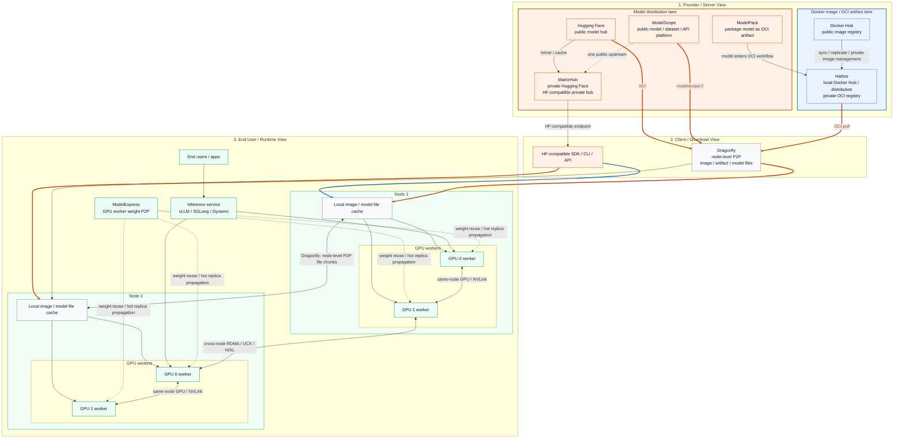
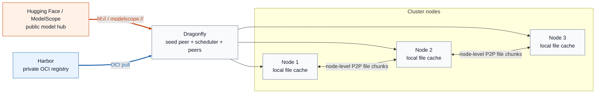
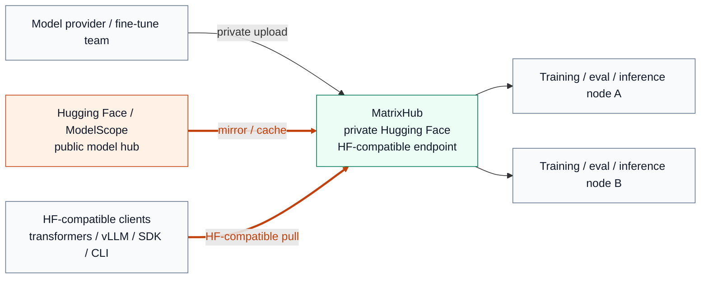
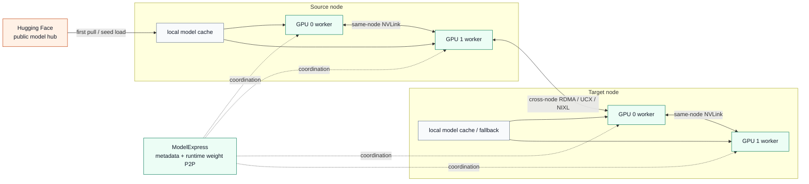

# One Diagram for Model Distribution: Hugging Face, MatrixHub, Harbor, Dragonfly, ModelPack, and ModelExpress

This page puts several frequently mixed-up projects on a single diagram. The
goal is to separate the **model source**, **private registry**, **cluster
distribution**, and **runtime acceleration** layers.

## The Stack in One Diagram

## Read the Diagram by Role

- **Provider / server view**: The blue lane is the Docker image / OCI artifact
  path. Harbor is easiest to read here as a local Docker Hub / Distribution
  style private registry. The orange lane is the model distribution path, with
  Hugging Face, ModelScope, and MatrixHub on that side.
- **Download view**: MatrixHub exposes an HF-compatible pull path. Dragonfly
  handles node-level file distribution and can serve OCI pulls from Harbor as
  well as `hf://` and `modelscope://` downloads.
- **End user / runtime view**: Model files first land in node-local caches,
  then feed GPU workers. ModelExpress sits later in the path and accelerates
  weight reuse between workers, including cross-node GPU transfers over RDMA.

Line colors also carry meaning:

- **Orange links**: HF-compatible or public model hub download paths
- **Blue links**: OCI pull paths
- **Grey node-to-node links**: Dragonfly node-level file chunk propagation
- **Green GPU-to-GPU links**: runtime weight sharing paths relevant to ModelExpress

## Focused Reference Diagrams

### 1. Dragonfly path: Harbor plus public model hubs

### 2. MatrixHub path: private Hugging Face style access

### 3. ModelExpress path: runtime weight sharing after initial pull

## Read the Diagram from Left to Right

### 1. Hugging Face

Hugging Face is the public upstream model hub. It is the default source for
many training and inference workflows using `huggingface_hub`,
`transformers`, `vLLM`, and similar clients.

### 2. Private Hugging Face

Private Hugging Face is a **target state**, not a single product. It means:

- private model hosting
- access control and governance
- low-friction compatibility with existing HF-style workflows
- predictable distribution inside enterprise or air-gapped environments

### 3. MatrixHub

MatrixHub is the most direct path to that target state in this stack. It acts
as an **HF-compatible private hub**, so teams can keep the Hugging Face
interaction model while moving to a governed internal endpoint.

In practice, MatrixHub is the layer for:

- private model registry and lifecycle governance
- transparent HF proxy behavior
- on-demand caching from public Hugging Face
- multi-region or air-gapped distribution workflows

### 4. ModelPack + Harbor + Dragonfly

This path is different. It is **OCI-first**, not HF-first.

- `ModelPack` provides a packaging/spec path for OCI-based model artifacts.
- `Harbor` provides the private OCI registry, including enterprise governance
  features such as RBAC, signing, replication, and retention. A useful mental
  model is to treat it as an enterprise-local Docker Hub / Distribution style
  system with stronger management features.
- `Dragonfly` accelerates distribution from the registry to nodes using
  preheat and P2P transfer patterns.

This stack is a strong answer to **private model artifact management**, but it
does not by itself provide a native Hugging Face-compatible endpoint.

### 5. ModelExpress

ModelExpress sits later in the path. It is not the primary model hub. Its main
job is **runtime weight movement and cold-start reduction inside the cluster**.

That usually means:

- coordinating cache usage in the inference cluster
- reducing repeated model pulls and loads
- enabling worker-to-worker transfer
- accelerating the last mile from storage or cache toward serving workers

The official documentation focuses on **in-cluster multi-node coordination**
rather than a global multi-cluster control plane.

## The Most Common Architecture Patterns

### Pattern A: Public Hugging Face

Use this when convenience matters more than control.

`Clients -> Hugging Face`

Tradeoff:

- simplest workflow
- least governance
- repeated public downloads
- weak fit for air-gapped or regulated environments

### Pattern B: Private Hugging Face with MatrixHub

Use this when existing HF workflows should remain almost unchanged.

`Clients -> MatrixHub -> Hugging Face or private storage`

Tradeoff:

- lowest migration cost for HF-first teams
- strong fit for internal mirroring and governance
- less aligned with OCI-first platform standardization than Harbor

### Pattern C: Private Model Registry with Harbor + ModelPack + Dragonfly

Use this when the platform is already centered on OCI artifacts and Kubernetes.

`Build/package -> ModelPack -> Harbor -> Dragonfly -> cluster nodes`

Tradeoff:

- strong standardization and enterprise controls
- clean fit for OCI-native platform teams
- more workflow translation if users expect native HF semantics

### Pattern D: MatrixHub + ModelExpress

Use this when you need both **private Hugging Face-style access** and **faster
cluster runtime loading**.

`Clients -> MatrixHub -> cluster cache/source -> ModelExpress -> workers`

Division of responsibility:

- `MatrixHub` is the upstream system of record and governed distribution layer.
- `ModelExpress` is the in-cluster runtime acceleration layer.

This is especially natural in multi-cluster environments where each cluster
runs its own runtime acceleration path while a shared upstream model source
keeps versions and access policies consistent.

## Quick Positioning Table

| Component | Primary layer | Best for |
| --- | --- | --- |
| Hugging Face | Public upstream hub | Public model discovery and default client workflows |
| Private Hugging Face | Capability / target state | Internal HF-like experience |
| MatrixHub | Private model hub | HF-compatible internal distribution and governance |
| ModelPack | Packaging/spec | OCI-based model artifact definition |
| Harbor | Private registry | OCI artifact governance and replication |
| Dragonfly | Cluster distribution | Large-scale node-level pull acceleration |
| ModelExpress | Runtime acceleration | In-cluster cold-start and weight transfer optimization |

## Practical Rule of Thumb

- If the question is **"where should models live and be governed?"**, think
  `MatrixHub` or `Harbor`.
- If the question is **"do we want HF-compatible developer experience or
  OCI-first artifact workflows?"**, choose between `MatrixHub` and
  `Harbor + ModelPack`.
- If the question is **"how do we reduce cluster cold-start and repeated weight
  movement?"**, think `Dragonfly` and `ModelExpress`.
- If the question is **"how do we keep HF-like access while improving
  last-mile runtime loading?"**, combine `MatrixHub` with `ModelExpress`.

## References

- [MatrixHub](https://github.com/matrixhub-ai/matrixhub)
- [ModelExpress](https://github.com/ai-dynamo/modelexpress)
- [Harbor](https://goharbor.io/)
- [Dragonfly](https://d7y.io/)
- [ModelPack](https://modelpack.org/)
- [Hugging Face](https://huggingface.co/)
