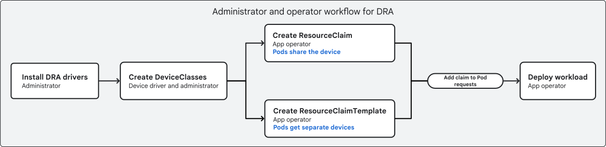

# Dynamic Resource Allocation (DRA)

[DRA](https://github.com/kubernetes/dynamic-resource-allocation/) is Dynamic
Resource Allocation for Kubernetes, enabling flexible device allocation with
structured parameters and topology awareness.

## Overview

DRA provides a more flexible alternative to the traditional device plugin
framework, supporting:

- Complex device requirements (GPU + NIC + storage combinations)
- Topology-aware scheduling (NUMA, NVLink, InfiniBand)
- Structured parameters for fine-grained device configuration
- Multiple device types per pod



**See also:**
[Scheduling Optimization Guide](./scheduling-optimization.md#26-topology-aware-scheduling)
for DRA usage in production scenarios.

## KEPs and Roadmap

- DRA: structured parameters
  [#4381](https://github.com/kubernetes/enhancements/issues/4381). GA in
  v1.34.
- All KEPs about DRA:
  [GitHub Issues](https://github.com/kubernetes/enhancements/issues/?q=is%3Aissue%20%20DRA%20in%3Atitle)

**Performance Testing:**

See [DRA Performance Testing](./dra-performance-testing.md) for comprehensive
scale testing, performance benchmarks, and production best practices.

## Topology Management with DRA

DRA enables sophisticated topology-aware scheduling through device attributes
and constraints. This is essential for AI workloads that require GPU + NIC
coordination on the same PCIe fabric.

### How DRA Handles Topology

DRA uses **attributes** and **constraints** with CEL (Common Expression
Language) to express topology requirements:

1. **Device Attributes**: Each device publishes topology information
   - `pcieRoot`: PCIe hierarchy identifier
   - `numaNode`: NUMA node association
   - `nvlinkDomain`: NVLink fabric identifier
   - `rdmaDevice`: Associated RDMA NIC

2. **Constraints**: CEL expressions that enforce topology rules
   - Same PCIe root for GPU and NIC
   - Same NUMA node for CPU and memory
   - NVLink connectivity between GPUs

3. **SharedID**: Devices on the same topology domain get a shared identifier

### GPU + NIC Topology Coordination

The most powerful use case is coordinating GPU and NIC allocation on the same
PCIe root. This is critical for RDMA-based distributed training with
GPU-Direct.

```yaml
apiVersion: resource.k8s.io/v1beta1
kind: ResourceClaimTemplate
metadata:
  name: gpu-nic-topology
spec:
  spec:
    devices:
      requests:
      - name: gpu
        deviceClassName: nvidia-gpu
        count: 1
      - name: rdma-nic
        deviceClassName: rdma-nic
        count: 1
      constraints:
      # GPU and NIC must be on the same PCIe root
      - requests: ["gpu", "rdma-nic"]
        matchAttribute: pcieRoot
```

### Integration with Kueue and DRANET

[DRANET](https://github.com/google/dranet) integrates with Kueue's
topology-aware scheduling using node labels:

```yaml
# Topology labels used by Kueue and DRANET
cloud.google.com/gce-topology-block
cloud.google.com/gce-topology-subblock
cloud.google.com/gce-topology-host
kubernetes.io/hostname
```

### DRAConsumableCapacity (Alpha in 1.34)

A new feature enabling flexible resource sharing while maintaining topology
awareness:

- **Allow multiple allocations** over multiple resource requests
- **Consumable capacity** - Guaranteed resource sharing

**Use Cases:**

- Virtual GPU Memory Partitioning
- Virtual NIC (vNIC) Sharing
- Bandwidth-limited Network Allocation
- I/O Bandwidth Smart Storage Device Sharing

### Migration from Device Plugin to DRA

Many organizations have significant investments in Device Plugin-based
solutions. Migrating to DRA presents challenges:

**Coexistence Problems:**

- **Resource conflicts**: Same device managed by both systems
- **Topology inconsistency**: Different topology views between systems
- **Scheduling confusion**: Scheduler doesn't have unified view

**Feature Gaps:**

- Device health monitoring (Device Plugin has built-in health checks)
- Hot-plug support (Device Plugin supports dynamic device addition)
- Metrics integration (Prometheus metrics from Device Plugins)

**Recommended Migration Path:**

1. Deploy DRA driver alongside existing Device Plugin
2. Use node taints to partition workloads
3. Gradually migrate workloads to DRA-based resource claims
4. Phase out Device Plugin once all workloads migrated

**DRA Extension Capabilities:**

- DRA drivers can implement compatibility layers
- NVIDIA's DRA driver supports Device Plugin migration path
- NRI integration can bridge runtime-level gaps

**Related Blog Post:**
[Topology-Aware Scheduling Blog](../blog/2025-11-25/topology-aware-scheduling.md)
for comprehensive coverage of DRA topology management and migration.

## DRA Driver Implementations

### NVIDIA DRA Driver for GPUs

<a href="https://github.com/NVIDIA/k8s-dra-driver-gpu">**NVIDIA DRA Driver for
GPUs**</a> is NVIDIA's reference implementation of DRA for GPU resource
management.

**Architecture:**

The driver includes two kubelet plugins:

- <a href="https://github.com/NVIDIA/k8s-dra-driver-gpu/tree/main/cmd/gpu-kubelet-plugin">**gpu-kubelet-plugin**</a>:
  Standard GPU resource allocation using DRA
- <a href="https://github.com/NVIDIA/k8s-dra-driver-gpu/tree/main/cmd/compute-domain-kubelet-plugin">**compute-domain-kubelet-plugin**</a>:
  Advanced plugin for compute domain management

**Key Features:**

- GB200 support with specialized compute domain management
  (<a href="https://docs.google.com/presentation/d/1Xupr8IZVAjs5bNFKJnYaK0LE7QWETnJjkz6KOfLu87E/edit?pli=1&slide=id.g373e0ebfa8e_1_233#slide=id.g373e0ebfa8e_1_233">architecture
  presentation</a>)
- Topology-aware GPU scheduling (NVLink, NVSwitch awareness)
- Fine-grained resource allocation beyond simple GPU counts
- Support for complex multi-GPU configurations

**Integration:**

- Will be integrated into <a href="./nvidia-gpu-operator.md">NVIDIA GPU
  Operator</a> in future releases
- Provides migration path from traditional device plugin to DRA

**See also:** [NVIDIA GPU Operator](./nvidia-gpu-operator.md) for comprehensive
coverage of NVIDIA GPU management in Kubernetes.

### DRA Driver for CPU Resources

<a href="https://github.com/kubernetes-sigs/dra-driver-cpu">**DRA Driver for
CPU Resources**</a> is a reference implementation of DRA for managing CPU
resources on Kubernetes nodes.

**Architecture:**

The driver is deployed as a DaemonSet with two core components:

- **DRA driver**: Discovers CPU topology and reports available CPUs as
  allocatable resources via `ResourceSlice` objects. Generates CDI (Container
  Device Interface) specifications for CPU set assignment.
- **NRI Plugin**: Integrates with container runtime via Node Resource Interface
  (NRI) to enforce CPU pinning and manage shared CPU pools.

**Key Features:**

- Exclusive CPU allocation for guaranteed pods requesting CPUs via
  ResourceClaim
- Shared CPU pool management for containers without ResourceClaim
- Dynamic CPU pool updates as guaranteed containers are created or removed
- System CPU reservation via `--reserved-cpus` flag (aligns with kubelet's
  static CPU Manager policy)
- State synchronization on daemonset restart to handle existing pod allocations

**Configuration:**

The driver supports `--reserved-cpus` flag to specify CPUs reserved for system
and kubelet processes (similar to kubelet's `reservedSystemCPUs` setting).

**CPU Micro-Topology Support:**

Recent development ([PR #16](https://github.com/kubernetes-sigs/dra-driver-cpu/pull/16))
adds CPU micro-topology support including:

- NUMA-aware CPU allocation
- CPU pinning with topology alignment
- Coordination with GPU NUMA placement

**Current Limitations:**

- CPU resources only; memory management not supported

## Learning Resources

### Conference Talks

- **KubeCon NA 2025**: [Mind the Topology: Smarter Scheduling for AI
  Workloads](https://www.youtube.com/watch?v=o5i7pTWZjfo) - Roman Baron, NVIDIA
- **KubeCon NA 2025**: [Device Management Deep
  Dive](https://www.youtube.com/watch?v=j6zkGxrxm6o) - DRA and Device Plugin
- **KubeCon NA 2024**: [Kubernetes WG Device Management - GPUs, TPUs, NICs
  and More With DRA](https://www.youtube.com/watch?v=Z_15EyXOnhU) - Kevin
  Klues & Patrick Ohly

### Additional Resources

- [Kubernetes docs](https://kubernetes.io/docs/concepts/scheduling-eviction/dynamic-resource-allocation/)
- [GKE docs](https://cloud.google.com/kubernetes-engine/docs/concepts/about-dynamic-resource-allocation)
- [Kubernetes blog](https://kubernetes.io/blog/2025/05/01/kubernetes-v1-33-dra-updates/)
- [YouTube search: DRA](https://www.youtube.com/@cncf/search?query=DRA)
- [Kubernetes WG Device
  Management](https://github.com/kubernetes/community/blob/master/wg-device-management/README.md)
- [NVIDIA KAI Scheduler](https://github.com/NVIDIA/KAI-Scheduler) - GPU-optimized
  scheduling with topology awareness
