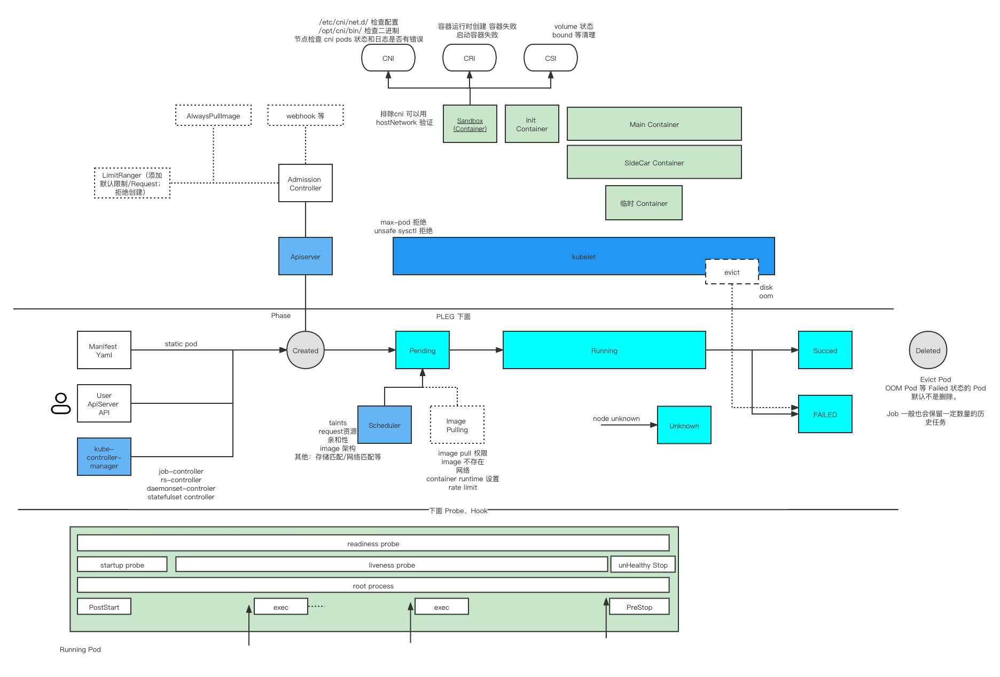

# Pod Lifecycle in Kubernetes: Recent Changes and Enhancements

## Why Understanding Pod Lifecycle Matters

Understanding the Pod lifecycle is crucial for Kubernetes users and operators
for several key reasons:

1. **Handling Pod Crashes and Failures**: Deep knowledge of Pod lifecycle
   helps diagnose and resolve common issues like container crashes, failed
   health checks, and stuck pods. Understanding when and why containers
   restart enables better troubleshooting and faster recovery.

2. **Optimizing Pod Startup Performance**: By understanding the sequence of
   Pod initialization - from scheduling to readiness - you can identify
   bottlenecks in image pulling, init container execution, and application
   startup, leading to faster deployment times.

3. **Implementing Advanced Patterns**: Modern applications often require
   sophisticated lifecycle management, such as graceful shutdowns,
   coordinated sidecar startup, or selective container restarts. Understanding
   the lifecycle enables these patterns.

4. **Resource Efficiency**: Proper lifecycle management helps optimize
   resource utilization, prevent resource leaks, and ensure clean Pod
   termination.

## Pod Lifecycle Overview



In Kubernetes, a Pod goes through several standard lifecycle **phases**.
These phases describe the high-level status of the Pod, not the state of
individual containers.

For detailed Pod lifecycle information, refer to:

- [Official Kubernetes Documentation on Pod
  Lifecycle](https://kubernetes.io/docs/concepts/workloads/pods/pod-lifecycle/)
- [Chinese Blog: Understanding Pod Lifecycle
  (Part 1)](https://mp.weixin.qq.com/s/3rViD6CLJ8wVadh_MPqovw)
- [Chinese Blog: Understanding Pod Lifecycle
  (Part 2)](https://mp.weixin.qq.com/s/MG5V8Pqa-Ua_Je9OXxdt1A)

### Pod Phases

- **Pending**: Pod has been accepted but containers are not yet running
- **Running**: Pod has been bound to a node and all containers have been
  created
- **Succeeded**: All containers in the Pod have terminated successfully
- **Failed**: All containers have terminated, and at least one failed
- **Unknown**: Pod state cannot be determined

### Pod Milestones from Creation to Readiness


*Source: "My Job Says 'Running' But Nothing's 'Running': Kubernetes Status
Reality Check" - [KubeCon NA 2025](https://sched.co/28D8Z)*

---

## Recent Enhancements to Pod Lifecycle (Kubernetes 1.35+)

The Kubernetes community continues to enhance Pod lifecycle management. Two
significant enhancements are targeting Kubernetes 1.35:


*Source: KubeCon NA 2025 SIG-Node Maintainer Track*

### 1. SchedulingGates

SchedulingGates allow you to control when a Pod should be scheduled. By
adding scheduling gates, you can keep a Pod in the "Pending" phase until
certain conditions are met, preventing premature scheduling.

**Use Cases**:

- Waiting for external resources to be provisioned
- Coordinating batch job scheduling
- Implementing custom admission policies

### 2. Container Restart Rules (KEP-5307)

**Status**: Targeting Beta in Kubernetes 1.35

[KEP-5307](https://github.com/kubernetes/enhancements/blob/master/keps/sig-node/5307-container-restart-policy/README.md)
introduces fine-grained container-level restart policy rules with more
flexibility than the traditional Pod-level `restartPolicy`.


*Source: KubeCon NA 2025 SIG-Node Maintainer Track*

#### Key Features

- **Override Pod-level restart policy**: Provide per-container flexibility
  instead of a single Pod-wide policy
- **Finer-grained control on conditions**: Exit-code based rules replace the
  generalized Never/OnFailure/Always policies
- **Distinguish failure types**: Enable different handling for hardware vs.
  retry-able errors
- **Finer-grained control on actions**:
  - **Restart**: Traditional container-level restart without Pod termination
  - **RestartAllContainers**: Restart all containers in the Pod, including
    init containers (see KEP-5532)
  - **TerminatePod** (TBD): Terminate the entire Pod
  - **Complete** (TBD): Treat the container as completed

#### Benefits

This enhancement is particularly useful for scenarios described in
[this Chinese blog post about container exit
policies](https://mp.weixin.qq.com/s/X_yhEtvkYh2RSp1F0p1UZA), including:

- **Job completion handling**: Mark jobs as complete based on main container
  exit codes while sidecars continue running
- **Selective restart logic**: Restart only specific containers on certain
  exit codes
- **Advanced failure handling**: Different actions based on exit code ranges

### 3. RestartAllContainers Action (KEP-5532)

**Status**: Targeting Alpha in Kubernetes 1.35

[KEP-5532](https://github.com/kubernetes/enhancements/blob/master/keps/sig-node/5532-restart-all-containers-on-container-exits/README.md)
introduces a new action that can be triggered by container exits: restarting
all containers in a Pod.

#### Key Features

- **Cleaner restart**: Restart all containers of the Pod, including init
  containers, providing a clean slate
- **Container-controlled Pod lifecycle**: Allow containers to have some
  control over the entire Pod lifecycle
- **Works with all container types**: Applicable to regular containers, init
  containers, and sidecar containers

#### Use Cases

1. **Configuration reload**: When a configuration container exits, trigger a
   full Pod restart to reload all containers with new configuration
2. **Dependency management**: When a critical sidecar fails, restart all
   containers to ensure consistent state
3. **Coordinated updates**: Enable containers to coordinate restarts when
   certain conditions are met

---

## Detailed Pod Lifecycle Diagrams

### Comprehensive Pod Lifecycle (Chinese)


*Detailed Pod lifecycle diagram showing the interaction between user,
controllers, scheduler, kubelet, and container runtime*

### Pod Lifecycle State Transitions


*Source: "Pod Lifecycle" - WG Node Lifecycle
[KubeCon NA 2025](https://sched.co/28aCd)*

---

## Related Concepts

- Container states
- Init containers  
- Sidecar containers
- Liveness probes
- Readiness probes
- Startup probes
- Restart policy
- Hooks: `preStop`, `postStart`
- SchedulingGates

More information available in
[Issue #1](https://github.com/pacoxu/AI-Infra/issues/1) or
[official Kubernetes documentation](https://kubernetes.io/docs/concepts/workloads/pods/pod-lifecycle/).

---

## 学习（读代码）前的理解 / Pre-Learning Understanding

### 1.1. Pod 生命周期 / Pod Lifecycle Overview

1. 调用 APIServer 创建 Pod / Call APIServer to create Pod
2. Scheduler 监控到 Pod 没有 NodeName，进行节点分配 / Scheduler detects Pod
   without NodeName and assigns node
3. Kubelet 根据节点分配情况，通过 CRI 创建 Pod 的容器实例 / Kubelet creates
   container instances via CRI based on node assignment
4. 调用 APIServer 删除 Pod / Call APIServer to delete Pod
5. 先标记 Pod Delete TimeStamp / First mark Pod Delete TimeStamp
6. Kubelet 获取到之后开始删除容器实例 / Kubelet starts deleting container
   instances after receiving the signal
7. 删除成功后，上报 Pod 删除成功 / Report Pod deletion success after
   successful deletion

### 1.2. 推测、猜想 / Speculation and Assumptions

1. 猜测 `--force --grace-period` 的时候可能表现不一样 / Suspect that
   `--force --grace-period` might behave differently
2. 猜测有特殊的 finalizer 可能有不同表现 / Suspect that special finalizers
   might have different behaviors
3. 节点驱逐发生的情况，Pod删除请求可能是 kubelet 发出的 / In node eviction
   scenarios, Pod deletion requests might be initiated by kubelet
4. 一般场景，rs 发起创建和删除 pod 的请求 / In general scenarios, ReplicaSet
   initiates Pod creation and deletion requests
5. StaticPod 可能有所不同，应该是kubelet 发起的 Pod Create，并且 NodeName是
   默认有的，不会触发调度 / StaticPod might be different - kubelet initiates
   Pod creation with pre-set NodeName, skipping scheduling
6. Kubelet webhook 跟 pod 的逻辑关系 / Logical relationship between Kubelet
   webhook and pod

### 1.3. 创建过程再细化一些（根据经验）/ Detailed Creation Process

根据之前的排错经验 / Based on previous troubleshooting experience:

#### Pod 创建失败的情况 / Pod Creation Failure Scenarios

- 权限不足 / Insufficient permissions
- QoS 限制：不允许创建 best effort pod 或者 limit range 不符合要求 /
  QoS restrictions: best effort pods not allowed or limit range requirements
  not met

#### Pod 在 ApiServer 创建好 / Pod Successfully Created in ApiServer

- Static Pod 自带 Node Name 会跳过下面一步 / Static Pod with built-in Node
  Name skips next step
- 早期版本指定 NodeName 的情况也会跳过下一步 / Early versions with specified
  NodeName also skip next step

#### 调度器标记 Pod 可以调度的节点 / Scheduler Marks Available Nodes

- 无法调度，等待 1s、2s、4s 直到 5分钟检查 / Unable to schedule, waits 1s,
  2s, 4s up to 5 minutes
- max pod 达到上限之后，是调度失败，还是调度后无法启动？ / When max pod limit
  is reached, is it a scheduling failure or failure to start after scheduling?

#### 对应节点上的 Kubelet 获取到这个信息，使用 CRI 去创建容器

**Pause 容器 / Pause Container:**

- 资源限制太小导致 Pause 容器无法启动 / Resource limits too small preventing
  Pause container startup
- 网络：首先创建 Pause 容器，并且做网络相关的初始化 使用的是本地 CNI /
  Network: Create Pause container first and initialize network using local CNI
  - 如果 CNI 为 SDN 或者公有云，放行规则如何发送？ / If CNI is SDN or public
    cloud, how are firewall rules sent?

**存储 / Storage:**

- 挂载和绑定存储使用 CSI（没有挂载会跳过）/ Mount and bind storage using CSI
  (skipped if no mounts)

**Pull 镜像 / Pull Images:**

- 拉取镜像超时、失败、无权限、已存在镜像等情况 / Image pull timeout,
  failure, no permissions, image already exists, etc.

#### Init 容器 / Init Containers

**创建和运行 应用容器 / Create and Run Application Containers:**

- 执行 PostStart / Execute PostStart

#### SideCar（Istio、Knative等）/ SideCar (Istio, Knative, etc.)

**传统 Sidecar / Traditional Sidecar:**

- 通过注入器（如 Istio）在 Pod 中添加辅助容器 / Added via injectors
  (like Istio) as helper containers in the Pod
- 与主容器并行运行，提供网络代理、监控等功能 / Run parallel to main
  containers, providing network proxy, monitoring, etc.

**原生 Sidecar 容器 / Native Sidecar Containers (Kubernetes 1.29+):**

- 使用 Init 容器配置 `restartPolicy: Always` / Use init containers
  with `restartPolicy: Always`
- 在主容器启动前启动，但持续运行整个 Pod 生命周期 / Start before main
  containers but run throughout the Pod lifecycle
- 提供原生的 Sidecar 支持，无需外部注入 / Provide native sidecar
  support without external injection

```yaml
apiVersion: v1
kind: Pod
spec:
  initContainers:
  - name: sidecar-container
    image: busybox
    restartPolicy: Always  # 使其成为 sidecar / Makes it a sidecar
  containers:
  - name: main-container
    image: app
```

#### 启动后 / After Startup

- Liveness 检查，可能会被 Kill / Liveness probe checks, might be killed
- OOM Kill
- Evicted

### 1.4. 删除过程 / Deletion Process

Terminating → Terminated → 清理掉 / Cleanup

---

## 学习过程 / Learning Process

### 2.1. Deployment 创建 Pod 过程 / Deployment Pod Creation Process

参考资料 / References:

- [PDF.us article](https://pdf.us/2019/05/16/3407.html)
- [Zhihu article](https://zhuanlan.zhihu.com/p/111241212)

#### 事件示例 / Event Examples

```text
调度     Normal   Scheduled  <unknown>           default-scheduler
         Successfully assigned default/spring-46phs-deployment-5dd8d6646-98hdh
         to dce-10-7-177-10

镜像Pull Normal   Pulled     2m49s               kubelet, dce-10-7-177-10
         Container image "10.7.177.84/daocloud/spring-boot-sample@sha256:..."
         already present on machine

创建容器 Normal   Created    2m48s               kubelet, dce-10-7-177-10
         Created container user-container

启动容器 Normal   Started    2m46s               kubelet, dce-10-7-177-10
         Started container user-container

SideCar镜像Pull Normal   Pulled     2m46s               kubelet, dce-10-7-177-10
         Container image "10.7.177.84/kube-system/knative-serving-queue:v0.17.3"
         already present on machine

创建Sidecar容器 Normal   Created    2m46s               kubelet, dce-10-7-177-10
         Created container queue-proxy

启动Sidecar容器 Normal   Started    2m44s               kubelet, dce-10-7-177-10
         Started container queue-proxy

Readiness检查 Warning  Unhealthy  2m (x2 over 2m20s)  kubelet, dce-10-7-177-10
         Readiness probe failed: probe returned not ready

         Warning  Unhealthy  39s (x4 over 100s)  kubelet, dce-10-7-177-10
         Readiness probe failed: failed to probe: Get "http://127.0.0.1:8012/":
         context deadline exceeded (Client.Timeout exceeded while awaiting headers)
```

---

## CNI 网络分配详情 / CNI Network Allocation Details

参考资料 / Reference: <https://www.qikqiak.com/post/pod-init-container/>

测试网络CNI 了解到 / Understanding from CNI network testing:

1. pod 创建后申请网络，会请求 CNI 分配 IP / After pod creation, network
   request goes to CNI for IP allocation
2. 容器进程全部crash（Pause 容器也退出的情况），重新启动过程，会重新申请 IP /
   When all container processes crash (including Pause container), restart
   process will request IP again

   - 重启场景 / Restart scenarios
   - 关闭过程：pod IP 会被清理掉，回收 CNI 可以收到 del IP 请求 /
     Shutdown: pod IP cleaned up, CNI receives del IP request
   - 启动过程：重新申请，网络组件需要保证 同一个 pod uuid 下次分配的 IP
     跟之前保持一致。（这里不是看 pod name 而是要看 uuid）/ Startup: re-request,
     network component must ensure same pod UUID gets same IP (based on UUID,
     not pod name)

---

## Kubelet 逻辑 Race 困境 / Kubelet Logic Race Conditions

参考资料 / References:

- [Kubernetes PR #102344](https://github.com/kubernetes/kubernetes/pull/102344)
- [Design Document](https://docs.google.com/document/d/1DvAmqp9CV8i4_zYvNdDWZW-V0FMk1NbZ8BAOvLRD3Ds/edit#)

### kubelet 需要处理什么？/ What Does Kubelet Need to Handle?

1. sync pod status 到 apiserver / Sync pod status to apiserver
2. 杀pod 需要 kubelet 去处理，默认 有个 graceful 的协议；force kill 比较特别；
   static pod 也需要特殊处理 / Kill pod requires kubelet handling, default
   graceful protocol; force kill is special; static pod needs special handling
3. kubelet 不是直接操作pod，而是通过 container runtime 管理，因此cri 封装 /
   Kubelet doesn't directly operate pods, but manages through container runtime,
   hence CRI abstraction

### 问题在哪？哪里容易 race？/ Where Are Race Conditions?

1. 如何区分 a) pod 没有running 的容器；b) pod 不能再启动 容器了？Status Manager
   的数据是否时最新的 / How to distinguish a) pod has no running containers;
   b) pod can't start containers anymore? Is Status Manager data up-to-date?
2. 随着 临时容器和 sidecar 容器的增加，以及 init container，有些地方的逻辑
   忽略了对这些容器的处理 / With addition of ephemeral containers and sidecar
   containers, plus init containers, some logic ignores handling of these
   containers

### 造成什么结果 / What Are the Consequences?

通常也不会造成太严重的问题，一般是 pod 清理的很慢，或者完全卡住了 /
Usually doesn't cause serious problems, generally slow pod cleanup or complete
stuck situations:

1. 部分情况下，重启kubelet 可以清理掉 / In some cases, restarting kubelet
   can clean up
2. 清理慢 如果涉及到一些资源回收，就会导致应用更新 非常缓慢，进而导致更多问题 /
   Slow cleanup involving resource reclamation leads to very slow application
   updates, causing more problems

### 解决方案 / Solutions

1. StatusManager 增强 / StatusManager enhancement
2. 逻辑分离 / Logic separation:
   - syncPod
   - syncTerminatingPod
   - syncTerminatedPod
3. sync loop 可以 abort / sync loop can abort

基本从以上几点解决问题，缩短 shutdown 时间 / Basically solve problems from
above points, shorten shutdown time

---

## PLEG (Pod Lifecycle Event Generator) 详情

### Generic + Evented PLEG 详细流程 / Generic + Evented PLEG Detailed Flow

参考资料 / References:

- [SIG-Node Slides](https://docs.google.com/presentation/d/1e-qJWe6He2qjt0PFiZtocqP8VbkrwKAI9B4X72L0bGk/edit?resourcekey=0-N77W7Q5UHuN5dFtekjmAIA#slide=id.g1b9bef2a0a0_3_248)
- [KubeCon Session](https://sched.co/1PTJk)
- [Evented PLEG Discussion](https://docs.google.com/document/d/1GfWDoKAYiaXApxayXmPl9bcK5ewyiimFDJ966r28TUE/edit?tab=t.0)
- [Generic PLEG Design](https://github.com/kubernetes/design-proposals-archive/blob/main/node/pod-lifecycle-event-generator.md?plain=1)
- [Evented PLEG KEP](https://github.com/kubernetes/enhancements/tree/master/keps/sig-node/3386-kubelet-evented-pleg)

### PLEG 工作原理 / PLEG Working Principles

PLEG is responsible for monitoring pod lifecycle events and notifying kubelet
of state changes. There are two types:

- **Generic PLEG**: Polls container runtime periodically
- **Evented PLEG**: Receives events from container runtime (more efficient)

---

## 附加资源 / Additional Resources

### 生命周期图表 / Lifecycle Diagrams

The following diagrams show detailed Pod lifecycle flows referenced in the
issue comments:

- [Pod Lifecycle Diagram 1](https://github.com/pacoxu/AI-Infra/assets/2010320/ca74609f-0c40-46a1-b3e1-016d627b0122)
- [Pod Lifecycle Diagram 2](https://github.com/pacoxu/AI-Infra/assets/2010320/819be861-1a45-47b4-a31e-f22d46b181ae)
- [PreStop Hook Flow](https://github.com/user-attachments/assets/79c6278c-4976-49c8-8348-c6636297e7e0)
- [Evented PLEG Flow](https://github.com/user-attachments/assets/87682f04-18ff-4366-8698-2bfa1765f1ec)

### 注意事项 / Notes

基于 kubernetes 1.27-；在 v1.28 之后，init container 可以通过新的重启策略
always 成为 sidecar container / Based on kubernetes 1.27-; after v1.28, init
containers can become sidecar containers with the new restart policy "always".

---

# Pod 生命周期：容器重启规则与 RestartAllContainers 动作的最新变化

## 为什么要了解 Pod 生命周期

深入理解 Pod 生命周期对于 Kubernetes 用户和运维人员至关重要，主要有以下几个好处：

1. **处理 Pod 常见 Crash 或故障**：深入了解 Pod
   生命周期有助于诊断和解决常见问题，如容器崩溃、健康检查失败和
   Pod 卡住等。理解容器何时以及为何重启，能够实现更好的故障排查和更快的恢复。

2. **优化 Pod 启动性能**：通过理解从调度到就绪的 Pod
   初始化序列，您可以识别镜像拉取、init
   容器执行和应用启动中的瓶颈，从而加快部署时间。

3. **实现高级模式**：现代应用通常需要复杂的生命周期管理，如优雅关闭、协调的
   sidecar 启动或选择性容器重启。理解生命周期可以实现这些模式。

4. **资源效率**：适当的生命周期管理有助于优化资源利用率，防止资源泄漏，并确保
   Pod 的干净终止。

## Pod 生命周期简介


在 Kubernetes 中，Pod 经历几个标准生命周期**阶段**。这些阶段描述的是 Pod
的高级状态，而不是单个容器的状态。

想要详细了解 Pod 生命周期，可以先参考：

- [Kubernetes 官方文档：Pod
  生命周期](https://kubernetes.io/docs/concepts/workloads/pods/pod-lifecycle/)
- [中文博客：理解 Pod 生命周期（上）](https://mp.weixin.qq.com/s/3rViD6CLJ8wVadh_MPqovw)
- [中文博客：理解 Pod 生命周期（下）](https://mp.weixin.qq.com/s/MG5V8Pqa-Ua_Je9OXxdt1A)

### Pod 阶段

- **Pending（待定）**：Pod 已被接受，但容器尚未运行
- **Running（运行中）**：Pod 已绑定到节点，所有容器都已创建
- **Succeeded（成功）**：Pod 中的所有容器都已成功终止
- **Failed（失败）**：所有容器都已终止，至少有一个失败
- **Unknown（未知）**：无法确定 Pod 状态

### Pod 从创建到就绪的里程碑


*来源："My Job Says 'Running' But Nothing's 'Running': Kubernetes Status
Reality Check" - [KubeCon NA 2025](https://sched.co/28D8Z)*

---

## Pod 生命周期的近期增强（Kubernetes 1.35+）

Kubernetes 社区持续增强 Pod 生命周期管理。两个重要的增强特性正在针对
Kubernetes 1.35 版本开发：


*来源：KubeCon NA 2025 SIG-Node 维护者分会*

### 1. SchedulingGates（调度门控）

SchedulingGates 允许您控制何时应调度 Pod。通过添加调度门控，您可以将 Pod
保持在"Pending"阶段，直到满足某些条件，防止过早调度。

**使用场景**：

- 等待外部资源被配置
- 协调批处理作业调度
- 实现自定义准入策略

### 2. Container Restart Rules（容器重启规则，KEP-5307）

**状态**：目标是在 Kubernetes 1.35 中达到 Beta 阶段

[KEP-5307](https://github.com/kubernetes/enhancements/blob/master/keps/sig-node/5307-container-restart-policy/README.md)
引入了细粒度的容器级重启策略规则，比传统的 Pod
级 `restartPolicy` 更加灵活。


*来源：KubeCon NA 2025 SIG-Node 维护者分会*

#### 主要特性

- **覆盖 Pod 级重启策略**：提供每个容器的灵活性，而不是单一的 Pod 范围策略
- **条件的细粒度控制**：基于退出码的规则取代了通用的
  Never/OnFailure/Always 策略
- **区分故障类型**：能够对硬件错误与可重试错误进行不同处理
- **动作的细粒度控制**：
  - **Restart（重启）**：传统的容器级重启，不终止 Pod
  - **RestartAllContainers（重启所有容器）**：重启 Pod
    中的所有容器，包括 init 容器（参见 KEP-5532）
  - **TerminatePod（待定）**：终止整个 Pod
  - **Complete（待定）**：将容器视为已完成

#### 优势

这一增强对于[这篇关于容器退出策略的中文博客文章](https://mp.weixin.qq.com/s/X_yhEtvkYh2RSp1F0p1UZA)中描述的场景特别有用，包括：

- **任务完成处理**：基于主容器退出码将任务标记为完成，同时 sidecar 继续运行
- **选择性重启逻辑**：仅在特定退出码时重启特定容器
- **高级故障处理**：基于退出码范围采取不同动作

### 3. RestartAllContainers Action（重启所有容器动作，KEP-5532）

**状态**：目标是在 Kubernetes 1.35 中达到 Alpha 阶段

[KEP-5532](https://github.com/kubernetes/enhancements/blob/master/keps/sig-node/5532-restart-all-containers-on-container-exits/README.md)
引入了一个可以由容器退出触发的新动作：重启 Pod 中的所有容器。

#### 主要特性

- **更干净的重启**：重启 Pod 的所有容器，包括 init
  容器，提供一个干净的起点
- **容器控制 Pod 生命周期**：允许容器对整个 Pod 生命周期拥有一定控制权
- **适用于所有容器类型**：可应用于常规容器、init 容器和 sidecar 容器

#### 使用场景

1. **配置重新加载**：当配置容器退出时，触发完整的 Pod
   重启以使所有容器重新加载新配置
2. **依赖管理**：当关键 sidecar 失败时，重启所有容器以确保一致状态
3. **协调更新**：使容器能够在满足某些条件时协调重启

---

## 详细的 Pod 生命周期图表

### 全面的 Pod 生命周期图（中文）


*详细的 Pod 生命周期图，显示了用户、控制器、调度器、kubelet
和容器运行时之间的交互*

### Pod 生命周期状态转换


*来源："Pod Lifecycle" - WG Node Lifecycle
[KubeCon NA 2025](https://sched.co/28aCd)*

---

## 相关概念

- 容器状态
- Init 容器
- Sidecar 容器
- 存活探针（Liveness probes）
- 就绪探针（Readiness probes）
- 启动探针（Startup probes）
- 重启策略（Restart policy）
- 生命周期钩子：`preStop`、`postStart`
- 调度门控（SchedulingGates）

更多信息请参见
[Issue #1](https://github.com/pacoxu/AI-Infra/issues/1) 或
[Kubernetes 官方文档](https://kubernetes.io/docs/concepts/workloads/pods/pod-lifecycle/)。

---
