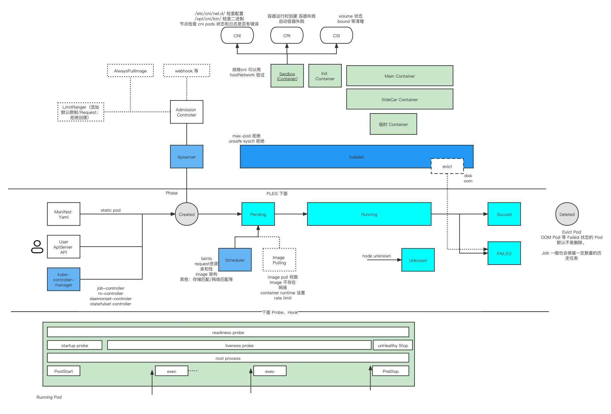

# Pod Lifecycle in Kubernetes



In Kubernetes, a Pod goes through several standard lifecycle **phases**.
These phases describe the high-level status of the Pod, not the state of
individual containers.

## Pod Phases

- **Pending**
- **Running**
- **Succeeded**
- **Failed**
- **Unknown**

## Related Concepts (not expanded here)

- Container states
- Init containers
- Sidecar containers
- Liveness probes
- Readiness probes
- Startup probes
- Restart policy
- Hooks: `preStop`, `postStart`
- SchedulingGates

More refer to [Issue #1](https://github.com/pacoxu/AI-Infra/issues/1) or
[official docs](https://kubernetes.io/docs/concepts/workloads/pods/pod-lifecycle/).

---

## 学习（读代码）前的理解 / Pre-Learning Understanding

### 1.1. Pod 生命周期 / Pod Lifecycle Overview

1. 调用 APIServer 创建 Pod / Call APIServer to create Pod
2. Scheduler 监控到 Pod 没有 NodeName，进行节点分配 / Scheduler detects Pod
   without NodeName and assigns node
3. Kubelet 根据节点分配情况，通过 CRI 创建 Pod 的容器实例 / Kubelet creates
   container instances via CRI based on node assignment
4. 调用 APIServer 删除 Pod / Call APIServer to delete Pod
5. 先标记 Pod Delete TimeStamp / First mark Pod Delete TimeStamp
6. Kubelet 获取到之后开始删除容器实例 / Kubelet starts deleting container
   instances after receiving the signal
7. 删除成功后，上报 Pod 删除成功 / Report Pod deletion success after
   successful deletion

### 1.2. 推测、猜想 / Speculation and Assumptions

1. 猜测 `--force --grace-period` 的时候可能表现不一样 / Suspect that
   `--force --grace-period` might behave differently
2. 猜测有特殊的 finalizer 可能有不同表现 / Suspect that special finalizers
   might have different behaviors
3. 节点驱逐发生的情况，Pod删除请求可能是 kubelet 发出的 / In node eviction
   scenarios, Pod deletion requests might be initiated by kubelet
4. 一般场景，rs 发起创建和删除 pod 的请求 / In general scenarios, ReplicaSet
   initiates Pod creation and deletion requests
5. StaticPod 可能有所不同，应该是kubelet 发起的 Pod Create，并且 NodeName是
   默认有的，不会触发调度 / StaticPod might be different - kubelet initiates
   Pod creation with pre-set NodeName, skipping scheduling
6. Kubelet webhook 跟 pod 的逻辑关系 / Logical relationship between Kubelet
   webhook and pod

### 1.3. 创建过程再细化一些（根据经验）/ Detailed Creation Process

根据之前的排错经验 / Based on previous troubleshooting experience:

#### Pod 创建失败的情况 / Pod Creation Failure Scenarios

- 权限不足 / Insufficient permissions
- QoS 限制：不允许创建 best effort pod 或者 limit range 不符合要求 /
  QoS restrictions: best effort pods not allowed or limit range requirements
  not met

#### Pod 在 ApiServer 创建好 / Pod Successfully Created in ApiServer

- Static Pod 自带 Node Name 会跳过下面一步 / Static Pod with built-in Node
  Name skips next step
- 早期版本指定 NodeName 的情况也会跳过下一步 / Early versions with specified
  NodeName also skip next step

#### 调度器标记 Pod 可以调度的节点 / Scheduler Marks Available Nodes

- 无法调度，等待 1s、2s、4s 直到 5分钟检查 / Unable to schedule, waits 1s,
  2s, 4s up to 5 minutes
- max pod 达到上限之后，是调度失败，还是调度后无法启动？ / When max pod limit
  is reached, is it a scheduling failure or failure to start after scheduling?

#### 对应节点上的 Kubelet 获取到这个信息，使用 CRI 去创建容器

**Pause 容器 / Pause Container:**

- 资源限制太小导致 Pause 容器无法启动 / Resource limits too small preventing
  Pause container startup
- 网络：首先创建 Pause 容器，并且做网络相关的初始化 使用的是本地 CNI /
  Network: Create Pause container first and initialize network using local CNI
  - 如果 CNI 为 SDN 或者公有云，放行规则如何发送？ / If CNI is SDN or public
    cloud, how are firewall rules sent?

**存储 / Storage:**

- 挂载和绑定存储使用 CSI（没有挂载会跳过）/ Mount and bind storage using CSI
  (skipped if no mounts)

**Pull 镜像 / Pull Images:**

- 拉取镜像超时、失败、无权限、已存在镜像等情况 / Image pull timeout,
  failure, no permissions, image already exists, etc.

#### Init 容器 / Init Containers

**创建和运行 应用容器 / Create and Run Application Containers:**

- 执行 PostStart / Execute PostStart

#### SideCar（Istio、Knative等）/ SideCar (Istio, Knative, etc.)

#### 启动后 / After Startup

- Liveness 检查，可能会被 Kill / Liveness probe checks, might be killed
- OOM Kill
- Evicted

### 1.4. 删除过程 / Deletion Process

Terminating → Terminated → 清理掉 / Cleanup

---

## 学习过程 / Learning Process

### 2.1. Deployment 创建 Pod 过程 / Deployment Pod Creation Process

参考资料 / References:

- [PDF.us article](https://pdf.us/2019/05/16/3407.html)
- [Zhihu article](https://zhuanlan.zhihu.com/p/111241212)

#### 事件示例 / Event Examples

```text
调度     Normal   Scheduled  <unknown>           default-scheduler
         Successfully assigned default/spring-46phs-deployment-5dd8d6646-98hdh
         to dce-10-7-177-10

镜像Pull Normal   Pulled     2m49s               kubelet, dce-10-7-177-10
         Container image "10.7.177.84/daocloud/spring-boot-sample@sha256:..."
         already present on machine

创建容器 Normal   Created    2m48s               kubelet, dce-10-7-177-10
         Created container user-container

启动容器 Normal   Started    2m46s               kubelet, dce-10-7-177-10
         Started container user-container

SideCar镜像Pull Normal   Pulled     2m46s               kubelet, dce-10-7-177-10
         Container image "10.7.177.84/kube-system/knative-serving-queue:v0.17.3"
         already present on machine

创建Sidecar容器 Normal   Created    2m46s               kubelet, dce-10-7-177-10
         Created container queue-proxy

启动Sidecar容器 Normal   Started    2m44s               kubelet, dce-10-7-177-10
         Started container queue-proxy

Readiness检查 Warning  Unhealthy  2m (x2 over 2m20s)  kubelet, dce-10-7-177-10
         Readiness probe failed: probe returned not ready

         Warning  Unhealthy  39s (x4 over 100s)  kubelet, dce-10-7-177-10
         Readiness probe failed: failed to probe: Get "http://127.0.0.1:8012/":
         context deadline exceeded (Client.Timeout exceeded while awaiting headers)
```

---

## CNI 网络分配详情 / CNI Network Allocation Details

参考资料 / Reference: <https://www.qikqiak.com/post/pod-init-container/>

测试网络CNI 了解到 / Understanding from CNI network testing:

1. pod 创建后申请网络，会请求 CNI 分配 IP / After pod creation, network
   request goes to CNI for IP allocation
2. 容器进程全部crash（Pause 容器也退出的情况），重新启动过程，会重新申请 IP /
   When all container processes crash (including Pause container), restart
   process will request IP again

   - 重启场景 / Restart scenarios
   - 关闭过程：pod IP 会被清理掉，回收 CNI 可以收到 del IP 请求 /
     Shutdown: pod IP cleaned up, CNI receives del IP request
   - 启动过程：重新申请，网络组件需要保证 同一个 pod uuid 下次分配的 IP
     跟之前保持一致。（这里不是看 pod name 而是要看 uuid）/ Startup: re-request,
     network component must ensure same pod UUID gets same IP (based on UUID,
     not pod name)

---

## Kubelet 逻辑 Race 困境 / Kubelet Logic Race Conditions

参考资料 / References:

- [Kubernetes PR #102344](https://github.com/kubernetes/kubernetes/pull/102344)
- [Design Document](https://docs.google.com/document/d/1DvAmqp9CV8i4_zYvNdDWZW-V0FMk1NbZ8BAOvLRD3Ds/edit#)

### kubelet 需要处理什么？/ What Does Kubelet Need to Handle?

1. sync pod status 到 apiserver / Sync pod status to apiserver
2. 杀pod 需要 kubelet 去处理，默认 有个 graceful 的协议；force kill 比较特别；
   static pod 也需要特殊处理 / Kill pod requires kubelet handling, default
   graceful protocol; force kill is special; static pod needs special handling
3. kubelet 不是直接操作pod，而是通过 container runtime 管理，因此cri 封装 /
   Kubelet doesn't directly operate pods, but manages through container runtime,
   hence CRI abstraction

### 问题在哪？哪里容易 race？/ Where Are Race Conditions?

1. 如何区分 a) pod 没有running 的容器；b) pod 不能再启动 容器了？Status Manager
   的数据是否时最新的 / How to distinguish a) pod has no running containers;
   b) pod can't start containers anymore? Is Status Manager data up-to-date?
2. 随着 临时容器和 sidecar 容器的增加，以及 init container，有些地方的逻辑
   忽略了对这些容器的处理 / With addition of ephemeral containers and sidecar
   containers, plus init containers, some logic ignores handling of these
   containers

### 造成什么结果 / What Are the Consequences?

通常也不会造成太严重的问题，一般是 pod 清理的很慢，或者完全卡住了 /
Usually doesn't cause serious problems, generally slow pod cleanup or complete
stuck situations:

1. 部分情况下，重启kubelet 可以清理掉 / In some cases, restarting kubelet
   can clean up
2. 清理慢 如果涉及到一些资源回收，就会导致应用更新 非常缓慢，进而导致更多问题 /
   Slow cleanup involving resource reclamation leads to very slow application
   updates, causing more problems

### 解决方案 / Solutions

1. StatusManager 增强 / StatusManager enhancement
2. 逻辑分离 / Logic separation:
   - syncPod
   - syncTerminatingPod
   - syncTerminatedPod
3. sync loop 可以 abort / sync loop can abort

基本从以上几点解决问题，缩短 shutdown 时间 / Basically solve problems from
above points, shorten shutdown time

---

## PLEG (Pod Lifecycle Event Generator) 详情

### Generic + Evented PLEG 详细流程 / Generic + Evented PLEG Detailed Flow

参考资料 / References:

- [SIG-Node Slides](https://docs.google.com/presentation/d/1e-qJWe6He2qjt0PFiZtocqP8VbkrwKAI9B4X72L0bGk/edit?resourcekey=0-N77W7Q5UHuN5dFtekjmAIA#slide=id.g1b9bef2a0a0_3_248)
- [KubeCon Session](https://sched.co/1PTJk)
- [Evented PLEG Discussion](https://docs.google.com/document/d/1GfWDoKAYiaXApxayXmPl9bcK5ewyiimFDJ966r28TUE/edit?tab=t.0)
- [Generic PLEG Design](https://github.com/kubernetes/design-proposals-archive/blob/main/node/pod-lifecycle-event-generator.md?plain=1)
- [Evented PLEG KEP](https://github.com/kubernetes/enhancements/tree/master/keps/sig-node/3386-kubelet-evented-pleg)

### PLEG 工作原理 / PLEG Working Principles

PLEG is responsible for monitoring pod lifecycle events and notifying kubelet
of state changes. There are two types:

- **Generic PLEG**: Polls container runtime periodically
- **Evented PLEG**: Receives events from container runtime (more efficient)

---

## 附加资源 / Additional Resources

### 生命周期图表 / Lifecycle Diagrams

The following diagrams show detailed Pod lifecycle flows referenced in the
issue comments:

- [Pod Lifecycle Diagram 1](https://github.com/pacoxu/AI-Infra/assets/2010320/ca74609f-0c40-46a1-b3e1-016d627b0122)
- [Pod Lifecycle Diagram 2](https://github.com/pacoxu/AI-Infra/assets/2010320/819be861-1a45-47b4-a31e-f22d46b181ae)
- [PreStop Hook Flow](https://github.com/user-attachments/assets/79c6278c-4976-49c8-8348-c6636297e7e0)
- [Evented PLEG Flow](https://github.com/user-attachments/assets/87682f04-18ff-4366-8698-2bfa1765f1ec)

### 注意事项 / Notes

基于 kubernetes 1.27-；在 v1.28 之后，init container 可以通过新的重启策略
always 成为 sidecar container / Based on kubernetes 1.27-; after v1.28, init
containers can become sidecar containers with the new restart policy "always".
